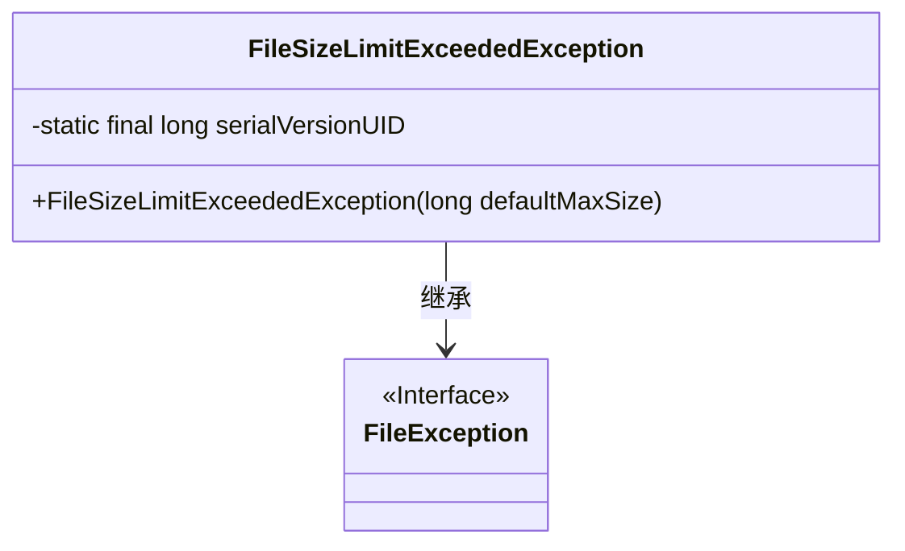
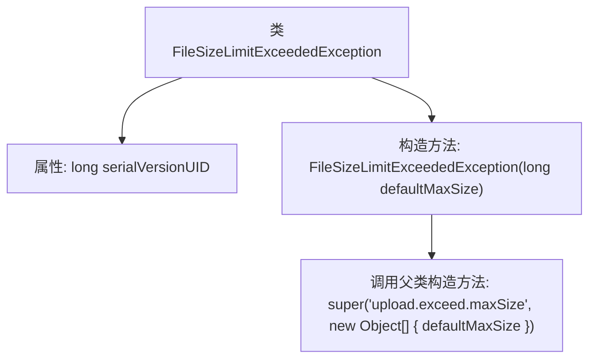

# 基础信息

|      |      |
|------|------|
| 名称 | FileSizeLimitExceededException |
| 编码语言 | .java |
| 代码路径 | RuoYi-main/ruoyi-common/src/main/java/com/ruoyi/common/exception/file/FileSizeLimitExceededException.java |
| 包名 | com.ruoyi.common.exception.file |
| 依赖项 | [] |
| 概述说明 | FileSizeLimitExceededException继承FileException，处理文件大小超限异常。 |

# 说明

FileSizeLimitExceededException类继承自FileException，专门用于处理文件大小超过限制的异常情况。该类的主要作用是在文件操作过程中，当检测到文件大小超出预设限制时，抛出此异常以提醒开发者或用户进行相应的处理。通过继承FileException，它能够利用父类的异常处理机制，同时针对文件大小超限这一特定场景提供更精确的异常管理。

# 类列表 Class Summary

| 名称   | 类型  | 说明 |
|-------|------|-------------|
| FileSizeLimitExceededException | class | FileSizeLimitExceededException类继承FileException，用于处理文件大小超限异常。 |

## 类 FileSizeLimitExceededException

|      |      |
|------|------|
| 访问范围 | public |
| 类型 | class |
| 名称 | FileSizeLimitExceededException |
| 说明 | FileSizeLimitExceededException类继承FileException，用于处理文件大小超限异常。 |

### UML类图

**描述：**  
`FileSizeLimitExceededException` 是一个自定义异常类，继承自 `FileException`。它用于处理文件大小超过限制的情况。类中包含一个静态的 `serialVersionUID` 用于序列化，以及一个构造函数，该构造函数接受一个 `long` 类型的参数 `defaultMaxSize`，并将其传递给父类的构造函数，用于生成异常信息。

### 内部方法调用关系图

这段代码定义了一个名为 `FileSizeLimitExceededException` 的异常类，它继承自 `FileException`。该类包含一个静态的 `serialVersionUID` 属性和一个构造方法。构造方法接收一个 `long` 类型的参数 `defaultMaxSize`，并调用父类的构造方法，传递一个错误消息字符串和一个包含 `defaultMaxSize` 的对象数组。这个异常类通常用于处理文件上传时文件大小超过限制的情况。

### 字段列表 Field List

| 名称  | 类型  | 说明 |
|-------|-------|------|
| serialVersionUID = 1L | long | 定义私有静态长整型常量serialVersionUID，值为1L。 |

### 方法列表 Method List

| 名称  | 类型  | 说明 |
|-------|-------|------|

