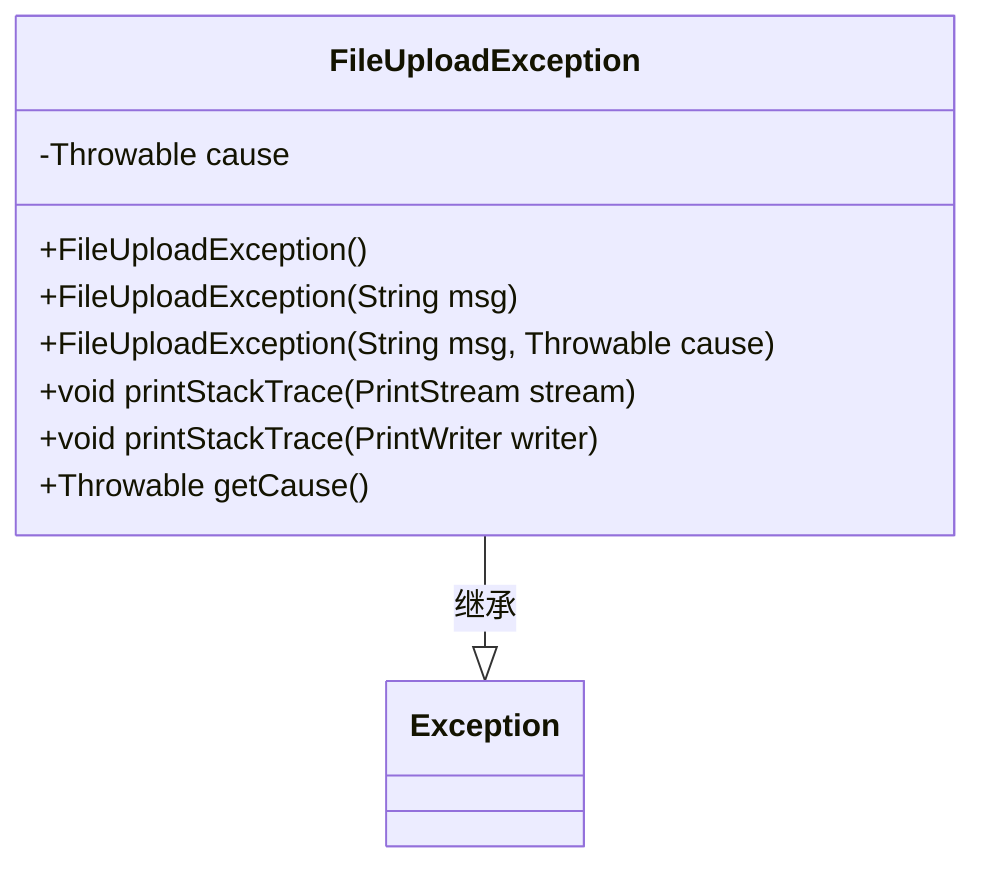
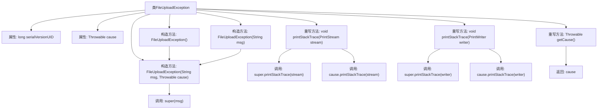

# 基础信息

|      |      |
|------|------|
| 名称 | FileUploadException |
| 编码语言 | .java |
| 代码路径 | RuoYi-main/ruoyi-common/src/main/java/com/ruoyi/common/exception/file/FileUploadException.java |
| 包名 | com.ruoyi.common.exception.file |
| 依赖项 | ['java.io.PrintStream', 'java.io.PrintWriter'] |
| 概述说明 | 自定义文件上传异常类，支持原因追溯和堆栈打印。 |

# 说明

自定义文件上传异常类专门用于处理文件上传过程中出现的异常情况。该类具备原因追溯功能，能够详细记录并分析异常发生的具体原因，帮助开发者快速定位问题。此外，异常类还集成了堆栈打印功能，可以在异常发生时自动打印堆栈信息，便于开发者进行调试和排查。通过结合原因追溯和堆栈打印，该类显著提升了异常处理的效率和准确性，为文件上传功能提供了更可靠的错误管理机制。

# 类列表 Class Summary

| 名称   | 类型  | 说明 |
|-------|------|-------------|
| FileUploadException | class | 自定义文件上传异常类，包含原因追溯和堆栈打印功能。 |

## 类 FileUploadException

|      |      |
|------|------|
| 访问范围 | public |
| 类型 | class |
| 名称 | FileUploadException |
| 说明 | 自定义文件上传异常类，包含原因追溯和堆栈打印功能。 |

### UML类图

这段代码定义了一个名为 `FileUploadException` 的自定义异常类，继承自 `Exception` 类。该类包含一个私有的 `Throwable` 类型的成员变量 `cause`，用于存储导致异常的根本原因。类中提供了三个构造函数，分别用于无参数、仅消息、以及消息和原因的情况。此外，重写了 `printStackTrace` 方法，用于在打印堆栈信息时同时打印出导致异常的原因，并提供了 `getCause` 方法用于获取异常的根本原因。该类主要用于处理文件上传过程中可能出现的异常情况。

### 内部方法调用关系图

这段代码定义了一个自定义异常类 `FileUploadException`，继承自 `Exception`。该类包含三个构造方法，分别用于初始化异常信息、原因或两者。重写了 `printStackTrace` 方法，用于在输出异常堆栈信息时，额外打印导致异常的原因。还重写了 `getCause` 方法，返回导致异常的原因。流程图展示了类的结构、属性、方法及其调用关系。

### 字段列表 Field List

| 名称  | 类型  | 说明 |
|-------|-------|------|
| cause | Throwable | 私有不可变的异常原因变量。 |
| serialVersionUID = 1L | long | 定义了一个静态长整型常量serialVersionUID，值为1L。 |

### 方法列表 Method List

| 名称  | 类型  | 说明 |
|-------|-------|------|
| printStackTrace | void | 重写printStackTrace方法，打印异常及原因。 |
| getCause | Throwable | 重写getCause方法，返回cause异常对象。 |
| printStackTrace | void | 重写printStackTrace方法，打印异常及其原因到指定流。 |

