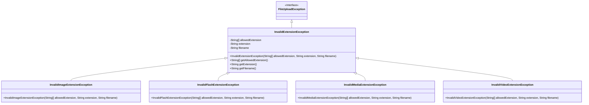
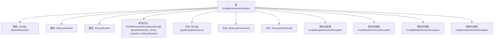

# 基础信息

|      |      |
|------|------|
| 名称 | InvalidExtensionException |
| 编码语言 | .java |
| 代码路径 | RuoYi-main/ruoyi-common/src/main/java/com/ruoyi/common/exception/file/InvalidExtensionException.java |
| 包名 | com.ruoyi.common.exception.file |
| 依赖项 | ['java.util.Arrays'] |
| 概述说明 | 文件后缀异常类涵盖图像、Flash、媒体和视频扩展异常。 |

# 说明

文件后缀异常类涵盖图像、Flash、媒体和视频等扩展名的异常情况。该类用于检测和处理这些文件类型在命名或格式上的异常，确保文件后缀与内容类型一致，避免因后缀错误导致的兼容性或识别问题。通过此类，可以有效管理和验证文件扩展名，提升文件处理的准确性和可靠性。

# 类列表 Class Summary

| 名称   | 类型  | 说明 |
|-------|------|-------------|
| InvalidExtensionException | class | 文件后缀异常类，包含图像、Flash、媒体和视频扩展异常。 |

## 类 InvalidExtensionException

|      |      |
|------|------|
| 访问范围 | public |
| 类型 | class |
| 名称 | InvalidExtensionException |
| 说明 | 文件后缀异常类，包含图像、Flash、媒体和视频扩展异常。 |

### UML类图

这段代码定义了一个继承自 `FileUploadException` 的 `InvalidExtensionException` 类，并包含了多个静态内部类，分别用于处理不同类型的文件扩展名异常。`InvalidExtensionException` 类包含了对允许的扩展名、实际扩展名和文件名的存储和获取方法。每个静态内部类都继承了 `InvalidExtensionException`，并提供了特定的构造函数来处理不同类型的文件扩展名异常。

### 内部方法调用关系图

这段代码定义了一个名为`InvalidExtensionException`的异常类，继承自`FileUploadException`。该类包含三个属性：`allowedExtension`、`extension`和`filename`，分别表示允许的文件扩展名、实际文件扩展名和文件名。构造方法用于初始化这些属性，并生成异常信息。此外，该类还定义了四个静态内部类，分别用于处理不同类型的文件扩展名异常，如`InvalidImageExtensionException`、`InvalidFlashExtensionException`、`InvalidMediaExtensionException`和`InvalidVideoExtensionException`。这些内部类都继承自`InvalidExtensionException`，并调用父类的构造方法进行初始化。

### 字段列表 Field List

| 名称  | 类型  | 说明 |
|-------|-------|------|
| allowedExtension | String[] | 定义私有字符串数组变量allowedExtension。 |
| serialVersionUID = 1L | long | 定义序列化版本号，确保对象版本一致性。 |
| extension | String | 定义了一个私有字符串变量extension。 |
| filename | String | 定义私有字符串变量filename。 |

### 方法列表 Method List

| 名称  | 类型  | 说明 |
|-------|-------|------|
| getExtension | String | 获取文件扩展名的方法。 |
| getAllowedExtension | String[] | 获取允许的文件扩展名数组。 |
| getFilename | String | 获取文件名的公共方法，返回变量filename。 |

