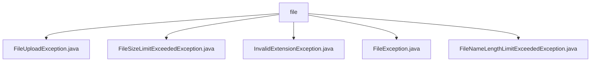

# 基础信息

|      |      |
|------|------|
| 名称 | file |
| 编码语言 | .java |
| 代码路径 | RuoYi-main/ruoyi-common/src/main/java/com/ruoyi/common/exception/file |
| 包名 | RuoYi-main.ruoyi-common.src.main.java.com.ruoyi.common.exception.file |
| 概述说明 | 自定义文件上传异常类处理上传异常，记录原因并打印堆栈信息。文件大小、后缀、长度超限异常类分别处理相应问题。FileException类继承BaseException，处理文件操作异常。 |

# 说明

## 概述
该代码模块主要围绕文件操作中的异常处理展开，提供了多种自定义异常类，用于处理文件上传、文件大小、文件后缀、文件名长度等场景中的异常情况。这些异常类继承自基础异常类`FileException`，并针对不同的文件操作场景提供了更精确的异常管理机制。通过原因追溯、堆栈打印、错误码传递等功能，显著提升了异常处理的效率和准确性，确保文件操作过程中的错误能够被及时捕获和处理。

## 主要业务场景
1. **文件上传异常处理**  
   - 使用`FileUploadException`类处理文件上传过程中可能出现的异常情况。该类具备原因追溯和堆栈打印功能，帮助开发者快速定位问题，提升调试效率。

2. **文件大小限制检查**  
   - 使用`FileSizeLimitExceededException`类检测文件大小是否超出预设限制。当文件大小超限时，抛出该异常以提醒开发者或用户进行相应处理。

3. **文件后缀验证**  
   - 使用`InvalidExtensionException`类验证文件后缀是否与内容类型一致，避免因后缀错误导致的兼容性或识别问题。该类涵盖图像、Flash、媒体和视频等扩展名的异常情况。

4. **文件名长度限制检查**  
   - 使用`FileNameLengthLimitExceededException`类检测文件名长度是否超出规定限制。当文件名长度超限时，抛出该异常以便程序捕获并处理。

5. **通用文件异常处理**  
   - 使用`FileException`类作为所有文件相关异常的基类，提供统一的异常处理机制。该类允许在实例化时传递错误码和参数，以便更精确地描述和捕获文件操作中的错误。

### 包内部结构视图

该流程图展示了`RuoYi-main/ruoyi-common/src/main/java/com/ruoyi/common/exception/file`目录下的文件层级关系。`file`作为根节点，包含了五个子节点，分别代表五个不同的异常类文件：`FileUploadException.java`、`FileSizeLimitExceededException.java`、`InvalidExtensionException.java`、`FileException.java`和`FileNameLengthLimitExceededException.java`。这些文件均属于文件异常处理模块，用于处理文件上传过程中可能出现的各种异常情况。

# 文件列表 File List

| 名称   | 类型  | 说明 |
|-------|------|-------------|
| [FileNameLengthLimitExceededException.java](FileNameLengthLimitExceededException.md) | file | 文件名长度超限异常类继承文件异常类，含默认长度参数。 |
| [FileSizeLimitExceededException.java](FileSizeLimitExceededException.md) | file | FileSizeLimitExceededException继承FileException，处理文件大小超限异常。 |
| [FileException.java](FileException.md) | file | FileException继承BaseException，处理文件异常，构造方法传递错误码和参数。 |
| [InvalidExtensionException.java](InvalidExtensionException.md) | file | 文件后缀异常类涵盖图像、Flash、媒体和视频扩展异常。 |
| [FileUploadException.java](FileUploadException.md) | file | 自定义文件上传异常类，支持原因追溯和堆栈打印。 |

