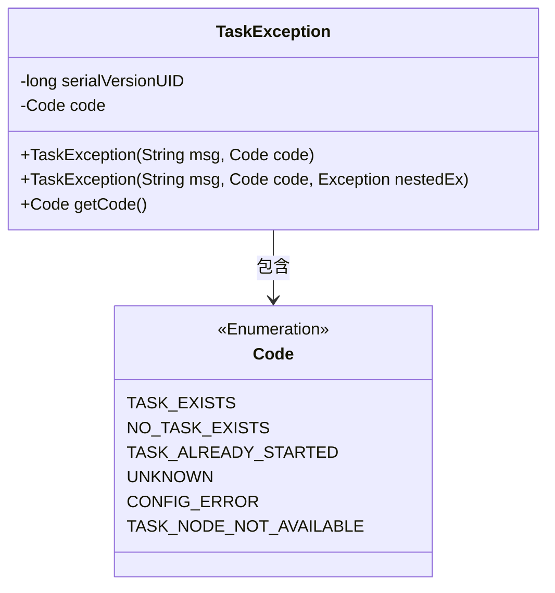
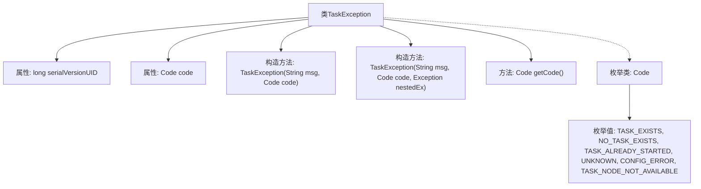

# 基础信息

|      |      |
|------|------|
| 名称 | TaskException |
| 编码语言 | .java |
| 代码路径 | RuoYi-main/ruoyi-common/src/main/java/com/ruoyi/common/exception/job/TaskException.java |
| 包名 | com.ruoyi.common.exception.job |
| 依赖项 | [] |
| 概述说明 | TaskException继承Exception，含错误码和嵌套异常，支持多错误类型。 |

# 说明

TaskException类是一个继承自Exception的异常类，它包含了错误码和嵌套异常的特性。该类支持多种错误类型，能够更灵活地处理和管理异常情况。通过引入错误码，可以更精确地识别和定位问题，而嵌套异常机制则允许在捕获和处理异常时保留原始异常的上下文信息，从而提供更全面的错误诊断和调试支持。

# 类列表 Class Summary

| 名称   | 类型  | 说明 |
|-------|------|-------------|
| TaskException | class | TaskException类继承Exception，包含错误码和嵌套异常，支持多种错误类型。 |

## 类 TaskException

|      |      |
|------|------|
| 访问范围 | public |
| 类型 | class |
| 名称 | TaskException |
| 说明 | TaskException类继承Exception，包含错误码和嵌套异常，支持多种错误类型。 |

### UML类图

类图描述：`TaskException` 类是一个自定义异常类，继承自 `Exception`。它包含一个 `Code` 枚举类型的私有成员变量 `code`，用于表示异常的错误代码。`TaskException` 类提供了两个构造函数，分别用于初始化异常信息和嵌套异常，以及一个获取错误代码的方法 `getCode()`。`Code` 枚举类定义了多种错误代码，用于标识不同类型的任务异常。

### 内部方法调用关系图

该流程图展示了`TaskException`类的结构，包括其属性、构造方法、方法和枚举类。`TaskException`类继承自`Exception`，包含一个`Code`枚举类型的属性`code`，并提供了两个构造方法用于初始化异常信息和嵌套异常。`getCode`方法用于获取`code`属性。枚举类`Code`定义了多个枚举值，用于表示不同的任务异常状态。

### 字段列表 Field List

| 名称  | 类型  | 说明 |
|-------|-------|------|
| code | Code | 私有代码变量声明。 |
| serialVersionUID = 1L | long | 声明一个静态常量serialVersionUID，值为1L。 |

### 方法列表 Method List

| 名称  | 类型  | 说明 |
|-------|-------|------|
| getCode | Code | 获取并返回当前对象的代码值。 |

