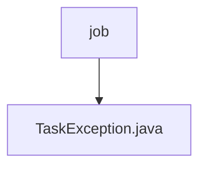

# 基础信息

|      |      |
|------|------|
| 名称 | job |
| 编码语言 | .java |
| 代码路径 | RuoYi-main/ruoyi-common/src/main/java/com/ruoyi/common/exception/job |
| 包名 | RuoYi-main.ruoyi-common.src.main.java.com.ruoyi.common.exception.job |
| 概述说明 | TaskException继承Exception，含错误码和嵌套异常，支持多错误类型。 |

# 说明

TaskException类是一个继承自Exception的异常类，它包含了错误码和嵌套异常的特性。该类支持多种错误类型，能够更灵活地处理和管理异常情况。通过引入错误码，可以更精确地识别和定位问题，而嵌套异常机制则允许在捕获和处理异常时保留原始异常的上下文信息，从而提供更全面的错误诊断和调试支持。

### 包内部结构视图

该流程图展示了RuoYi项目中`ruoyi-common`模块下的`job`文件夹与`TaskException.java`文件之间的层级关系。`job`文件夹作为父节点，`TaskException.java`文件作为子节点，表示该文件位于`job`文件夹内。这种结构体现了项目中异常处理模块的组织方式。

# 文件列表 File List

| 名称   | 类型  | 说明 |
|-------|------|-------------|
| [TaskException.java](TaskException.md) | file | TaskException继承Exception，含错误码和嵌套异常，支持多错误类型。 |

