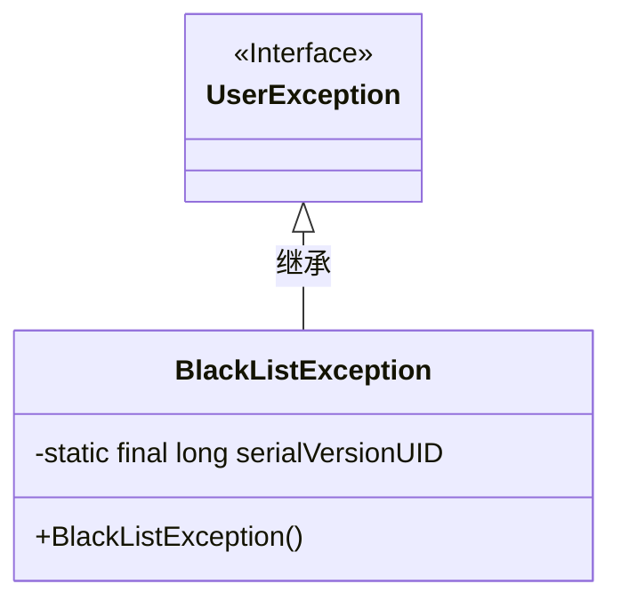
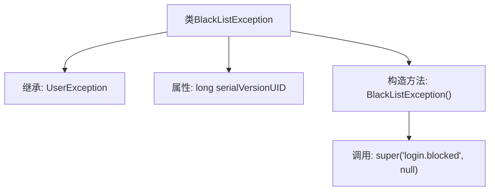

# 基础信息

|      |      |
|------|------|
| 名称 | BlackListException |
| 编码语言 | .java |
| 代码路径 | RuoYi-main/ruoyi-common/src/main/java/com/ruoyi/common/exception/user/BlackListException.java |
| 包名 | com.ruoyi.common.exception.user |
| 依赖项 | [] |
| 概述说明 | BlackListException继承UserException，处理登录被阻止。 |

# 说明

BlackListException继承自UserException，专门用于处理用户登录被阻止的情况。该异常类用于在用户因被列入黑名单而无法登录时抛出，以便在系统中进行相应的错误处理和提示。通过继承UserException，BlackListException保持了与用户相关异常的一致性，便于统一管理和维护。

# 类列表 Class Summary

| 名称   | 类型  | 说明 |
|-------|------|-------------|
| BlackListException | class | BlackListException继承UserException，用于处理登录被阻止的情况。 |

## 类 BlackListException

|      |      |
|------|------|
| 访问范围 | public |
| 类型 | class |
| 名称 | BlackListException |
| 说明 | BlackListException继承UserException，用于处理登录被阻止的情况。 |

### UML类图

这段代码定义了一个名为 `BlackListException` 的异常类，它继承自 `UserException` 接口。`BlackListException` 类包含一个静态的 `serialVersionUID` 字段和一个无参构造函数，该构造函数调用父类的构造函数并传递特定的错误消息和空参数。这个类用于表示用户被列入黑名单时的异常情况。

### 内部方法调用关系图

这段代码定义了一个名为 `BlackListException` 的类，该类继承自 `UserException`。它包含一个静态的 `serialVersionUID` 属性用于序列化，以及一个无参构造方法。在构造方法中，调用了父类的构造方法并传递了两个参数：一个字符串 `'login.blocked'` 和一个 `null` 值。这个异常类通常用于表示用户登录被阻止的情况。

### 字段列表 Field List

| 名称  | 类型  | 说明 |
|-------|-------|------|
| serialVersionUID = 1L | long | 定义了一个私有的静态最终长整型变量serialVersionUID，值为1L。 |

### 方法列表 Method List

| 名称  | 类型  | 说明 |
|-------|-------|------|

