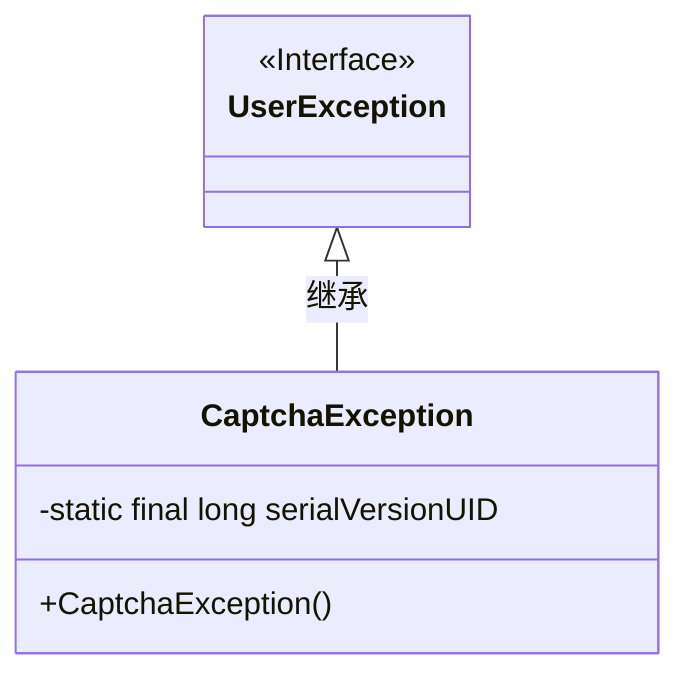
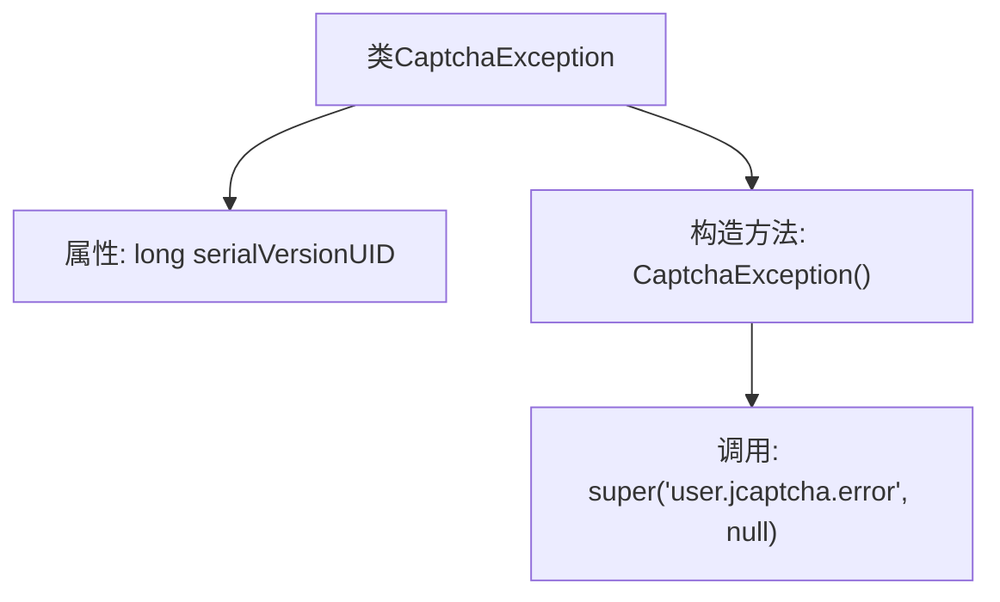

# 基础信息

|      |      |
|------|------|
| 名称 | CaptchaException |
| 编码语言 | .java |
| 代码路径 | RuoYi-main/ruoyi-common/src/main/java/com/ruoyi/common/exception/user/CaptchaException.java |
| 包名 | com.ruoyi.common.exception.user |
| 依赖项 | [] |
| 概述说明 | CaptchaException继承UserException，处理验证码错误。 |

# 说明

CaptchaException是一个继承自UserException的异常类，专门用于处理与验证码相关的错误情况。通过继承UserException，CaptchaException能够利用父类的异常处理机制，同时针对验证码错误提供特定的异常处理逻辑。这种设计使得在遇到验证码错误时，系统能够更精准地捕获和处理异常，从而提高代码的可维护性和用户体验。

# 类列表 Class Summary

| 名称   | 类型  | 说明 |
|-------|------|-------------|
| CaptchaException | class | CaptchaException继承UserException，用于处理验证码错误。 |

## 类 CaptchaException

|      |      |
|------|------|
| 访问范围 | public |
| 类型 | class |
| 名称 | CaptchaException |
| 说明 | CaptchaException继承UserException，用于处理验证码错误。 |

### UML类图

这段代码定义了一个 `CaptchaException` 类，该类继承自 `UserException` 接口。`CaptchaException` 类包含一个静态的 `serialVersionUID` 字段，用于序列化控制。它还有一个无参构造函数，调用父类的构造函数并传递错误信息和空参数。`CaptchaException` 类主要用于处理验证码相关的异常情况，继承自 `UserException` 接口，表明它是用户相关异常的特定实现。

### 内部方法调用关系图

这段代码定义了一个名为`CaptchaException`的类，该类继承自`UserException`。类中包含一个静态的`serialVersionUID`属性，用于序列化控制。构造方法`CaptchaException()`调用了父类的构造方法，并传递了两个参数：一个错误消息字符串`'user.jcaptcha.error'`和一个`null`值。这个类主要用于处理与验证码相关的异常情况。

### 字段列表 Field List

| 名称  | 类型  | 说明 |
|-------|-------|------|
| serialVersionUID = 1L | long | 定义序列化版本号，确保对象版本兼容性。 |

### 方法列表 Method List

| 名称  | 类型  | 说明 |
|-------|-------|------|

