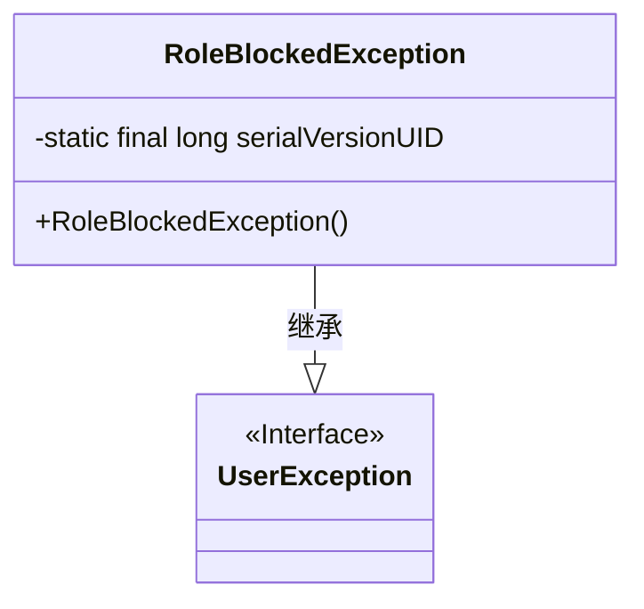
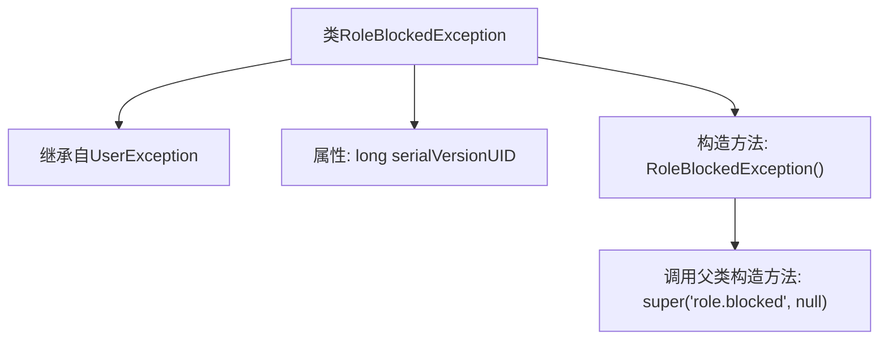

# 基础信息

|      |      |
|------|------|
| 名称 | RoleBlockedException |
| 编码语言 | .java |
| 代码路径 | RuoYi-main/ruoyi-common/src/main/java/com/ruoyi/common/exception/user/RoleBlockedException.java |
| 包名 | com.ruoyi.common.exception.user |
| 依赖项 | [] |
| 概述说明 | RoleBlockedException继承UserException，表示角色被阻止。 |

# 说明

RoleBlockedException是一个继承自UserException的异常类，用于提示当前用户角色被阻止的情况。该异常类主要用于在系统中检测到用户角色被阻止时抛出，以便开发者能够捕获并处理此类异常。通过继承UserException，RoleBlockedException保持了与用户相关异常的一致性，便于统一管理和处理。

# 类列表 Class Summary

| 名称   | 类型  | 说明 |
|-------|------|-------------|
| RoleBlockedException | class | RoleBlockedException继承UserException，提示角色被阻止。 |

## 类 RoleBlockedException

|      |      |
|------|------|
| 访问范围 | public |
| 类型 | class |
| 名称 | RoleBlockedException |
| 说明 | RoleBlockedException继承UserException，提示角色被阻止。 |

### UML类图

这段代码定义了一个名为 `RoleBlockedException` 的异常类，它继承自 `UserException`。`RoleBlockedException` 类包含一个静态的 `serialVersionUID` 字段，用于序列化控制。该类的构造函数调用父类的构造函数，并传递了两个参数：一个字符串 `"role.blocked"` 和一个 `null` 值。这个异常类通常用于表示用户角色被锁定的情况。

### 内部方法调用关系图

这段代码定义了一个名为`RoleBlockedException`的异常类，它继承自`UserException`。类中包含一个静态的`serialVersionUID`属性，用于序列化控制。构造方法`RoleBlockedException()`调用了父类的构造方法，并传递了两个参数：一个字符串`'role.blocked'`和一个`null`值。这个异常类通常用于表示用户角色被锁定的情况。

### 字段列表 Field List

| 名称  | 类型  | 说明 |
|-------|-------|------|
| serialVersionUID = 1L | long | 定义了一个静态长整型常量serialVersionUID，值为1L。 |

### 方法列表 Method List

| 名称  | 类型  | 说明 |
|-------|-------|------|

