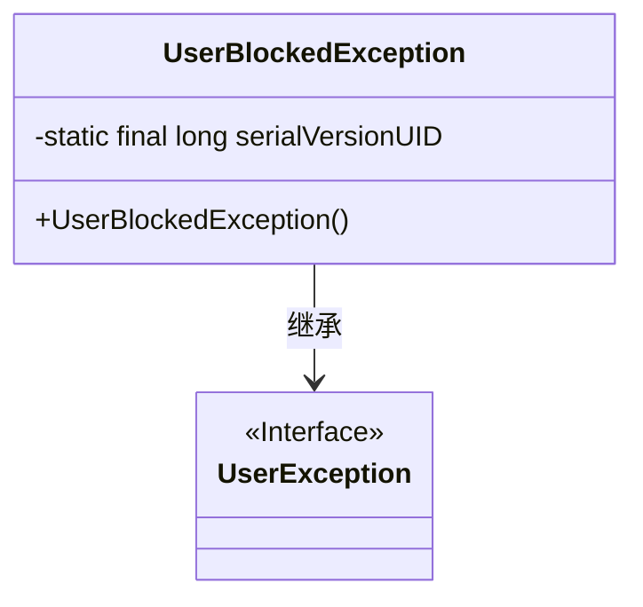
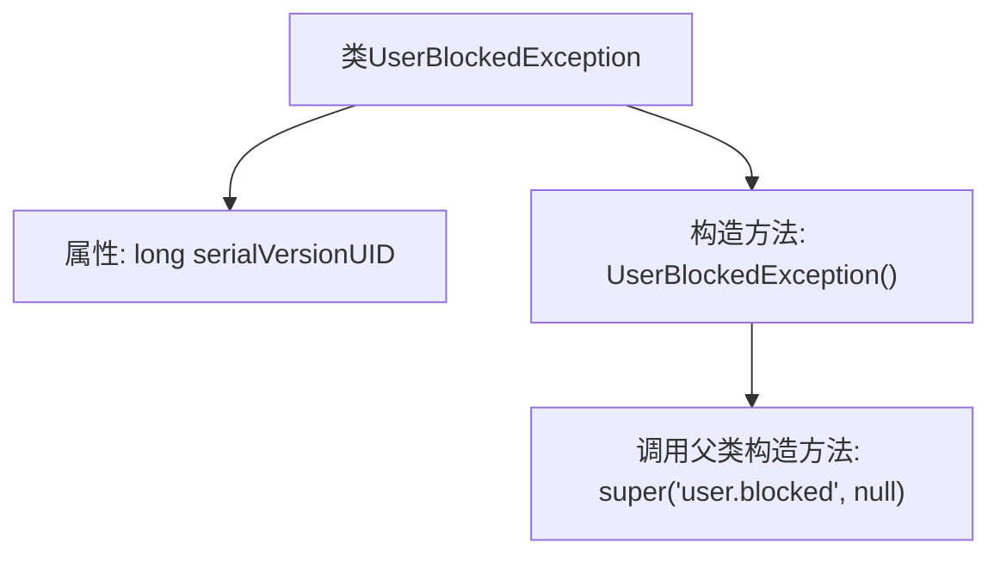

# 基础信息

|      |      |
|------|------|
| 名称 | UserBlockedException |
| 编码语言 | .java |
| 代码路径 | RuoYi-main/ruoyi-common/src/main/java/com/ruoyi/common/exception/user/UserBlockedException.java |
| 包名 | com.ruoyi.common.exception.user |
| 依赖项 | [] |
| 概述说明 | 自定义异常类，表示用户被封锁，继承自UserException。 |

# 说明

该内容描述了一个自定义异常类，专门用于表示用户被封锁的情况。这个异常类继承自UserException，表明它属于用户相关的异常处理体系。通过自定义异常类，可以更精确地捕获和处理用户被封锁的场景，提高代码的可读性和可维护性。这种设计有助于在用户被封锁时，提供明确的错误信息，并允许开发者在适当的位置进行处理或通知用户。

# 类列表 Class Summary

| 名称   | 类型  | 说明 |
|-------|------|-------------|
| UserBlockedException | class | 自定义异常类，表示用户被封锁，继承自UserException。 |

## 类 UserBlockedException

|      |      |
|------|------|
| 访问范围 | public |
| 类型 | class |
| 名称 | UserBlockedException |
| 说明 | 自定义异常类，表示用户被封锁，继承自UserException。 |

### UML类图

这段代码定义了一个 `UserBlockedException` 类，它继承自 `UserException` 类。`UserBlockedException` 是一个自定义异常类，用于表示用户被封锁的情况。它包含一个静态的 `serialVersionUID` 字段用于序列化，并且有一个无参构造函数，调用父类的构造函数并传递特定的错误信息和原因（这里为 `null`）。这个异常类通常用于在用户被封锁时抛出，以便在系统中处理这种情况。

### 内部方法调用关系图

这段代码定义了一个名为 `UserBlockedException` 的异常类，它继承自 `UserException`。该类包含一个静态的 `serialVersionUID` 属性，用于序列化控制。构造方法 `UserBlockedException()` 调用父类的构造方法，传递了两个参数：一个字符串 `'user.blocked'` 和一个 `null` 值。这个异常类主要用于表示用户被阻塞的情况。

### 字段列表 Field List

| 名称  | 类型  | 说明 |
|-------|-------|------|
| serialVersionUID = 1L | long | 定义序列化版本号的静态常量。 |

### 方法列表 Method List

| 名称  | 类型  | 说明 |
|-------|-------|------|

