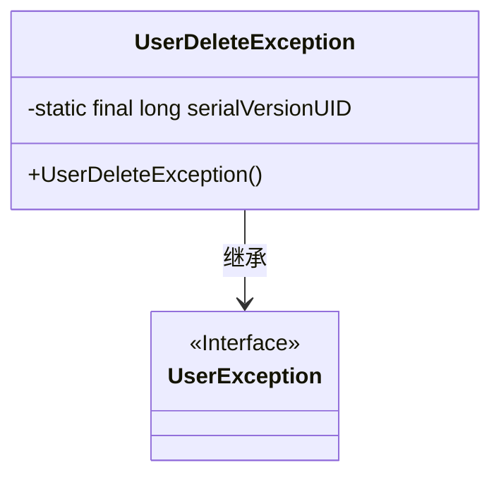
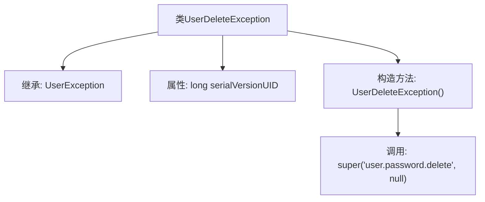

# 基础信息

|      |      |
|------|------|
| 名称 | UserDeleteException |
| 编码语言 | .java |
| 代码路径 | RuoYi-main/ruoyi-common/src/main/java/com/ruoyi/common/exception/user/UserDeleteException.java |
| 包名 | com.ruoyi.common.exception.user |
| 依赖项 | [] |
| 概述说明 | UserDeleteException继承UserException，用于处理用户删除异常。 |

# 说明

UserDeleteException是一个继承自UserException的异常类，专门用于处理用户删除操作中可能出现的异常情况。该异常类旨在捕获和管理在删除用户数据时发生的错误或异常，确保系统能够正确处理这些异常并提供相应的反馈或处理机制。通过继承UserException，UserDeleteException可以复用父类的异常处理逻辑，同时针对用户删除操作进行特定的异常管理。

# 类列表 Class Summary

| 名称   | 类型  | 说明 |
|-------|------|-------------|
| UserDeleteException | class | UserDeleteException继承UserException，用于处理用户删除异常。 |

## 类 UserDeleteException

|      |      |
|------|------|
| 访问范围 | public |
| 类型 | class |
| 名称 | UserDeleteException |
| 说明 | UserDeleteException继承UserException，用于处理用户删除异常。 |

### UML类图

这段代码定义了一个名为 `UserDeleteException` 的异常类，它继承自 `UserException` 接口。`UserDeleteException` 类包含一个静态的 `serialVersionUID` 字段，用于序列化控制，并提供了一个无参构造函数，该构造函数调用父类的构造函数并传递特定的错误消息。类图展示了 `UserDeleteException` 与 `UserException` 之间的继承关系，并明确标识了 `UserException` 是一个接口。

### 内部方法调用关系图

这段代码定义了一个名为 `UserDeleteException` 的异常类，它继承自 `UserException`。类中包含一个静态的 `serialVersionUID` 属性，用于序列化控制。构造方法 `UserDeleteException()` 调用了父类的构造方法，并传递了两个参数：一个字符串 `'user.password.delete'` 和一个 `null` 值。该异常类主要用于处理用户删除操作中的异常情况。

### 字段列表 Field List

| 名称  | 类型  | 说明 |
|-------|-------|------|
| serialVersionUID = 1L | long | 定义序列化版本号，确保类版本一致性。 |

### 方法列表 Method List

| 名称  | 类型  | 说明 |
|-------|-------|------|

