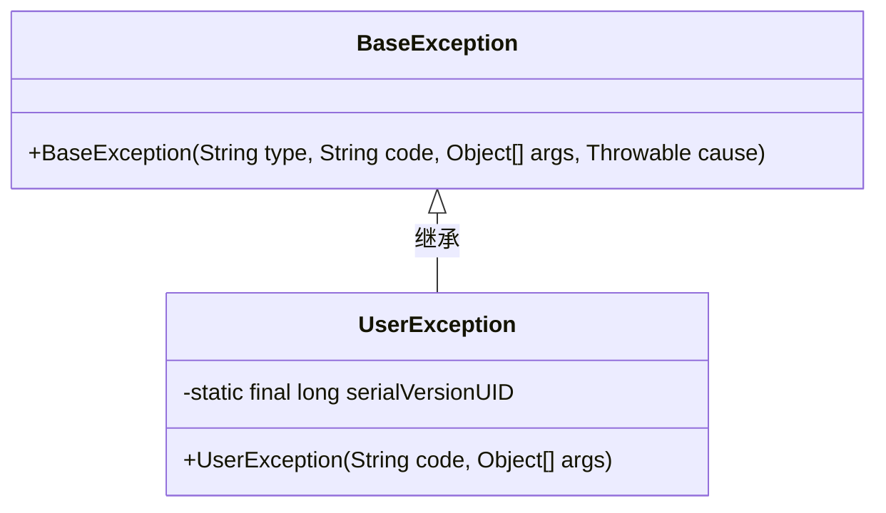
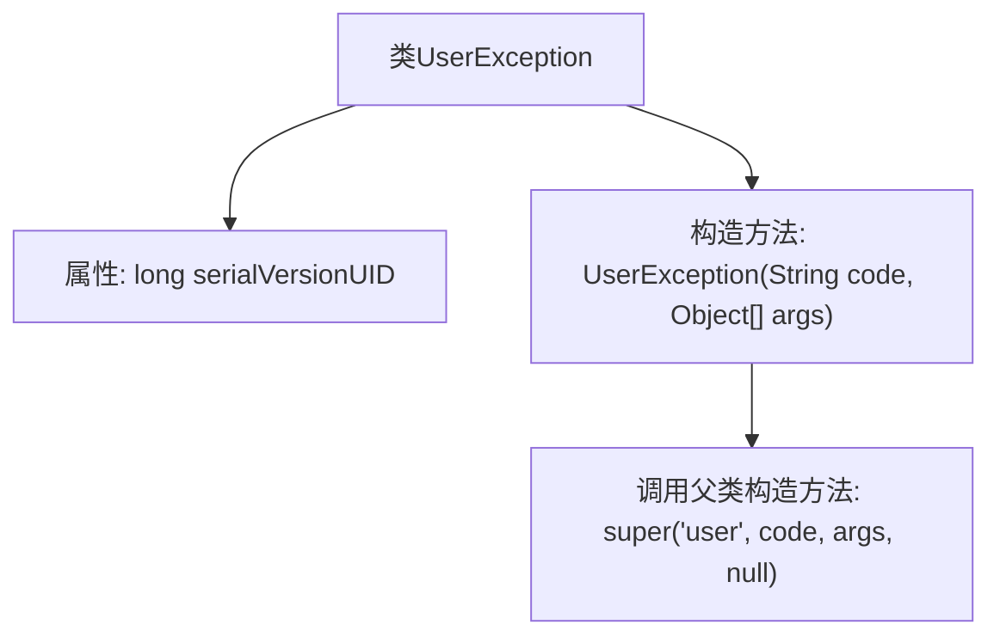

# 基础信息

|      |      |
|------|------|
| 名称 | UserException |
| 编码语言 | .java |
| 代码路径 | RuoYi-main/ruoyi-common/src/main/java/com/ruoyi/common/exception/user/UserException.java |
| 包名 | com.ruoyi.common.exception.user |
| 依赖项 | ['com.ruoyi.common.exception.base.BaseException'] |
| 概述说明 | 自定义用户异常类继承基础异常，包含序列化ID和构造方法。 |

# 说明

自定义用户异常类是一个继承自基础异常类的自定义异常类，主要用于处理特定用户相关的异常情况。该类包含一个序列化ID，用于确保在序列化和反序列化过程中对象的一致性。此外，该类还提供了构造方法，允许在创建异常实例时传递自定义的异常信息或原因，以便更精确地描述和处理异常情况。通过这种方式，开发者可以更好地管理和调试与用户相关的异常，提高代码的健壮性和可维护性。

# 类列表 Class Summary

| 名称   | 类型  | 说明 |
|-------|------|-------------|
| UserException | class | 自定义用户异常类，继承基础异常，包含序列化ID和构造方法。 |

## 类 UserException

|      |      |
|------|------|
| 访问范围 | public |
| 类型 | class |
| 名称 | UserException |
| 说明 | 自定义用户异常类，继承基础异常，包含序列化ID和构造方法。 |

### UML类图

这段代码定义了一个 `UserException` 类，它继承自 `BaseException` 类。`UserException` 类包含一个私有的静态常量 `serialVersionUID`，用于序列化控制，以及一个公有构造函数 `UserException`，该构造函数接受一个 `code` 字符串和一个 `args` 对象数组作为参数，并调用父类 `BaseException` 的构造函数。`UserException` 类的主要作用是处理与用户相关的异常情况，继承自 `BaseException` 类使其能够复用父类的异常处理逻辑。

### 内部方法调用关系图

这段代码定义了一个名为 `UserException` 的类，该类继承自 `BaseException`。`UserException` 类包含一个静态的 `serialVersionUID` 属性和一个构造方法。构造方法接收两个参数：`code` 和 `args`，并调用父类的构造方法，传递固定的字符串 `'user'`、`code`、`args` 和 `null` 作为参数。这段代码的主要作用是创建一个自定义的异常类，用于处理特定的用户异常情况。

### 字段列表 Field List

| 名称  | 类型  | 说明 |
|-------|-------|------|
| serialVersionUID = 1L | long | 声明一个静态不可变的长整型序列化版本号。 |

### 方法列表 Method List

| 名称  | 类型  | 说明 |
|-------|-------|------|

