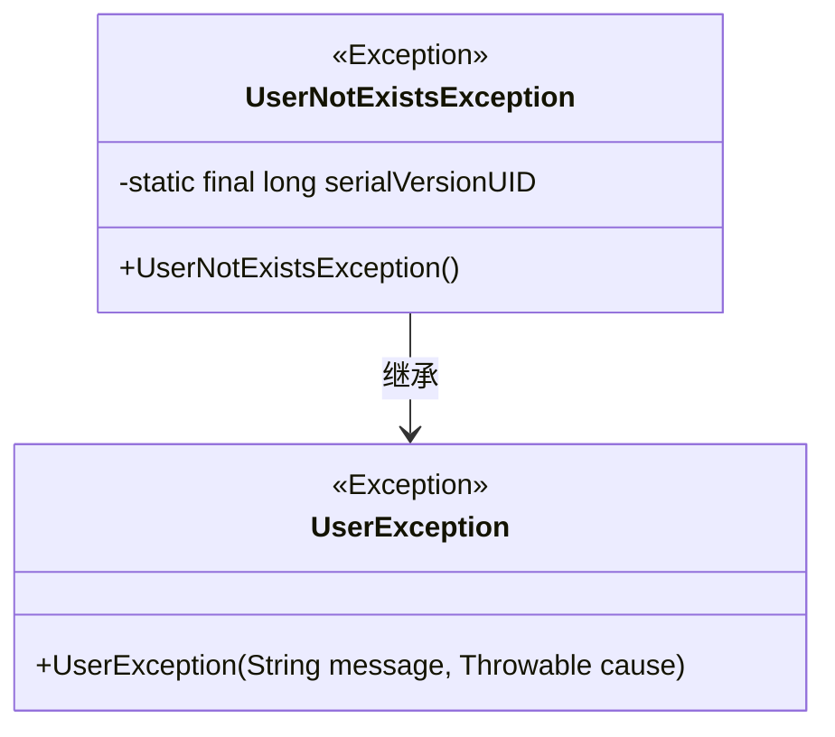
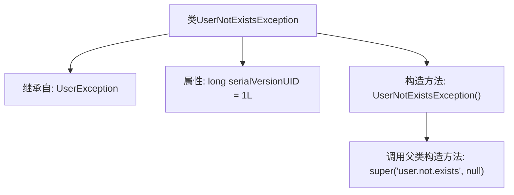

# 基础信息

|      |      |
|------|------|
| 名称 | UserNotExistsException |
| 编码语言 | .java |
| 代码路径 | RuoYi-main/ruoyi-common/src/main/java/com/ruoyi/common/exception/user/UserNotExistsException.java |
| 包名 | com.ruoyi.common.exception.user |
| 依赖项 | [] |
| 概述说明 | 用户不存在异常类继承自用户异常类。 |

# 说明

用户不存在异常类是一个自定义的异常类，它继承自用户异常类。该异常类用于处理与用户不存在相关的错误情况。通过继承用户异常类，用户不存在异常类能够复用父类的属性和方法，同时可以根据需要扩展或重写特定功能，以便更精确地捕获和处理用户不存在的异常场景。这种设计有助于提高代码的可维护性和异常处理的针对性。

# 类列表 Class Summary

| 名称   | 类型  | 说明 |
|-------|------|-------------|
| UserNotExistsException | class | 用户不存在异常类，继承自用户异常类。 |

## 类 UserNotExistsException

|      |      |
|------|------|
| 访问范围 | public |
| 类型 | class |
| 名称 | UserNotExistsException |
| 说明 | 用户不存在异常类，继承自用户异常类。 |

### UML类图

**描述**：  
`UserNotExistsException` 是一个自定义异常类，继承自 `UserException`。它用于表示用户不存在的异常情况。该类包含一个静态的 `serialVersionUID` 用于序列化，并通过构造函数调用父类的构造函数，传递特定的错误消息。这个类主要用于在用户管理系统中处理用户不存在的异常场景。

### 内部方法调用关系图

**描述：**  
`UserNotExistsException` 是一个自定义异常类，继承自 `UserException`。它包含一个静态的 `serialVersionUID` 属性，用于序列化控制。构造方法 `UserNotExistsException()` 在创建对象时调用父类的构造方法，传递错误信息 `'user.not.exists'` 和 `null` 作为参数。该异常类通常用于处理用户不存在的场景。

### 字段列表 Field List

| 名称  | 类型  | 说明 |
|-------|-------|------|
| serialVersionUID = 1L | long | 定义静态常量serialVersionUID，值为1L。 |

### 方法列表 Method List

| 名称  | 类型  | 说明 |
|-------|-------|------|

