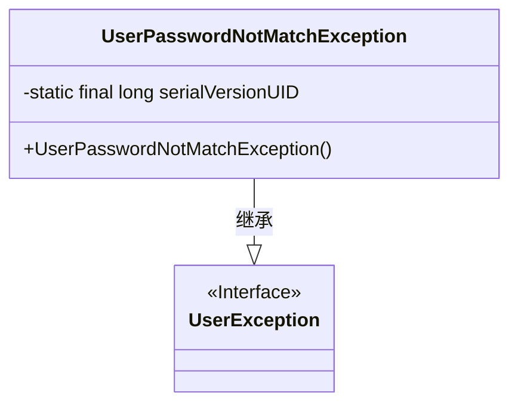
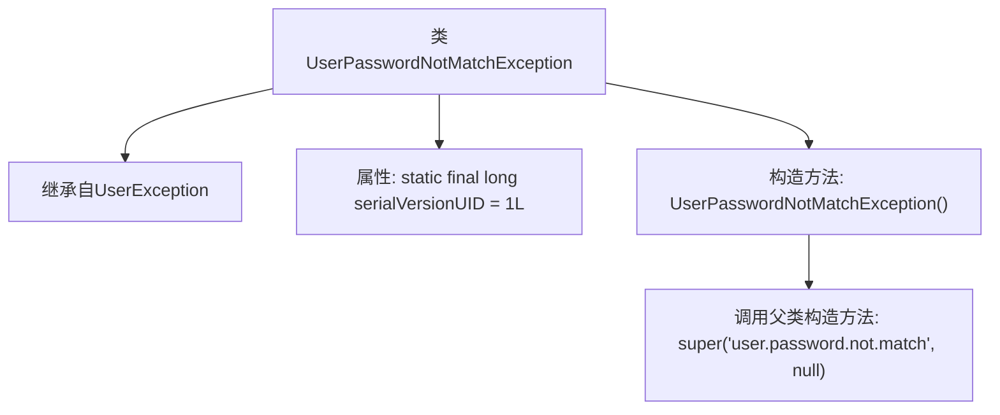

# 基础信息

|      |      |
|------|------|
| 名称 | UserPasswordNotMatchException |
| 编码语言 | .java |
| 代码路径 | RuoYi-main/ruoyi-common/src/main/java/com/ruoyi/common/exception/user/UserPasswordNotMatchException.java |
| 包名 | com.ruoyi.common.exception.user |
| 依赖项 | [] |
| 概述说明 | 用户密码不匹配异常类继承自用户异常类。 |

# 说明

用户密码不匹配异常类是一种特定的异常类型，它继承自用户异常类。该异常类用于处理用户密码不匹配的情况，通常发生在用户登录或验证密码时。通过继承用户异常类，它继承了父类的属性和方法，同时可以根据具体需求进行扩展或定制，以便更精确地处理和反馈密码不匹配的错误信息。这种异常类的设计有助于提高代码的可读性和可维护性，使得密码验证逻辑更加清晰和易于管理。

# 类列表 Class Summary

| 名称   | 类型  | 说明 |
|-------|------|-------------|
| UserPasswordNotMatchException | class | 用户密码不匹配异常类，继承自用户异常类。 |

## 类 UserPasswordNotMatchException

|      |      |
|------|------|
| 访问范围 | public |
| 类型 | class |
| 名称 | UserPasswordNotMatchException |
| 说明 | 用户密码不匹配异常类，继承自用户异常类。 |

### UML类图

**描述**：`UserPasswordNotMatchException` 是一个自定义异常类，继承自 `UserException`。它用于表示用户密码不匹配的情况。该类包含一个静态的 `serialVersionUID` 字段，用于序列化控制，并提供了一个无参构造函数，调用父类的构造函数并传递特定的错误信息。

### 内部方法调用关系图

这段代码定义了一个名为 `UserPasswordNotMatchException` 的异常类，它继承自 `UserException` 类。该类包含一个静态常量 `serialVersionUID`，用于序列化控制。构造方法 `UserPasswordNotMatchException()` 调用父类的构造方法，并传递了两个参数：一个字符串 `'user.password.not.match'` 和一个 `null` 值。这个异常类通常用于处理用户密码不匹配的情况。

### 字段列表 Field List

| 名称  | 类型  | 说明 |
|-------|-------|------|
| serialVersionUID = 1L | long | 声明一个私有静态常量serialVersionUID，值为1L。 |

### 方法列表 Method List

| 名称  | 类型  | 说明 |
|-------|-------|------|

