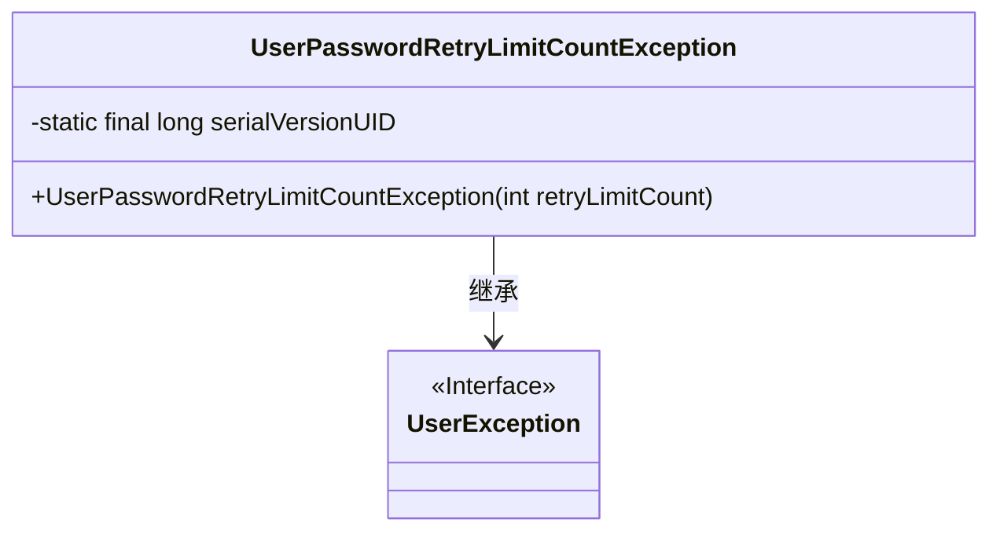
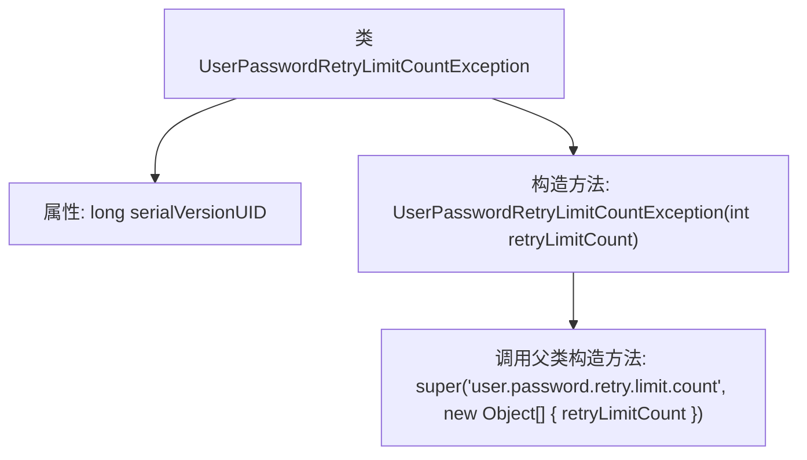

# 基础信息

|      |      |
|------|------|
| 名称 | UserPasswordRetryLimitCountException |
| 编码语言 | .java |
| 代码路径 | RuoYi-main/ruoyi-common/src/main/java/com/ruoyi/common/exception/user/UserPasswordRetryLimitCountException.java |
| 包名 | com.ruoyi.common.exception.user |
| 依赖项 | [] |
| 概述说明 | 用户密码重试超限异常类继承自用户异常类。 |

# 说明

用户密码重试次数超限异常类是一个自定义异常类，它继承自用户异常类。该异常类用于处理用户在进行密码验证时，因连续多次输入错误密码而触发的异常情况。通过继承用户异常类，该异常类能够复用父类的属性和方法，同时针对密码重试次数超限这一特定场景进行扩展和定制。这种设计有助于在系统中更准确地捕获和处理与密码验证相关的异常，提高系统的安全性和用户体验。

# 类列表 Class Summary

| 名称   | 类型  | 说明 |
|-------|------|-------------|
| UserPasswordRetryLimitCountException | class | 用户密码重试次数超限异常类，继承自用户异常类。 |

## 类 UserPasswordRetryLimitCountException

|      |      |
|------|------|
| 访问范围 | public |
| 类型 | class |
| 名称 | UserPasswordRetryLimitCountException |
| 说明 | 用户密码重试次数超限异常类，继承自用户异常类。 |

### UML类图

**描述：**  
`UserPasswordRetryLimitCountException` 是一个自定义异常类，继承自 `UserException`。它用于处理用户密码重试次数超过限制的情况。该类包含一个静态的 `serialVersionUID` 用于序列化，以及一个构造函数，接受一个整数参数 `retryLimitCount`，并将其传递给父类构造函数以生成异常信息。该异常类的主要作用是捕获并处理密码重试次数超过限制的场景。

### 内部方法调用关系图

这段代码定义了一个名为 `UserPasswordRetryLimitCountException` 的异常类，它继承自 `UserException`。该类包含一个静态的 `serialVersionUID` 属性和一个构造函数。构造函数接受一个 `retryLimitCount` 参数，并调用父类的构造函数，传递一个错误消息模板和一个包含 `retryLimitCount` 的对象数组。这个异常类通常用于处理用户密码重试次数超过限制的情况。

### 字段列表 Field List

| 名称  | 类型  | 说明 |
|-------|-------|------|
| serialVersionUID = 1L | long | 定义序列化版本UID为1L，确保类序列化兼容性。 |

### 方法列表 Method List

| 名称  | 类型  | 说明 |
|-------|-------|------|

