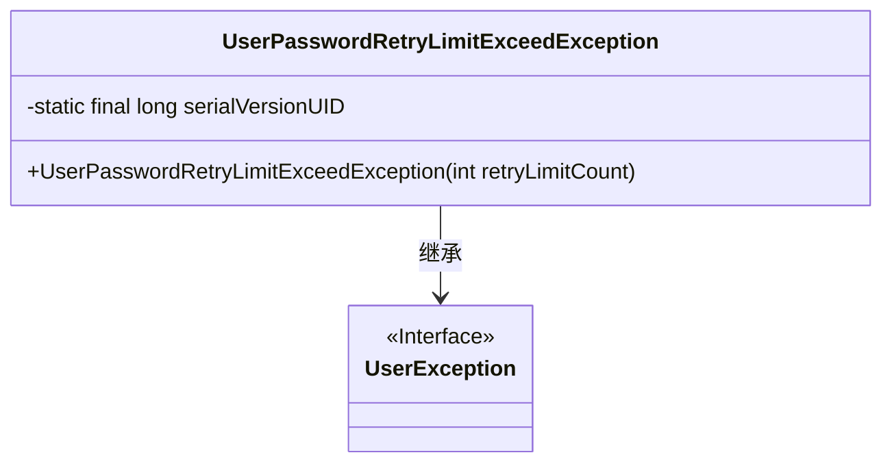
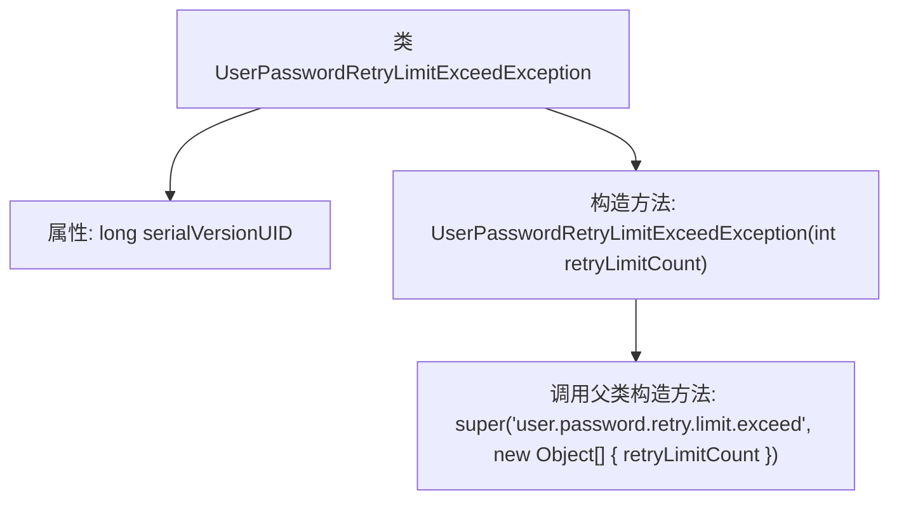

# 基础信息

|      |      |
|------|------|
| 名称 | UserPasswordRetryLimitExceedException |
| 编码语言 | .java |
| 代码路径 | RuoYi-main/ruoyi-common/src/main/java/com/ruoyi/common/exception/user/UserPasswordRetryLimitExceedException.java |
| 包名 | com.ruoyi.common.exception.user |
| 依赖项 | [] |
| 概述说明 | 用户密码重试次数超限异常类继承自用户异常。 |

# 说明

用户密码重试次数超限异常类是一个继承自用户异常的特定异常类型。该异常用于处理用户在尝试登录或验证密码时，因连续多次输入错误密码而超过预设重试次数限制的情况。通过继承用户异常，该异常类能够更好地融入现有的用户管理系统中，便于统一处理和记录相关错误信息。此类异常的设计有助于提高系统的安全性和用户体验，防止暴力破解密码等安全威胁。

# 类列表 Class Summary

| 名称   | 类型  | 说明 |
|-------|------|-------------|
| UserPasswordRetryLimitExceedException | class | 用户密码重试次数超限异常类，继承自用户异常。 |

## 类 UserPasswordRetryLimitExceedException

|      |      |
|------|------|
| 访问范围 | public |
| 类型 | class |
| 名称 | UserPasswordRetryLimitExceedException |
| 说明 | 用户密码重试次数超限异常类，继承自用户异常。 |

### UML类图

这段代码定义了一个名为 `UserPasswordRetryLimitExceedException` 的异常类，它继承自 `UserException`。该类用于表示用户密码重试次数超过限制的情况。类中包含一个静态的 `serialVersionUID` 用于序列化，以及一个构造函数，该构造函数接受一个整数参数 `retryLimitCount`，并将其传递给父类的构造函数以生成异常消息。

### 内部方法调用关系图

这段代码定义了一个名为 `UserPasswordRetryLimitExceedException` 的异常类，它继承自 `UserException`。该类包含一个静态的 `serialVersionUID` 属性和一个构造函数。构造函数接收一个整数参数 `retryLimitCount`，并调用父类的构造函数，传递一个错误消息和包含 `retryLimitCount` 的对象数组。这个异常类用于处理用户密码重试次数超过限制的情况。

### 字段列表 Field List

| 名称  | 类型  | 说明 |
|-------|-------|------|
| serialVersionUID = 1L | long | 声明一个静态不可变的序列化版本标识符。 |

### 方法列表 Method List

| 名称  | 类型  | 说明 |
|-------|-------|------|

