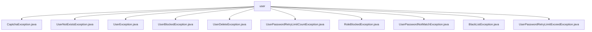

# 基础信息

|      |      |
|------|------|
| 名称 | user |
| 编码语言 | .java |
| 代码路径 | RuoYi-main/ruoyi-common/src/main/java/com/ruoyi/common/exception/user |
| 包名 | RuoYi-main.ruoyi-common.src.main.java.com.ruoyi.common.exception.user |
| 概述说明 | 多个自定义异常类继承UserException，处理验证码、用户不存在、密码错误等场景，提升代码维护性和用户体验。 |

# 说明

## 概述
该代码模块主要包含一系列自定义异常类，这些异常类均继承自`UserException`，专门用于处理与用户相关的各种异常场景。通过继承`UserException`，这些异常类能够复用父类的异常处理机制，同时针对特定的用户操作或状态（如验证码错误、用户不存在、用户被封锁等）提供更精确的异常处理逻辑。这种设计不仅提高了代码的可维护性，还增强了系统的健壮性和用户体验。

## 主要业务场景
1. **验证码错误处理**：`CaptchaException`用于处理用户输入验证码错误的情况，确保系统能够捕获并提供相应的错误提示。
2. **用户不存在处理**：`UserNotExistsException`用于处理用户不存在的情况，通常在用户登录或查询用户信息时使用。
3. **用户封锁处理**：`UserBlockedException`用于处理用户被封锁的情况，通常在用户登录或执行某些操作时使用。
4. **用户删除处理**：`UserDeleteException`用于处理用户删除操作中可能出现的异常情况，确保系统能够正确处理这些异常。
5. **密码重试次数超限处理**：`UserPasswordRetryLimitCountException`和`UserPasswordRetryLimitExceedException`用于处理用户连续多次输入错误密码而超过预设重试次数限制的情况，提高系统的安全性。
6. **角色封锁处理**：`RoleBlockedException`用于处理用户角色被阻止的情况，通常在用户登录或执行某些操作时使用。
7. **密码不匹配处理**：`UserPasswordNotMatchException`用于处理用户密码不匹配的情况，通常在用户登录或验证密码时使用。
8. **黑名单处理**：`BlackListException`用于处理用户因被列入黑名单而无法登录的情况，确保系统能够捕获并提供相应的错误提示。

这些异常类的设计使得系统能够更精确地捕获和处理与用户相关的各种异常场景，提高了代码的可读性、可维护性和系统的安全性。

### 包内部结构视图

该流程图展示了`user`目录下的多个异常类文件。`user`作为根节点，直接连接到多个具体的异常类文件，这些文件分别处理不同的用户相关异常情况，如验证码错误、用户不存在、用户被锁定等。每个异常类文件都直接依赖于`user`目录，清晰地展示了它们之间的层级关系。

# 文件列表 File List

| 名称   | 类型  | 说明 |
|-------|------|-------------|
| [BlackListException.java](BlackListException.md) | file | BlackListException继承UserException，处理登录被阻止。 |
| [RoleBlockedException.java](RoleBlockedException.md) | file | RoleBlockedException继承UserException，表示角色被阻止。 |
| [UserException.java](UserException.md) | file | 自定义用户异常类继承基础异常，包含序列化ID和构造方法。 |
| [UserPasswordRetryLimitExceedException.java](UserPasswordRetryLimitExceedException.md) | file | 用户密码重试次数超限异常类继承自用户异常。 |
| [UserPasswordNotMatchException.java](UserPasswordNotMatchException.md) | file | 用户密码不匹配异常类继承自用户异常类。 |
| [UserPasswordRetryLimitCountException.java](UserPasswordRetryLimitCountException.md) | file | 用户密码重试超限异常类继承自用户异常类。 |
| [UserDeleteException.java](UserDeleteException.md) | file | UserDeleteException继承UserException，用于处理用户删除异常。 |
| [UserBlockedException.java](UserBlockedException.md) | file | 自定义异常类，表示用户被封锁，继承自UserException。 |
| [UserNotExistsException.java](UserNotExistsException.md) | file | 用户不存在异常类继承自用户异常类。 |
| [CaptchaException.java](CaptchaException.md) | file | CaptchaException继承UserException，处理验证码错误。 |

