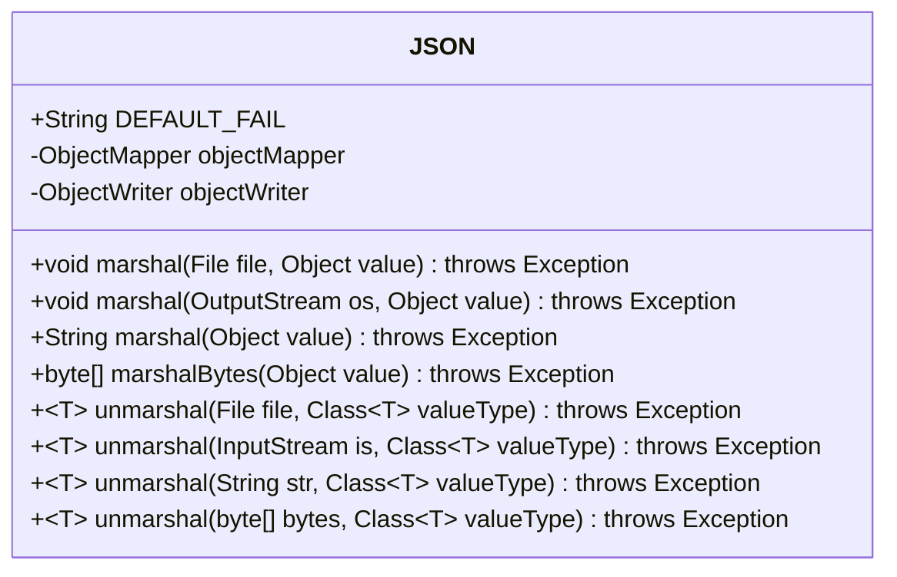

# 基础信息

|      |      |
|------|------|
| 名称 | JSON |
| 编码语言 | .java |
| 代码路径 | RuoYi-main/ruoyi-common/src/main/java/com/ruoyi/common/json/JSON.java |
| 包名 | com.ruoyi.common.json |
| 依赖项 | ['java.io.File', 'java.io.IOException', 'java.io.InputStream', 'java.io.OutputStream', 'com.fasterxml.jackson.core.JsonGenerationException', 'com.fasterxml.jackson.core.JsonParseException', 'com.fasterxml.jackson.databind.JsonMappingException', 'com.fasterxml.jackson.databind.ObjectMapper', 'com.fasterxml.jackson.databind.ObjectWriter'] |
| 概述说明 | JSON工具类支持文件、流、字符串和字节数组的序列化与反序列化。 |

# 说明

JSON序列化与反序列化工具类提供了一种高效的方式来处理JSON数据。它支持多种数据格式的操作，包括文件、流、字符串和字节数组。用户可以通过该工具类将对象序列化为JSON格式，或将JSON数据反序列化为对象。无论是从文件中读取JSON数据，还是将JSON数据写入流中，该工具类都能轻松应对。此外，它还支持处理字符串和字节数组形式的JSON数据，为用户提供了灵活的数据处理方式。该工具类的设计旨在简化JSON数据的处理流程，提高开发效率。

# 类列表 Class Summary

| 名称   | 类型  | 说明 |
|-------|------|-------------|
| JSON | class | JSON序列化与反序列化工具类，支持文件、流、字符串和字节数组操作。 |

## 类 JSON

|      |      |
|------|------|
| 访问范围 | public |
| 类型 | class |
| 名称 | JSON |
| 说明 | JSON序列化与反序列化工具类，支持文件、流、字符串和字节数组操作。 |

### UML类图

这段代码定义了一个名为 `JSON` 的类，主要用于将对象序列化为 JSON 格式以及将 JSON 数据反序列化为对象。类中包含多个 `marshal` 和 `unmarshal` 方法，分别用于处理不同类型的输入输出流、文件、字符串和字节数组。所有方法都捕获了可能的异常，并将其重新抛出为 `Exception`。`ObjectMapper` 和 `ObjectWriter` 是类中用于处理 JSON 序列化和反序列化的核心对象。

### 内部方法调用关系图

```mermaid
graph TD
    A["类JSON"]
    B["常量: String DEFAULT_FAIL"]
    C["静态变量: ObjectMapper objectMapper"]
    D["静态变量: ObjectWriter objectWriter"]
    E["方法: void marshal(File file, Object value)"]
    F["方法: void marshal(OutputStream os, Object value)"]
    G["方法: String marshal(Object value)"]
    H["方法: byte[] marshalBytes(Object value)"]
    I["方法: <T> T unmarshal(File file, Class<T> valueType)"]
    J["方法: <T> T unmarshal(InputStream is, Class<T> valueType)"]
    K["方法: <T> T unmarshal(String str, Class<T> valueType)"]
    L["方法: <T> T unmarshal(byte[] bytes, Class<T> valueType)"]

    A --> B
    A --> C
    A --> D
    A --> E
    A --> F
    A --> G
    A --> H
    A --> I
    A --> J
    A --> K
    A --> L
```

该流程图展示了`JSON`类的结构和主要方法。`JSON`类包含一个常量`DEFAULT_FAIL`和两个静态变量`objectMapper`和`objectWriter`。类中定义了多个`marshal`和`unmarshal`方法，用于将对象序列化为JSON格式或从JSON格式反序列化为对象。每个方法都处理了可能的异常情况，并将异常重新抛出为`Exception`。

### 字段列表 Field List

| 名称  | 类型  | 说明 |
|-------|-------|------|
| DEFAULT_FAIL = "\"Parse failed\"" | String | 定义常量字符串DEFAULT_FAIL，值为"Parse failed"。 |
| objectMapper = new ObjectMapper() | ObjectMapper | 定义并初始化了一个静态且不可变的ObjectMapper对象。 |
| objectWriter = objectMapper.writerWithDefaultPrettyPrinter() | ObjectWriter | 创建默认格式的ObjectWriter对象实例。 |

### 方法列表 Method List

| 名称  | 类型  | 说明 |
|-------|-------|------|
| marshal | String | 将对象序列化为JSON字符串，捕获并抛出相关异常。 |
| marshalBytes | byte[] | 将对象序列化为字节数组，捕获并抛出异常。 |
| unmarshal | T | 将文件反序列化为指定类型的对象，捕获并转换异常。 |
| marshal | void | 将对象序列化为JSON文件，捕获并处理可能的异常。 |
| unmarshal | T | 将字节数组反序列化为指定类型的对象，处理异常并返回结果。 |
| unmarshal | T | 将字符串反序列化为指定类型对象，捕获并抛出异常。 |
| unmarshal | T | 静态方法unmarshal将输入流反序列化为指定类型对象，捕获并转换异常。 |
| marshal | void | 将对象序列化并写入输出流，捕获异常并抛出。 |

