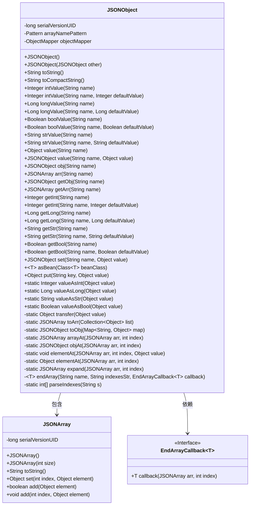

# 基础信息

|      |      |
|------|------|
| 名称 | JSONObject |
| 编码语言 | .java |
| 代码路径 | RuoYi-main/ruoyi-common/src/main/java/com/ruoyi/common/json/JSONObject.java |
| 包名 | com.ruoyi.common.json |
| 依赖项 | ['java.util.ArrayList', 'java.util.Collection', 'java.util.LinkedHashMap', 'java.util.List', 'java.util.Map', 'java.util.StringTokenizer', 'java.util.regex.Matcher', 'java.util.regex.Pattern', 'com.fasterxml.jackson.databind.ObjectMapper', 'com.ruoyi.common.utils.StringUtils'] |
| 概述说明 | JSONObject类扩展LinkedHashMap，支持JSON数据的获取与设置。 |

# 说明

JSONObject类继承自LinkedHashMap，专门用于处理JSON数据。它提供了对JSON数据的全面操作支持，包括对数组、对象以及字段值的获取与设置。通过扩展LinkedHashMap，JSONObject类能够高效地管理和操作JSON结构，确保数据的灵活性和可访问性。

# 类列表 Class Summary

| 名称   | 类型  | 说明 |
|-------|------|-------------|
| JSONObject | class | JSONObject类扩展LinkedHashMap，支持JSON数据操作，包括数组、对象、字段值的获取与设置。 |

## 类 JSONObject

|      |      |
|------|------|
| 访问范围 | public |
| 类型 | class |
| 名称 | JSONObject |
| 说明 | JSONObject类扩展LinkedHashMap，支持JSON数据操作，包括数组、对象、字段值的获取与设置。 |

### UML类图

这段代码定义了一个 `JSONObject` 类，它继承自 `LinkedHashMap<String, Object>`，用于处理 JSON 数据的解析和操作。`JSONObject` 提供了多种方法来获取和设置 JSON 字段的值，包括整型、长整型、布尔型和字符串等。此外，`JSONObject` 还包含一个内部类 `JSONArray`，用于处理 JSON 数组。`EndArrayCallback` 是一个泛型接口，用于处理多维数组的回调操作。代码通过 `transfer` 方法确保所有层次中的 `Map` 类型都能正确转换为 `JSONObject` 类型。

### 内部方法调用关系图

这段代码定义了一个`JSONObject`类，继承自`LinkedHashMap`，用于处理JSON数据。它包含多个方法用于获取和设置JSON字段的值，支持多种数据类型如整数、长整数、布尔值、字符串等。类中还定义了一个内部类`JSONArray`，用于处理JSON数组。代码通过正则表达式和递归处理多级字段名和数组下标，确保能够正确解析和操作复杂的JSON结构。

### 字段列表 Field List

| 名称  | 类型  | 说明 |
|-------|-------|------|
| serialVersionUID = 1L | long | 声明一个私有静态长整型常量serialVersionUID，值为1L。 |
| objectMapper = new ObjectMapper() | ObjectMapper | 声明并初始化一个私有的静态ObjectMapper对象。 |
| arrayNamePattern = Pattern.compile("(\\w+)((\\[\\d+\\])+)") | Pattern | 定义正则表达式匹配数组名及下标。 |

### 方法列表 Method List

| 名称  | 类型  | 说明 |
|-------|-------|------|
| arrayAt | JSONArray | 方法arrayAt扩展JSONArray至指定索引并返回该索引处的JSONArray。 |
| toArr | JSONArray | 将集合转换为JSON数组的方法。 |
| getArr | JSONArray | 获取指定名称的JSON数组对象。 |
| getStr | String | 方法getStr返回指定名称的字符串值。 |
| getObj | JSONObject | 获取指定名称的JSON对象。 |
| boolValue | Boolean | 该方法返回指定名称的布尔值，若不存在则返回默认值。 |
| intValue | Integer | 方法返回指定名称的整数值，若不存在则返回默认值。 |
| toCompactString | String | 将对象转换为JSON字符串，异常时抛出运行时错误。 |
| put | Object | 重写put方法，调用父类方法并转换值。 |
| longValue | Long | 该方法根据名称获取长整型值，若为空则返回默认值。 |
| getBool | Boolean | 该方法根据名称获取布尔值，若为空则返回默认值。 |
| toString | String | 重写toString方法，将对象转为JSON字符串，异常时抛出运行时异常。 |
| getInt | Integer | 该方法通过名称获取整数值。 |
| asBean | T | 将当前对象转换为指定类型的Bean，异常时抛出运行时异常。 |
| toObj | JSONObject | 将Map转换为JSONObject，遍历并转移键值对。 |
| strValue | String | 该方法接收字符串参数name，返回其转换后的字符串值。 |
| endArray | T | 解析索引字符串并调用回调函数处理数组。 |
| getBool | Boolean | 方法getBool通过name获取布尔值。 |
| value | Object | 方法根据名称查找对象值，支持嵌套对象和数组元素访问。 |
| expand | JSONArray | 扩展JSON数组至指定索引，未填充元素置为null。 |
| set | JSONObject | 该方法将键值对加入JSON对象并返回当前对象。 |
| valueAsLong | Long | 将对象转换为Long类型，支持多种类型输入。 |
| getLong | Long | 获取指定名称的Long值，若为空则返回默认值。 |
| getInt | Integer | 获取指定名称的整数值，若为空则返回默认值。 |
| strValue | String | 方法返回指定名称的字符串值，若为空则返回默认值。 |
| valueAsInt | Integer | 将对象转换为整数，支持多种类型。 |
| transfer | Object | 将Map或Collection转换为JSON对象或数组，否则返回原值。 |
| valueAsBool | Boolean | 方法将对象转换为布尔值，支持布尔、数字和字符串类型。 |
| getStr | String | 该方法通过`StringUtils.nvl`获取字符串值，若为空则返回默认值。 |
| arr | JSONArray | 该方法获取或创建指定名称的JSONArray对象，并返回它。 |
| elementAt | void | 该方法在JSON数组中指定索引处插入值，并扩展数组至所需大小。 |
| longValue | Long | 方法longValue通过valueAsLong转换value(name)的结果为Long类型。 |
| intValue | Integer | 方法intValue通过value方法获取字符串name的整数值。 |
| boolValue | Boolean | 方法boolValue通过name获取值并返回布尔类型结果。 |
| getLong | Long | 方法`getLong`通过`get`获取值并转换为`Long`类型。 |
| value | JSONObject | 方法`value`根据名称设置JSON对象值，支持嵌套和数组操作。 |
| elementAt | Object | 方法elementAt通过expand获取JSONArray中指定索引的元素。 |
| objAt | JSONObject | 静态方法`objAt`扩展JSON数组并在指定索引处返回或创建JSON对象。 |
| parseIndexes | int[] | 解析字符串中的索引并返回整型数组，若索引为负则抛出异常。 |
| obj | JSONObject | 方法根据名称匹配数组模式，匹配成功则调用回调处理，否则获取或创建JSON对象并返回。 |
| valueAsStr | String | 将对象转换为字符串，若为字符串直接返回，非空对象调用toString，否则返回null。 |

