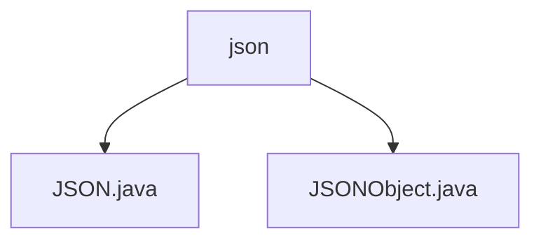

# 基础信息

|      |      |
|------|------|
| 名称 | json |
| 编码语言 | .java |
| 代码路径 | RuoYi-main/ruoyi-common/src/main/java/com/ruoyi/common/json |
| 包名 | RuoYi-main.ruoyi-common.src.main.java.com.ruoyi.common.json |
| 概述说明 | JSON工具类支持多种数据格式的序列化与反序列化，简化数据处理流程。JSONObject类继承LinkedHashMap，提供全面的JSON操作支持。 |

# 说明

## 概述
该代码模块主要提供了JSON数据的序列化与反序列化功能，以及JSON数据的操作支持。通过工具类和扩展的LinkedHashMap实现，模块能够高效地处理JSON格式的数据，支持多种数据格式的操作，包括文件、流、字符串和字节数组。模块的设计旨在简化JSON数据的处理流程，提高开发效率。

## 主要业务场景
1. **JSON序列化与反序列化**：通过`JSON.java`工具类，用户可以将对象序列化为JSON格式，或将JSON数据反序列化为对象。支持从文件、流、字符串和字节数组中读取和写入JSON数据，适用于需要将对象持久化或在不同系统间传输数据的场景。
2. **JSON数据操作**：通过`JSONObject.java`类，用户可以高效地管理和操作JSON结构。该类继承自`LinkedHashMap`，提供了对JSON数据的全面操作支持，包括对数组、对象以及字段值的获取与设置。适用于需要对JSON数据进行动态修改或查询的场景。

### 包内部结构视图

该流程图展示了RuoYi项目中`ruoyi-common`模块下的`json`目录及其包含的两个Java文件：`JSON.java`和`JSONObject.java`。`json`作为根节点，直接连接了两个子节点，清晰地反映了文件在目录中的层级关系。

# 文件列表 File List

| 名称   | 类型  | 说明 |
|-------|------|-------------|
| [JSONObject.java](JSONObject.md) | file | JSONObject类扩展LinkedHashMap，支持JSON数据的获取与设置。 |
| [JSON.java](JSON.md) | file | JSON工具类支持文件、流、字符串和字节数组的序列化与反序列化。 |

