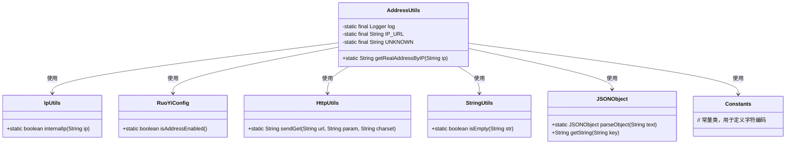
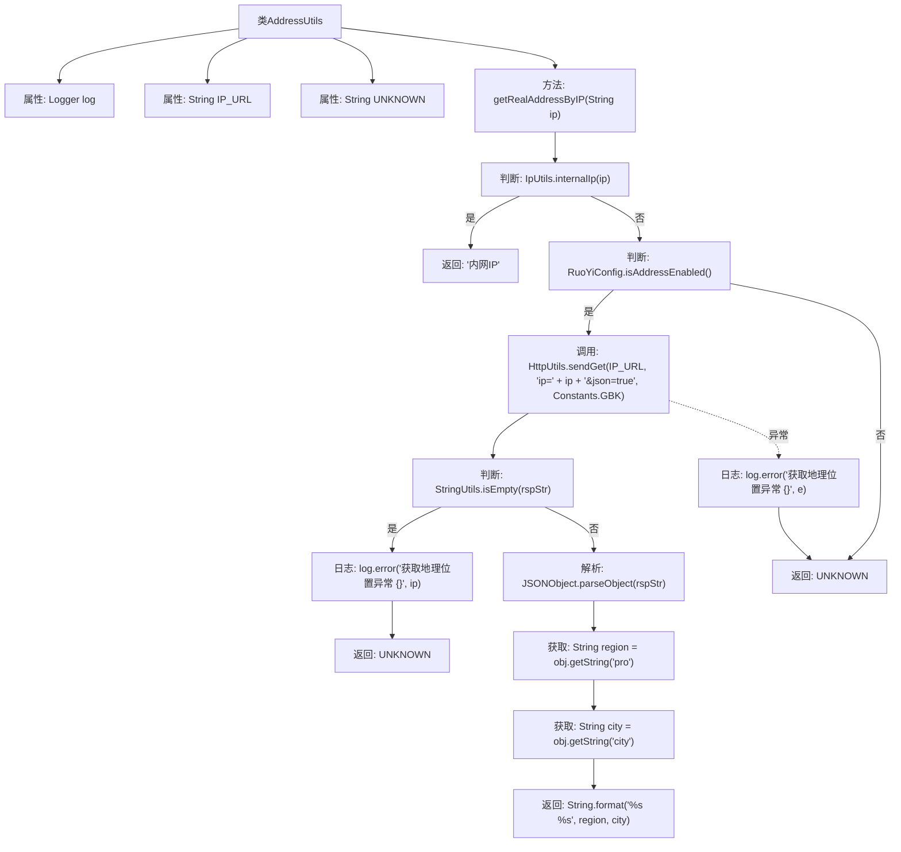

# 基础信息

|      |      |
|------|------|
| 名称 | AddressUtils |
| 编码语言 | .java |
| 代码路径 | RuoYi-main/ruoyi-common/src/main/java/com/ruoyi/common/utils/AddressUtils.java |
| 包名 | com.ruoyi.common.utils |
| 依赖项 | ['org.slf4j.Logger', 'org.slf4j.LoggerFactory', 'com.alibaba.fastjson.JSONObject', 'com.ruoyi.common.config.RuoYiConfig', 'com.ruoyi.common.constant.Constants', 'com.ruoyi.common.utils.http.HttpUtils'] |
| 概述说明 | AddressUtils类通过IP查询地理位置，内网IP返回“内网IP”，异常返回“XX XX”。 |

# 说明

AddressUtils类的主要功能是通过IP地址查询地理位置。当输入的是内网IP时，该类会返回“内网IP”作为结果。如果查询过程中出现异常情况，则会返回“XX XX”作为异常标识。该类设计简洁，专注于处理IP地址与地理位置的映射关系，同时具备对异常情况的处理能力。

# 类列表 Class Summary

| 名称   | 类型  | 说明 |
|-------|------|-------------|
| AddressUtils | class | AddressUtils类通过IP查询地理位置，内网IP返回“内网IP”，异常返回“XX XX”。 |

## 类 AddressUtils

|      |      |
|------|------|
| 访问范围 | public |
| 类型 | class |
| 名称 | AddressUtils |
| 说明 | AddressUtils类通过IP查询地理位置，内网IP返回“内网IP”，异常返回“XX XX”。 |

### UML类图

**描述：**
`AddressUtils` 类用于根据IP地址获取真实地理位置。它依赖于 `IpUtils` 类来检查IP是否为内网IP，`RuoYiConfig` 类来检查是否启用地址查询功能，`HttpUtils` 类来发送HTTP请求，`StringUtils` 类来检查字符串是否为空，`JSONObject` 类来解析JSON数据，以及 `Constants` 类来定义字符编码。如果IP为内网IP或地址查询功能未启用，则返回“内网IP”或“未知地址”。

### 内部方法调用关系图

这段代码用于根据IP地址获取真实的地理位置。首先判断IP是否为内网IP，如果是则返回“内网IP”。如果不是内网IP且地址查询功能启用，则通过HTTP请求获取地理位置信息。如果请求成功并返回有效数据，则解析JSON对象并返回地理位置；如果请求失败或返回空数据，则记录错误日志并返回“XX XX”表示未知地址。

### 字段列表 Field List

| 名称  | 类型  | 说明 |
|-------|-------|------|
| log = LoggerFactory.getLogger(AddressUtils.class) | Logger | 定义AddressUtils类的静态日志实例。 |
| UNKNOWN = "XX XX" | String | 定义常量UNKNOWN，值为"XX XX"。 |
| IP_URL = "http://whois.pconline.com.cn/ipJson.jsp" | String | 定义静态常量IP_URL，指向IP查询接口地址。 |

### 方法列表 Method List

| 名称  | 类型  | 说明 |
|-------|-------|------|
| getRealAddressByIP | String | 通过IP查询真实地址，内网IP直接返回，外网IP调用API获取地理位置信息。 |

