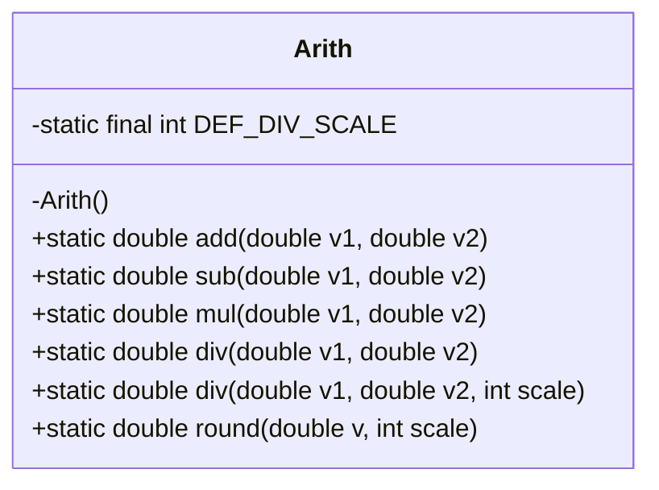
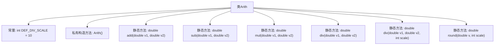

# 基础信息

|      |      |
|------|------|
| 名称 | Arith |
| 编码语言 | .java |
| 代码路径 | RuoYi-main/ruoyi-common/src/main/java/com/ruoyi/common/utils/Arith.java |
| 包名 | com.ruoyi.common.utils |
| 依赖项 | ['java.math.BigDecimal', 'java.math.RoundingMode'] |
| 概述说明 | Arith类实现精确运算，采用BigDecimal保障计算精度。 |

# 说明

Arith类提供了精确的加减乘除和四舍五入运算功能，通过使用BigDecimal类来确保运算的精度，避免浮点数计算中的精度丢失问题。

# 类列表 Class Summary

| 名称   | 类型  | 说明 |
|-------|------|-------------|
| Arith | class | Arith类提供精确的加减乘除和四舍五入运算，使用BigDecimal确保精度。 |

## 类 Arith

|      |      |
|------|------|
| 访问范围 | public |
| 类型 | class |
| 名称 | Arith |
| 说明 | Arith类提供精确的加减乘除和四舍五入运算，使用BigDecimal确保精度。 |

### UML类图

**描述：**  
`Arith` 类是一个用于执行精确数学运算的工具类，包含加法、减法、乘法、除法和四舍五入操作。该类使用 `BigDecimal` 来确保浮点数运算的精度，避免浮点数运算中的精度丢失问题。类中的方法均为静态方法，且类本身不能被实例化。除法运算支持自定义精度，四舍五入操作也支持指定小数点后保留的位数。

### 内部方法调用关系图

该流程图展示了`Arith`类的结构及其方法。`Arith`类包含一个常量`DEF_DIV_SCALE`、一个私有构造方法和多个静态方法，用于执行精确的加、减、乘、除以及四舍五入运算。每个方法都通过`BigDecimal`类来确保计算的精度，避免浮点数运算中的精度丢失问题。

### 字段列表 Field List

| 名称  | 类型  | 说明 |
|-------|-------|------|
| DEF_DIV_SCALE = 10 | int | 定义常量DEF_DIV_SCALE，值为10。 |

### 方法列表 Method List

| 名称  | 类型  | 说明 |
|-------|-------|------|
| sub | double | 该方法使用BigDecimal实现双精度浮点数减法，避免精度丢失。 |
| div | double | 该方法实现两个浮点数除法，支持指定小数位数并处理异常。 |
| add | double | 该方法通过BigDecimal实现两个浮点数的高精度加法运算。 |
| round | double | Java方法：四舍五入双精度数至指定小数位，支持正数或零。 |
| div | double | 静态方法div接收两个双精度参数，返回其商，默认精度为DEF_DIV_SCALE。 |
| mul | double | 使用BigDecimal实现双精度浮点数乘法，避免精度丢失。 |

