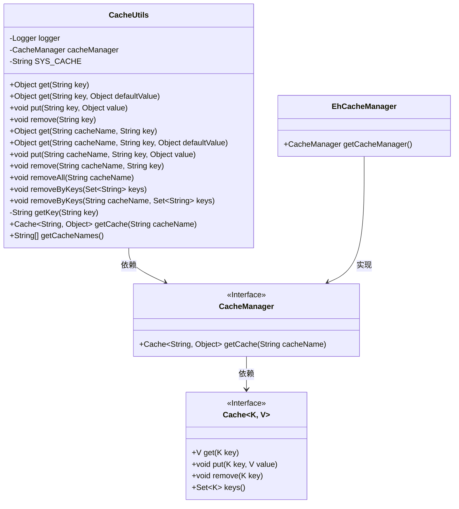
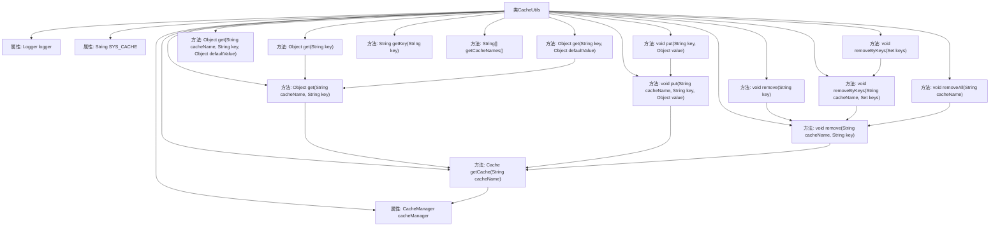

# 基础信息

|      |      |
|------|------|
| 名称 | CacheUtils |
| 编码语言 | .java |
| 代码路径 | RuoYi-main/ruoyi-common/src/main/java/com/ruoyi/common/utils/CacheUtils.java |
| 包名 | com.ruoyi.common.utils |
| 依赖项 | ['java.util.Iterator', 'java.util.Set', 'org.apache.shiro.cache.Cache', 'org.apache.shiro.cache.CacheManager', 'org.apache.shiro.cache.ehcache.EhCacheManager', 'org.slf4j.Logger', 'org.slf4j.LoggerFactory', 'com.ruoyi.common.utils.spring.SpringUtils'] |
| 概述说明 | CacheUtils类实现缓存管理，支持获取、写入、移除及清理操作。 |

# 说明

CacheUtils类是一个用于管理缓存的功能模块，提供了多种操作缓存的方法。它支持从缓存中获取数据、将数据写入缓存、移除缓存中的特定数据，以及执行清理操作以清空整个缓存。通过这些功能，用户可以有效地管理和控制缓存数据，确保系统的性能和效率。

# 类列表 Class Summary

| 名称   | 类型  | 说明 |
|-------|------|-------------|
| CacheUtils | class | CacheUtils类提供缓存管理功能，支持获取、写入、移除缓存及清理操作。 |

## 类 CacheUtils

|      |      |
|------|------|
| 访问范围 | public |
| 类型 | class |
| 名称 | CacheUtils |
| 说明 | CacheUtils类提供缓存管理功能，支持获取、写入、移除缓存及清理操作。 |

### UML类图

### 描述
`CacheUtils` 是一个工具类，用于管理与缓存相关的操作。它依赖于 `CacheManager` 接口来获取缓存实例，并通过 `Cache` 接口执行具体的缓存操作，如获取、写入、移除等。`EhCacheManager` 是 `CacheManager` 的一个实现类，提供了获取缓存管理器的方法。`CacheUtils` 提供了多种方法来处理缓存，包括获取缓存、写入缓存、移除缓存等，并且支持批量移除缓存项。

### 内部方法调用关系图

这段代码描述了一个缓存工具类 `CacheUtils`，它提供了对缓存的基本操作，包括获取、写入、移除缓存等功能。类中定义了一个默认缓存名称 `SYS_CACHE`，并通过 `CacheManager` 管理缓存。流程图展示了类中各个方法的调用关系，以及它们如何通过 `getCache` 方法获取缓存实例并进行操作。

### 字段列表 Field List

| 名称  | 类型  | 说明 |
|-------|-------|------|
| logger = LoggerFactory.getLogger(CacheUtils.class) | Logger | 定义CacheUtils类的静态日志记录器。 |
| cacheManager = SpringUtils.getBean(CacheManager.class) | CacheManager | 通过SpringUtils获取CacheManager实例并赋值给静态变量cacheManager。 |
| SYS_CACHE = "sys-cache" | String | 定义私有静态常量SYS_CACHE，值为"sys-cache"。 |

### 方法列表 Method List

| 名称  | 类型  | 说明 |
|-------|-------|------|
| removeByKeys | void | 静态方法移除缓存中指定键值，并记录清理日志。 |
| put | void | 静态方法put将键值对存入指定缓存中。 |
| get | Object | 获取指定键的值，若为空则返回默认值。 |
| getCache | Cache<String, Object> | 获取指定缓存，若不存在则抛出异常。 |
| getKey | String | 该方法接收一个字符串参数并直接返回该参数。 |
| get | Object | 静态方法`get`通过缓存名和键获取缓存对象。 |
| put | void | 静态方法put用于存储键值对到系统缓存中。 |
| removeAll | void | 静态方法移除指定缓存所有键值对并记录日志。 |
| removeByKeys | void | 静态方法removeByKeys通过传入键集移除系统缓存中的对应项。 |
| get | Object | 静态方法get通过key从SYS_CACHE中获取对象。 |
| get | Object | 静态方法get从缓存中获取值，若不存在则返回默认值。 |
| remove | void | 移除指定缓存名称和键对应的缓存项。 |
| remove | void | 静态方法remove用于删除指定键的值。 |
| getCacheNames | String[] | 该方法返回EhCacheManager中所有缓存的名称数组。 |

