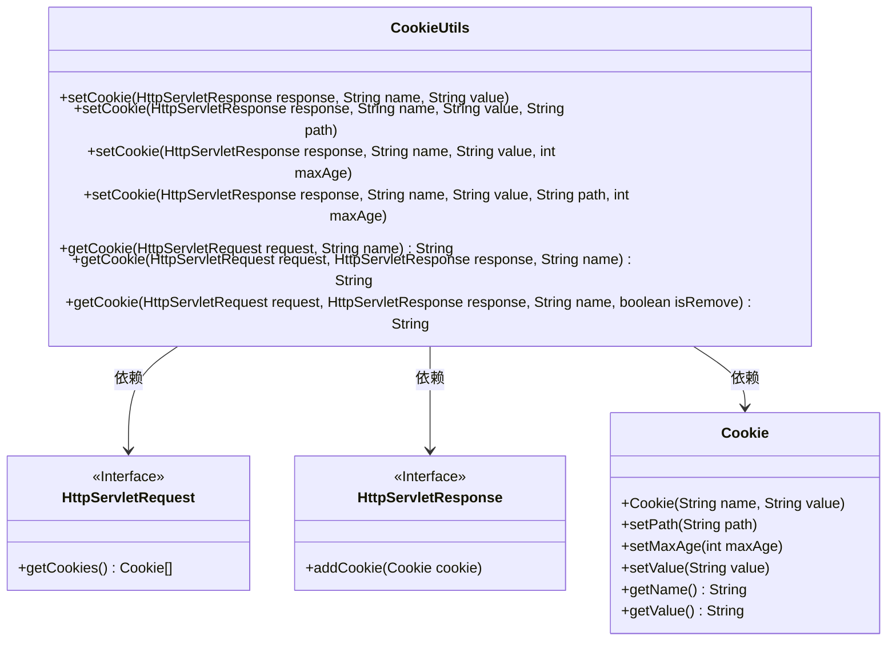
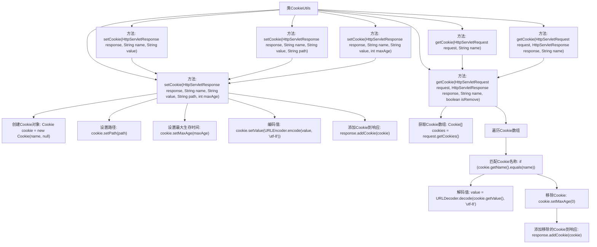

# 基础信息

|      |      |
|------|------|
| 名称 | CookieUtils |
| 编码语言 | .java |
| 代码路径 | RuoYi-main/ruoyi-common/src/main/java/com/ruoyi/common/utils/CookieUtils.java |
| 包名 | com.ruoyi.common.utils |
| 依赖项 | ['java.io.UnsupportedEncodingException', 'java.net.URLDecoder', 'java.net.URLEncoder', 'javax.servlet.http.Cookie', 'javax.servlet.http.HttpServletRequest', 'javax.servlet.http.HttpServletResponse'] |
| 概述说明 | CookieUtils类支持设置获取Cookie，处理路径、生存时间及编码。 |

# 说明

CookieUtils类是一个功能全面的工具类，主要用于处理Cookie的设置和获取操作。它支持对Cookie路径、生存时间以及编码方式进行灵活配置，确保Cookie在Web应用中的有效管理和使用。通过该工具类，开发者可以便捷地实现Cookie的相关功能，提升开发效率。

# 类列表 Class Summary

| 名称   | 类型  | 说明 |
|-------|------|-------------|
| CookieUtils | class | CookieUtils类提供设置和获取Cookie的功能，支持路径、生存时间和编码处理。 |

## 类 CookieUtils

|      |      |
|------|------|
| 访问范围 | public |
| 类型 | class |
| 名称 | CookieUtils |
| 说明 | CookieUtils类提供设置和获取Cookie的功能，支持路径、生存时间和编码处理。 |

### UML类图

**描述：**
`CookieUtils` 类提供了设置和获取 HTTP Cookie 的实用方法。它包含多个重载的 `setCookie` 方法，允许设置 Cookie 的名称、值、路径和最大生存时间，并支持编码和解码操作。`getCookie` 方法用于获取指定名称的 Cookie 值，并可选地移除该 Cookie。该类依赖于 `HttpServletRequest` 和 `HttpServletResponse` 接口以及 `Cookie` 类来实现其功能。

### 内部方法调用关系图

该流程图展示了`CookieUtils`类中的主要方法及其调用关系。`setCookie`方法通过不同的参数重载，最终调用最完整的`setCookie`方法来设置Cookie。`getCookie`方法则通过遍历请求中的Cookie数组，匹配指定名称的Cookie，并根据参数决定是否移除该Cookie。整个过程涵盖了Cookie的创建、设置、编码、解码和移除等操作。

### 字段列表 Field List

| 名称  | 类型  | 说明 |
|-------|-------|------|

### 方法列表 Method List

| 名称  | 类型  | 说明 |
|-------|-------|------|
| getCookie | String | 静态方法获取指定名称的HTTP请求Cookie。 |
| setCookie | void | 设置HTTP响应Cookie，默认有效期为24小时。 |
| setCookie | void | 静态方法设置cookie，包含名称、值、路径，默认有效期为24小时。 |
| getCookie | String | 获取并解码指定名称的Cookie，可选择移除。 |
| setCookie | void | 静态方法设置Cookie，包含名称、值、路径和最大年龄参数。 |
| setCookie | void | 静态方法设置HTTP响应Cookie，包含名称、值、路径和最大存活时间。 |
| getCookie | String | 静态方法getCookie从HttpServletRequest中获取指定名称的Cookie。 |

