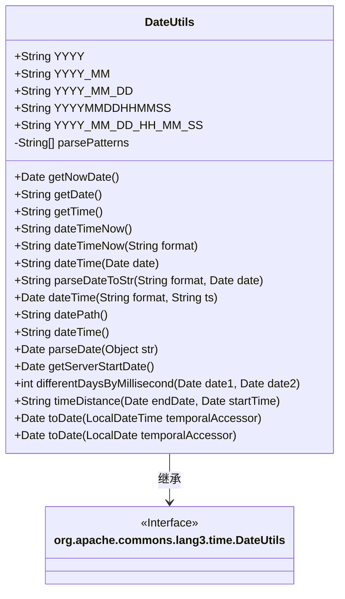

# 基础信息

|      |      |
|------|------|
| 名称 | DateUtils |
| 编码语言 | .java |
| 代码路径 | RuoYi-main/ruoyi-common/src/main/java/com/ruoyi/common/utils/DateUtils.java |
| 包名 | com.ruoyi.common.utils |
| 依赖项 | ['java.lang.management.ManagementFactory', 'java.text.ParseException', 'java.text.SimpleDateFormat', 'java.time.LocalDate', 'java.time.LocalDateTime', 'java.time.LocalTime', 'java.time.ZoneId', 'java.time.ZonedDateTime', 'java.util.Date', 'org.apache.commons.lang3.time.DateFormatUtils'] |
| 概述说明 | DateUtils类提供日期格式化、转换和计算功能，支持多种日期格式和操作。 |

# 说明

DateUtils类是一个功能丰富的工具类，主要用于处理日期相关的操作。它提供了日期格式化的功能，能够将日期转换为多种不同的格式，满足各种需求。此外，该类还支持日期的转换操作，可以将日期在不同格式之间进行转换。DateUtils类还包含了日期的计算功能，能够进行日期的加减、比较等操作，帮助开发者轻松处理复杂的日期逻辑。总之，DateUtils类是一个强大的日期处理工具，适用于各种需要日期操作的场景。

# 类列表 Class Summary

| 名称   | 类型  | 说明 |
|-------|------|-------------|
| DateUtils | class | DateUtils类提供日期格式化、转换、计算等功能，支持多种日期格式和操作。 |

## 类 DateUtils

|      |      |
|------|------|
| 访问范围 | public |
| 类型 | class |
| 名称 | DateUtils |
| 说明 | DateUtils类提供日期格式化、转换、计算等功能，支持多种日期格式和操作。 |

### UML类图

**描述**：`DateUtils` 类继承自 `org.apache.commons.lang3.time.DateUtils`，提供了多种日期和时间的处理方法。它包含静态字段定义常见的日期格式，以及多个静态方法用于获取当前日期、格式化日期、计算日期差等。该类还支持将 `LocalDateTime` 和 `LocalDate` 转换为 `Date` 类型，并提供了处理日期字符串的解析功能。通过这些方法，`DateUtils` 类简化了日期和时间的操作，增强了代码的可读性和可维护性。

### 内部方法调用关系图

```mermaid
graph TD
    A["类DateUtils"]
    B["静态属性: String YYYY"]
    C["静态属性: String YYYY_MM"]
    D["静态属性: String YYYY_MM_DD"]
    E["静态属性: String YYYYMMDDHHMMSS"]
    F["静态属性: String YYYY_MM_DD_HH_MM_SS"]
    G["静态属性: String[] parsePatterns"]
    H["静态方法: Date getNowDate()"]
    I["静态方法: String getDate()"]
    J["静态方法: String getTime()"]
    K["静态方法: String dateTimeNow()"]
    L["静态方法: String dateTimeNow(String format)"]
    M["静态方法: String dateTime(Date date)"]
    N["静态方法: String parseDateToStr(String format, Date date)"]
    O["静态方法: Date dateTime(String format, String ts)"]
    P["静态方法: String datePath()"]
    Q["静态方法: String dateTime()"]
    R["静态方法: Date parseDate(Object str)"]
    S["静态方法: Date getServerStartDate()"]
    T["静态方法: int differentDaysByMillisecond(Date date1, Date date2)"]
    U["静态方法: String timeDistance(Date endDate, Date startTime)"]
    V["静态方法: Date toDate(LocalDateTime temporalAccessor)"]
    W["静态方法: Date toDate(LocalDate temporalAccessor)"]

    A --> B
    A --> C
    A --> D
    A --> E
    A --> F
    A --> G
    A --> H
    A --> I
    A --> J
    A --> K
    A --> L
    A --> M
    A --> N
    A --> O
    A --> P
    A --> Q
    A --> R
    A --> S
    A --> T
    A --> U
    A --> V
    A --> W
```

**描述：**  
`DateUtils` 类是一个日期工具类，提供了多种日期格式的静态属性和方法，用于获取当前日期、格式化日期、解析日期字符串、计算日期差等操作。该类扩展了 `org.apache.commons.lang3.time.DateUtils`，并提供了额外的功能，如将 `LocalDateTime` 和 `LocalDate` 转换为 `Date` 类型。通过这些方法，开发者可以方便地处理各种日期和时间相关的操作。

### 字段列表 Field List

| 名称  | 类型  | 说明 |
|-------|-------|------|
| YYYY_MM_DD_HH_MM_SS = "yyyy-MM-dd HH:mm:ss" | String | 定义日期时间格式字符串常量。 |
| YYYY_MM = "yyyy-MM" | String | 定义静态字符串变量YYYY_MM，值为"yyyy-MM"。 |
| YYYY = "yyyy" | String | 定义静态字符串常量YYYY，值为"yyyy"。 |
| parsePatterns = {            "yyyy-MM-dd", "yyyy-MM-dd HH:mm:ss", "yyyy-MM-dd HH:mm", "yyyy-MM",             "yyyy/MM/dd", "yyyy/MM/dd HH:mm:ss", "yyyy/MM/dd HH:mm", "yyyy/MM",            "yyyy.MM.dd", "yyyy.MM.dd HH:mm:ss", "yyyy.MM.dd HH:mm", "yyyy.MM"} | String[] | 定义了多种日期时间格式解析模式。 |
| YYYYMMDDHHMMSS = "yyyyMMddHHmmss" | String | 定义静态字符串常量，表示日期时间格式为"yyyyMMddHHmmss"。 |
| YYYY_MM_DD = "yyyy-MM-dd" | String | 定义日期格式为"年-月-日"的静态字符串常量。 |

### 方法列表 Method List

| 名称  | 类型  | 说明 |
|-------|-------|------|
| getNowDate | Date | 获取当前日期的静态方法。 |
| parseDateToStr | String | 该方法将日期格式化为指定格式的字符串。 |
| parseDate | Date | 解析日期字符串，失败返回null。 |
| dateTime | String | 静态方法将日期转换为指定格式字符串。 |
| getDate | String | 静态方法返回当前日期，格式为YYYY_MM_DD。 |
| getServerStartDate | Date | 获取服务器启动时间并返回日期对象。 |
| toDate | Date | 将LocalDate转换为Date类型。 |
| timeDistance | String | 计算两个日期之间的天数、小时数和分钟数差。 |
| dateTimeNow | String | 该方法根据指定格式返回当前日期时间的字符串表示。 |
| dateTime | String | 静态方法dateTime返回当前日期的"yyyyMMdd"格式字符串。 |
| datePath | String | 静态方法datePath返回当前日期的格式化字符串"yyyy/MM/dd"。 |
| dateTimeNow | String | 静态方法返回当前日期时间，格式为YYYYMMDDHHMMSS。 |
| dateTime | Date | 静态方法将字符串按指定格式解析为日期对象，异常时抛出运行时异常。 |
| getTime | String | 静态方法getTime返回当前时间，格式为YYYY_MM_DD_HH_MM_SS。 |
| toDate | Date | 将LocalDateTime转换为系统默认时区的Date对象。 |
| differentDaysByMillisecond | int | 计算两个日期相差的天数，返回绝对值。 |

