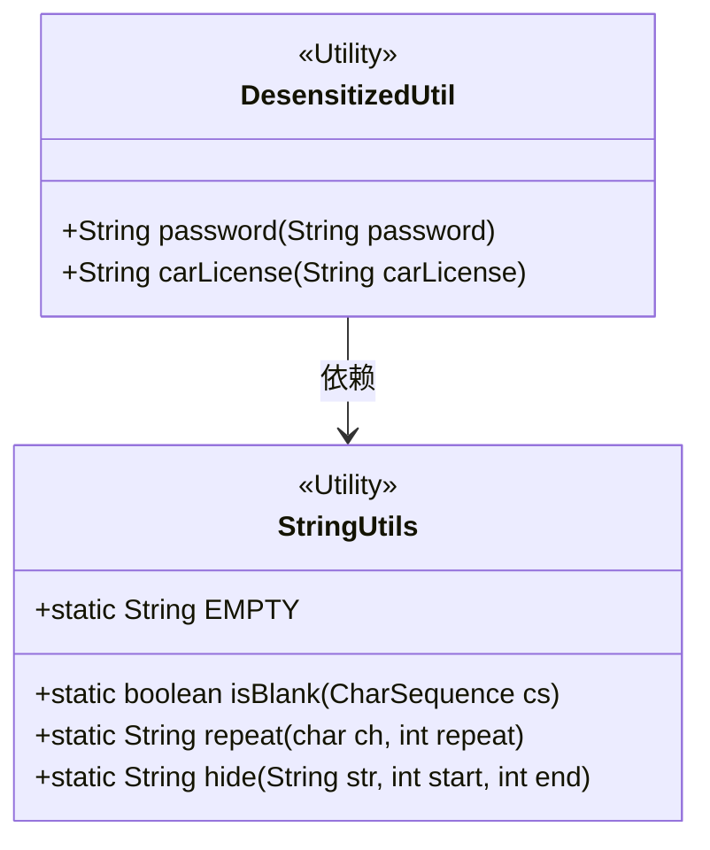
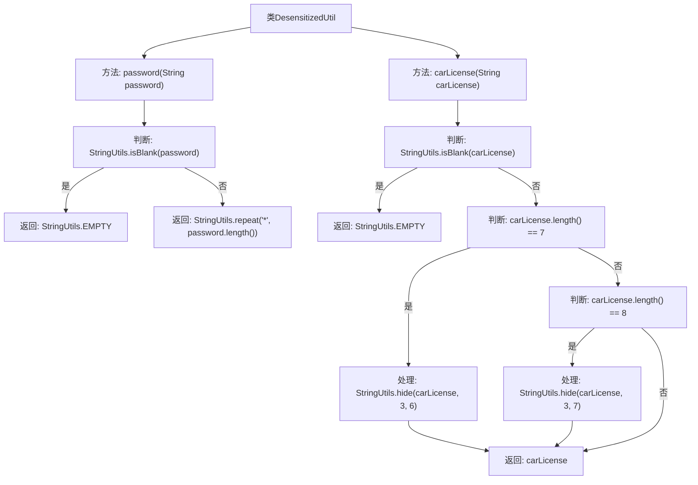

# 基础信息

|      |      |
|------|------|
| 名称 | DesensitizedUtil |
| 编码语言 | .java |
| 代码路径 | RuoYi-main/ruoyi-common/src/main/java/com/ruoyi/common/utils/DesensitizedUtil.java |
| 包名 | com.ruoyi.common.utils |
| 依赖项 | [] |
| 概述说明 | DesensitizedUtil类实现密码全*替换和车牌中间隐藏功能。 |

# 说明

DesensitizedUtil类提供了密码和车牌脱敏功能。对于密码，所有字符均被替换为星号，确保密码信息完全隐藏。对于车牌，中间部分被隐藏，仅保留部分可见，以保护车牌信息的隐私。该类通过这两种方式有效实现了敏感信息的脱敏处理。

# 类列表 Class Summary

| 名称   | 类型  | 说明 |
|-------|------|-------------|
| DesensitizedUtil | class | DesensitizedUtil类提供密码和车牌脱敏功能，密码全替换为*，车牌中间部分隐藏。 |

## 类 DesensitizedUtil

|      |      |
|------|------|
| 访问范围 | public |
| 类型 | class |
| 名称 | DesensitizedUtil |
| 说明 | DesensitizedUtil类提供密码和车牌脱敏功能，密码全替换为*，车牌中间部分隐藏。 |

### UML类图

这段代码定义了一个名为 `DesensitizedUtil` 的工具类，用于对敏感信息进行脱敏处理。该类包含两个静态方法：`password` 和 `carLicense`。`password` 方法将密码字符串全部替换为星号，`carLicense` 方法对车牌号进行部分隐藏处理。`DesensitizedUtil` 类依赖于 `StringUtils` 工具类，后者提供了字符串处理的常用方法，如判断字符串是否为空、重复字符、隐藏部分字符等。

### 内部方法调用关系图

这段代码定义了一个名为 `DesensitizedUtil` 的类，包含两个静态方法 `password` 和 `carLicense`，用于对密码和车牌号进行脱敏处理。`password` 方法将密码全部替换为 `*`，而 `carLicense` 方法根据车牌号长度对中间部分进行隐藏处理。流程图展示了两个方法的逻辑流程，包括输入判断、处理和返回结果。

### 字段列表 Field List

| 名称  | 类型  | 说明 |
|-------|-------|------|

### 方法列表 Method List

| 名称  | 类型  | 说明 |
|-------|-------|------|
| password | String | 静态方法password检查输入密码，若为空则返回空字符串，否则返回等长星号串。 |
| carLicense | String | 根据车牌长度隐藏部分字符，普通车牌隐藏3-6位，新能源车牌隐藏3-7位。 |

