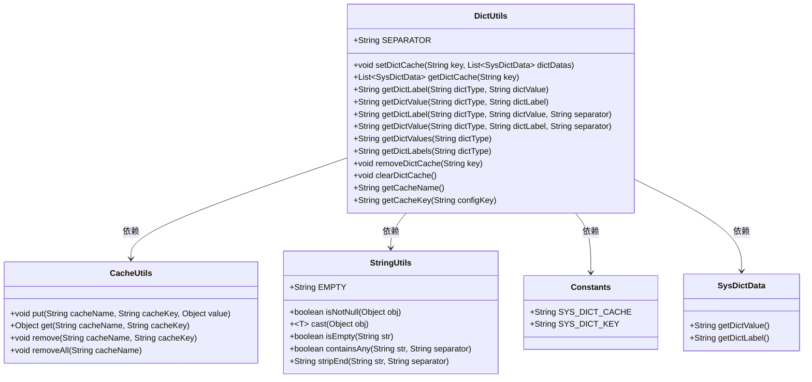

# 基础信息

|      |      |
|------|------|
| 名称 | DictUtils |
| 编码语言 | .java |
| 代码路径 | RuoYi-main/ruoyi-common/src/main/java/com/ruoyi/common/utils/DictUtils.java |
| 包名 | com.ruoyi.common.utils |
| 依赖项 | ['java.util.List', 'org.springframework.stereotype.Component', 'com.ruoyi.common.constant.Constants', 'com.ruoyi.common.core.domain.entity.SysDictData'] |
| 概述说明 | DictUtils类支持字典缓存操作，包括设置、获取、删除及类型值标签互查。 |

# 说明

DictUtils类是一个用于处理字典缓存操作的实用工具类，提供了多种功能以方便对缓存的管理。它支持设置缓存，即可以将键值对存储在缓存中；获取缓存，即根据键从缓存中检索对应的值；删除缓存，即从缓存中移除指定的键值对。此外，该类还支持根据类型和值获取标签或值，这意味着用户可以通过特定的类型和值来查询或获取相关的标签或值信息。这些功能使得DictUtils类在处理字典缓存时更加灵活和高效。

# 类列表 Class Summary

| 名称   | 类型  | 说明 |
|-------|------|-------------|
| DictUtils | class | DictUtils类提供字典缓存操作，支持设置、获取、删除缓存，及根据类型和值获取标签或值。 |

## 类 DictUtils

|      |      |
|------|------|
| 访问范围 | @Component;public |
| 类型 | class |
| 名称 | DictUtils |
| 说明 | DictUtils类提供字典缓存操作，支持设置、获取、删除缓存，及根据类型和值获取标签或值。 |

### UML类图

**描述：**  
`DictUtils` 类是一个工具类，主要用于管理字典数据的缓存操作。它提供了设置、获取、删除和清空字典缓存的方法，并且能够根据字典类型和值获取对应的标签或值。`DictUtils` 依赖于 `CacheUtils` 进行缓存操作，依赖于 `StringUtils` 进行字符串处理，依赖于 `Constants` 获取缓存名称和键，依赖于 `SysDictData` 获取字典数据的值和标签。

### 内部方法调用关系图

```mermaid
graph TD
    A["类DictUtils"]
    B["属性: String SEPARATOR"]
    C["方法: setDictCache(String key, List<SysDictData> dictDatas)"]
    D["方法: getDictCache(String key)"]
    E["方法: getDictLabel(String dictType, String dictValue)"]
    F["方法: getDictValue(String dictType, String dictLabel)"]
    G["方法: getDictLabel(String dictType, String dictValue, String separator)"]
    H["方法: getDictValue(String dictType, String dictLabel, String separator)"]
    I["方法: getDictValues(String dictType)"]
    J["方法: getDictLabels(String dictType)"]
    K["方法: removeDictCache(String key)"]
    L["方法: clearDictCache()"]
    M["方法: getCacheName()"]
    N["方法: getCacheKey(String configKey)"]
    O["调用: CacheUtils.put(getCacheName(), getCacheKey(key), dictDatas)"]
    P["调用: CacheUtils.get(getCacheName(), getCacheKey(key))"]
    Q["调用: StringUtils.isNotNull(cacheObj)"]
    R["调用: StringUtils.cast(cacheObj)"]
    S["调用: StringUtils.isEmpty(dictValue)"]
    T["调用: StringUtils.isEmpty(dictLabel)"]
    U["调用: StringUtils.isNull(datas)"]
    V["调用: StringUtils.containsAny(dictValue, separator)"]
    W["调用: StringUtils.stripEnd(propertyString.toString(), separator)"]
    X["调用: CacheUtils.remove(getCacheName(), getCacheKey(key))"]
    Y["调用: CacheUtils.removeAll(getCacheName())"]

    A --> B
    A --> C
    A --> D
    A --> E
    A --> F
    A --> G
    A --> H
    A --> I
    A --> J
    A --> K
    A --> L
    A --> M
    A --> N
    C --> O
    D --> P
    D --> Q
    D --> R
    E --> S
    F --> T
    G --> U
    G --> V
    G --> W
    H --> U
    H --> V
    H --> W
    I --> U
    I --> W
    J --> U
    J --> W
    K --> X
    L --> Y
```

这段代码是一个用于管理字典缓存的工具类 `DictUtils`。它提供了多种方法来设置、获取、删除和清空字典缓存，以及根据字典类型和值获取标签或值。代码中使用了 `CacheUtils` 来操作缓存，并通过 `StringUtils` 进行字符串处理。流程图展示了类中各个方法之间的调用关系，以及它们如何通过 `CacheUtils` 和 `StringUtils` 完成具体的功能。

### 字段列表 Field List

| 名称  | 类型  | 说明 |
|-------|-------|------|
| SEPARATOR = "," | String | 定义静态常量SEPARATOR，值为逗号。 |

### 方法列表 Method List

| 名称  | 类型  | 说明 |
|-------|-------|------|
| getDictLabel | String | 获取字典标签，空值返回空字符串。 |
| getCacheName | String | 获取系统字典缓存名称的方法。 |
| removeDictCache | void | 移除指定键的字典缓存。 |
| getDictValue | String | 根据字典类型和标签获取值，若标签为空则返回空字符串。 |
| setDictCache | void | 静态方法`setDictCache`用于将字典数据存入缓存，键为`key`，值为`dictDatas`。 |
| getDictLabels | String | 静态方法获取字典标签，拼接后返回去除分隔符的字符串。 |
| getCacheKey | String | 生成缓存键方法，返回系统字典键与配置键的组合。 |
| getDictValues | String | 获取字典类型值并拼接成字符串，空数据返回空字符串。 |
| getDictCache | List<SysDictData> | 通过缓存键获取系统字典数据，若存在则返回，否则返回空。 |
| clearDictCache | void | 清除字典缓存方法，调用CacheUtils移除所有缓存。 |
| getDictLabel | String | 获取字典标签，支持多值分隔符处理，返回匹配标签。 |
| getDictValue | String | 方法通过字典类型和标签获取值，支持多标签分隔符处理。 |

