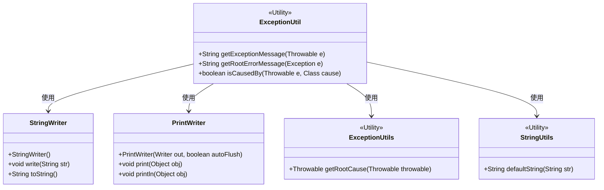
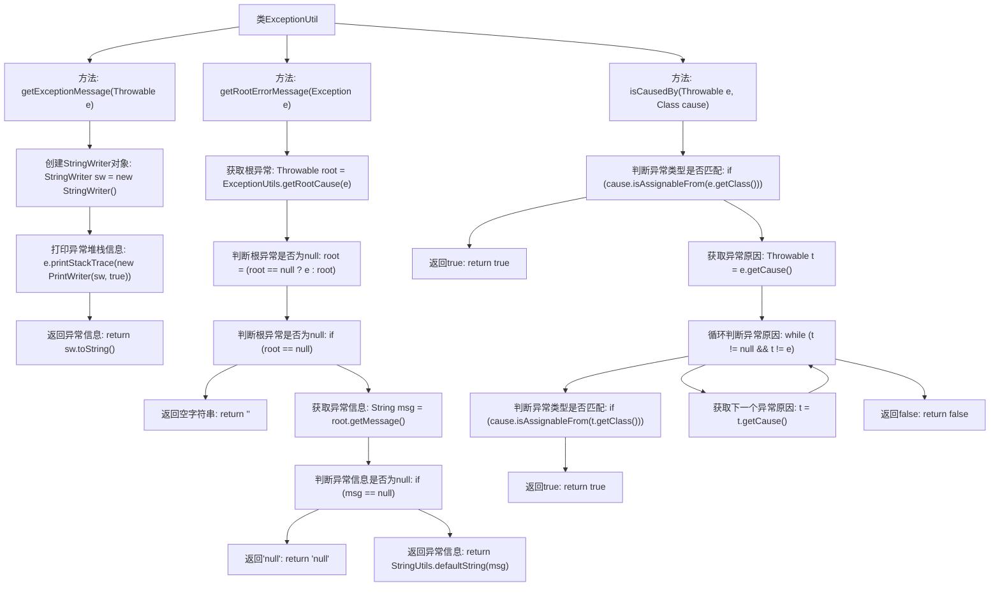

# 基础信息

|      |      |
|------|------|
| 名称 | ExceptionUtil |
| 编码语言 | .java |
| 代码路径 | RuoYi-main/ruoyi-common/src/main/java/com/ruoyi/common/utils/ExceptionUtil.java |
| 包名 | com.ruoyi.common.utils |
| 依赖项 | ['java.io.PrintWriter', 'java.io.StringWriter', 'org.apache.commons.lang3.exception.ExceptionUtils'] |
| 概述说明 | ExceptionUtil类用于获取异常信息及判断异常原因。 |

# 说明

ExceptionUtil类是一个工具类，主要用于处理异常相关的操作。它提供了两个核心功能：一是获取异常信息，即从异常对象中提取详细的错误描述或堆栈信息；二是判断异常原因，即通过分析异常对象来确定其根本原因或触发条件。这类工具类通常用于简化异常处理流程，帮助开发者更高效地调试和定位问题。

# 类列表 Class Summary

| 名称   | 类型  | 说明 |
|-------|------|-------------|
| ExceptionUtil | class | ExceptionUtil类提供获取异常信息和判断异常原因的方法。 |

## 类 ExceptionUtil

|      |      |
|------|------|
| 访问范围 | public |
| 类型 | class |
| 名称 | ExceptionUtil |
| 说明 | ExceptionUtil类提供获取异常信息和判断异常原因的方法。 |

### UML类图

这段代码定义了一个名为 `ExceptionUtil` 的工具类，用于处理异常相关的操作。该类包含三个静态方法：`getExceptionMessage` 用于获取异常的详细错误信息，`getRootErrorMessage` 用于获取异常的根错误信息，`isCausedBy` 用于检测异常是否由特定类型的异常触发。`ExceptionUtil` 类依赖于 `StringWriter`、`PrintWriter`、`ExceptionUtils` 和 `StringUtils` 等工具类来完成其功能。这些工具类分别用于字符串处理、异常根原因获取以及字符串默认值处理等操作。

### 内部方法调用关系图

这段代码定义了一个`ExceptionUtil`类，其中包含三个方法：`getExceptionMessage`用于获取异常的详细堆栈信息；`getRootErrorMessage`用于获取异常的根原因信息；`isCausedBy`用于判断异常是否由特定类型的异常触发。通过这些方法，可以更方便地处理和诊断异常信息。

### 字段列表 Field List

| 名称  | 类型  | 说明 |
|-------|-------|------|

### 方法列表 Method List

| 名称  | 类型  | 说明 |
|-------|-------|------|
| isCausedBy | boolean | 判断异常是否由指定类型引起，递归检查异常链。 |
| getExceptionMessage | String | 获取异常信息并返回字符串。 |
| getRootErrorMessage | String | 获取异常根错误信息，若无则返回空或null。 |

