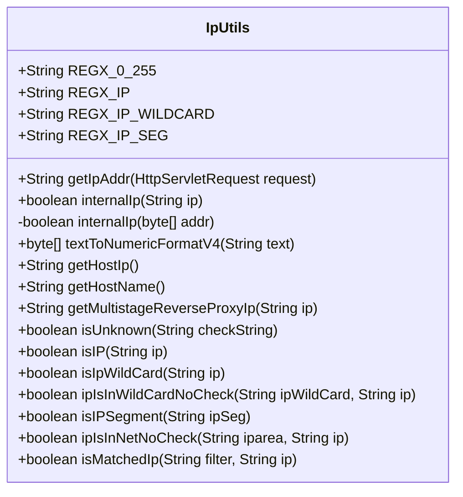

# 基础信息

|      |      |
|------|------|
| 名称 | IpUtils |
| 编码语言 | .java |
| 代码路径 | RuoYi-main/ruoyi-common/src/main/java/com/ruoyi/common/utils/IpUtils.java |
| 包名 | com.ruoyi.common.utils |
| 依赖项 | ['java.net.InetAddress', 'java.net.UnknownHostException', 'javax.servlet.http.HttpServletRequest'] |
| 概述说明 | IpUtils类提供IP地址处理功能，包括获取、检查、转换、匹配和验证等操作。 |

# 说明

IpUtils类是一个专门用于处理IP地址的工具类，提供了多种实用功能。这些功能包括获取客户端IP地址、检查IP地址是否为内部地址、进行IP地址格式的转换、支持通配符匹配以及验证IP地址是否属于特定网段。通过这些功能，开发者可以方便地进行IP地址的相关操作和验证，提升开发效率和准确性。

# 类列表 Class Summary

| 名称   | 类型  | 说明 |
|-------|------|-------------|
| IpUtils | class | IpUtils类提供IP地址处理功能，包括获取客户端IP、检查内部IP、IP格式转换、通配符匹配及网段验证等。 |

## 类 IpUtils

|      |      |
|------|------|
| 访问范围 | public |
| 类型 | class |
| 名称 | IpUtils |
| 说明 | IpUtils类提供IP地址处理功能，包括获取客户端IP、检查内部IP、IP格式转换、通配符匹配及网段验证等。 |

### UML类图

这段代码定义了一个名为 `IpUtils` 的工具类，主要用于处理与IP地址相关的操作。类中包含多个静态方法，用于获取客户端IP、检查IP是否为内部IP、将IP地址转换为字节数组、获取本地主机IP和主机名、处理多级反向代理IP、判断IP是否在指定网段或通配符范围内等。此外，类中还定义了几个正则表达式常量，用于匹配IP地址、通配符IP和IP段。这些方法广泛应用于网络请求处理、IP地址校验和过滤等场景。

### 内部方法调用关系图

```mermaid
graph TD
    A["类IpUtils"]
    B["常量: REGX_0_255"]
    C["常量: REGX_IP"]
    D["常量: REGX_IP_WILDCARD"]
    E["常量: REGX_IP_SEG"]
    F["方法: getIpAddr(HttpServletRequest request)"]
    G["方法: internalIp(String ip)"]
    H["方法: internalIp(byte[] addr)"]
    I["方法: textToNumericFormatV4(String text)"]
    J["方法: getHostIp()"]
    K["方法: getHostName()"]
    L["方法: getMultistageReverseProxyIp(String ip)"]
    M["方法: isUnknown(String checkString)"]
    N["方法: isIP(String ip)"]
    O["方法: isIpWildCard(String ip)"]
    P["方法: ipIsInWildCardNoCheck(String ipWildCard, String ip)"]
    Q["方法: isIPSegment(String ipSeg)"]
    R["方法: ipIsInNetNoCheck(String iparea, String ip)"]
    S["方法: isMatchedIp(String filter, String ip)"]

    A --> B
    A --> C
    A --> D
    A --> E
    A --> F
    A --> G
    A --> H
    A --> I
    A --> J
    A --> K
    A --> L
    A --> M
    A --> N
    A --> O
    A --> P
    A --> Q
    A --> R
    A --> S
```

这段代码定义了一个名为 `IpUtils` 的类，主要用于处理与IP地址相关的操作。类中包含了多个常量和静态方法，用于验证IP地址的格式、检查IP地址是否为内部地址、获取客户端IP地址、将IP地址转换为字节数组等。代码还提供了对IP地址通配符和IP段的支持，并能够判断IP地址是否符合特定的过滤规则。流程图展示了类中各个方法之间的关系，便于理解代码的结构和功能。

### 字段列表 Field List

| 名称  | 类型  | 说明 |
|-------|-------|------|
| REGX_0_255 = "(25[0-5]|2[0-4]\\d|1\\d{2}|[1-9]\\d|\\d)" | String | 正则表达式匹配0到255的数字。 |
| REGX_IP_WILDCARD = "(((\\*\\.){3}\\*)|(" + REGX_0_255 + "(\\.\\*){3})|(" + REGX_0_255 + "\\." + REGX_0_255 + ")(\\.\\*){2}" + "|((" + REGX_0_255 + "\\.){3}\\*))" | String | 定义IP通配符的正则表达式，支持多种格式匹配。 |
| REGX_IP = "((" + REGX_0_255 + "\\.){3}" + REGX_0_255 + ")" | String | 定义静态IP地址正则表达式，匹配0-255范围的四段数字。 |
| REGX_IP_SEG = "(" + REGX_IP + "\\-" + REGX_IP + ")" | String | 定义静态常量REGX_IP_SEG，匹配IP段格式。 |

### 方法列表 Method List

| 名称  | 类型  | 说明 |
|-------|-------|------|
| isIP | boolean | 检查字符串是否为有效IP地址。 |
| isUnknown | boolean | 方法检查字符串为空或为"unknown"。 |
| getHostIp | String | 获取本地主机IP地址，失败返回127.0.0.1。 |
| isIpWildCard | boolean | 该方法检查IP地址是否为通配符格式。 |
| internalIp | boolean | 判断IP是否为内部地址或本地回环地址。 |
| ipIsInWildCardNoCheck | boolean | 该方法检查IP地址是否匹配通配符IP，忽略通配符后的部分。 |
| isIPSegment | boolean | 静态方法isIPSegment检查ipSeg非空且符合IP段正则表达式。 |
| getHostName | String | 获取本地主机名，失败返回"未知"。 |
| ipIsInNetNoCheck | boolean | 检查IP是否在指定IP段内，忽略边界校验。 |
| textToNumericFormatV4 | byte[] | 将文本转换为IPv4格式的字节数组，处理不同长度并验证范围。 |
| isMatchedIp | boolean | 判断IP是否匹配过滤器，支持精确匹配、通配符和网段。 |
| internalIp | boolean | 判断IP地址是否为内网地址，支持10.x.x.x、172.16.x.x和192.168.x.x范围。 |
| getIpAddr | String | 获取HTTP请求IP地址，优先从多个头部字段提取，最终返回客户端IP。 |
| getMultistageReverseProxyIp | String | 该方法检测多级反向代理IP，返回首个有效IP的前255字符。 |

