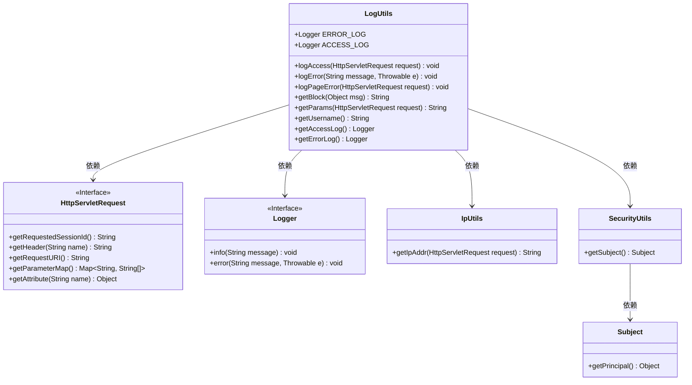
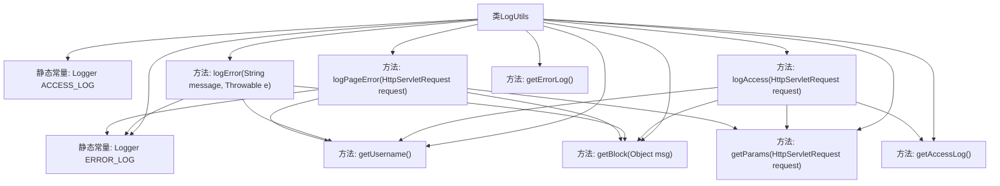

# 基础信息

|      |      |
|------|------|
| 名称 | LogUtils |
| 编码语言 | .java |
| 代码路径 | RuoYi-main/ruoyi-common/src/main/java/com/ruoyi/common/utils/LogUtils.java |
| 包名 | com.ruoyi.common.utils |
| 依赖项 | ['java.io.PrintWriter', 'java.io.StringWriter', 'java.util.Map', 'javax.servlet.http.HttpServletRequest', 'org.apache.shiro.SecurityUtils', 'org.slf4j.Logger', 'org.slf4j.LoggerFactory', 'com.ruoyi.common.json.JSON'] |
| 概述说明 | LogUtils类记录访问、异常和页面错误日志，含用户名、IP、URL等信息。 |

# 说明

LogUtils类是一个用于记录系统日志的工具，它支持访问日志、异常日志和页面错误日志的记录功能。该类能够捕获并存储关键信息，如用户名、IP地址和URL等，以便于后续的分析和问题排查。通过这些日志，开发人员可以更好地监控系统运行状态，及时发现并解决潜在问题。

# 类列表 Class Summary

| 名称   | 类型  | 说明 |
|-------|------|-------------|
| LogUtils | class | LogUtils类提供访问日志、异常日志和页面错误日志的记录功能，包含用户名、IP、URL等关键信息。 |

## 类 LogUtils

|      |      |
|------|------|
| 访问范围 | public |
| 类型 | class |
| 名称 | LogUtils |
| 说明 | LogUtils类提供访问日志、异常日志和页面错误日志的记录功能，包含用户名、IP、URL等关键信息。 |

### UML类图

### 描述
`LogUtils` 类是一个工具类，用于记录系统访问日志、错误日志和页面错误日志。它依赖于 `HttpServletRequest` 接口来获取请求信息，`Logger` 接口来记录日志，`IpUtils` 类来获取IP地址，`SecurityUtils` 类来获取当前用户信息。`LogUtils` 提供了多个静态方法，如 `logAccess`、`logError` 和 `logPageError`，分别用于记录不同类型的日志。`getBlock` 方法用于格式化日志信息，`getParams` 方法用于获取请求参数，`getUsername` 方法用于获取当前用户名。

### 内部方法调用关系图

这段代码定义了一个名为 `LogUtils` 的类，主要用于记录访问日志、异常错误和页面错误。类中包含两个静态常量 `ERROR_LOG` 和 `ACCESS_LOG`，分别用于记录错误日志和访问日志。类中的方法 `logAccess` 用于记录访问日志，`logError` 用于记录异常错误，`logPageError` 用于记录页面错误。此外，类中还包含一些辅助方法，如 `getBlock` 用于格式化日志信息，`getParams` 用于获取请求参数，`getUsername` 用于获取当前用户，`getAccessLog` 和 `getErrorLog` 分别用于获取访问日志和错误日志的实例。这些方法通过调用 `HttpServletRequest` 对象和 `Logger` 对象来实现日志记录功能。

### 字段列表 Field List

| 名称  | 类型  | 说明 |
|-------|-------|------|
| ACCESS_LOG = LoggerFactory.getLogger("sys-access") | Logger | 定义名为ACCESS_LOG的静态常量日志记录器，用于系统访问日志。 |
| ERROR_LOG = LoggerFactory.getLogger("sys-error") | Logger | 定义静态常量ERROR_LOG，用于记录系统错误日志。 |

### 方法列表 Method List

| 名称  | 类型  | 说明 |
|-------|-------|------|
| getBlock | String | 静态方法getBlock处理空对象，返回带方括号的字符串。 |
| getErrorLog | Logger | 静态方法返回错误日志实例。 |
| getAccessLog | Logger | 获取静态日志记录器ACCESS_LOG的方法。 |
| logAccess | void | 记录用户访问信息，包括用户名、会话ID、IP、请求头、URL和参数。 |
| getUsername | String | 该方法通过SecurityUtils获取当前用户的用户名并返回。 |
| logError | void | 记录错误日志，包含异常、用户名和消息信息。 |
| logPageError | void | 记录HTTP请求错误信息，包括用户名、状态码、消息、URI、IP、来源和异常堆栈。 |
| getParams | String | 静态方法getParams获取请求参数并转换为JSON字符串。 |

