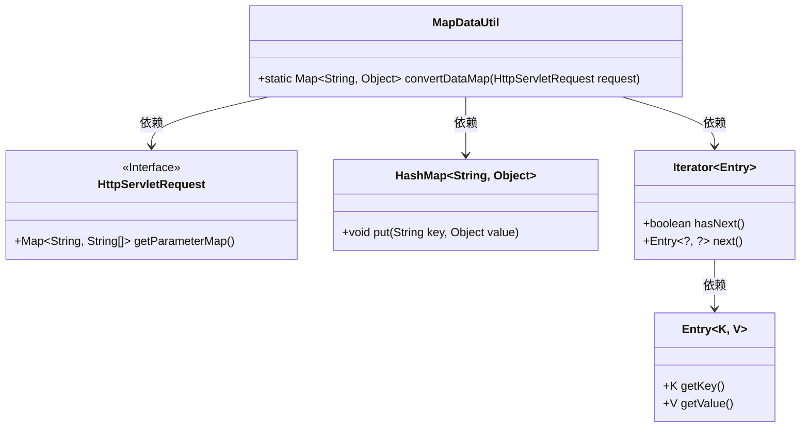
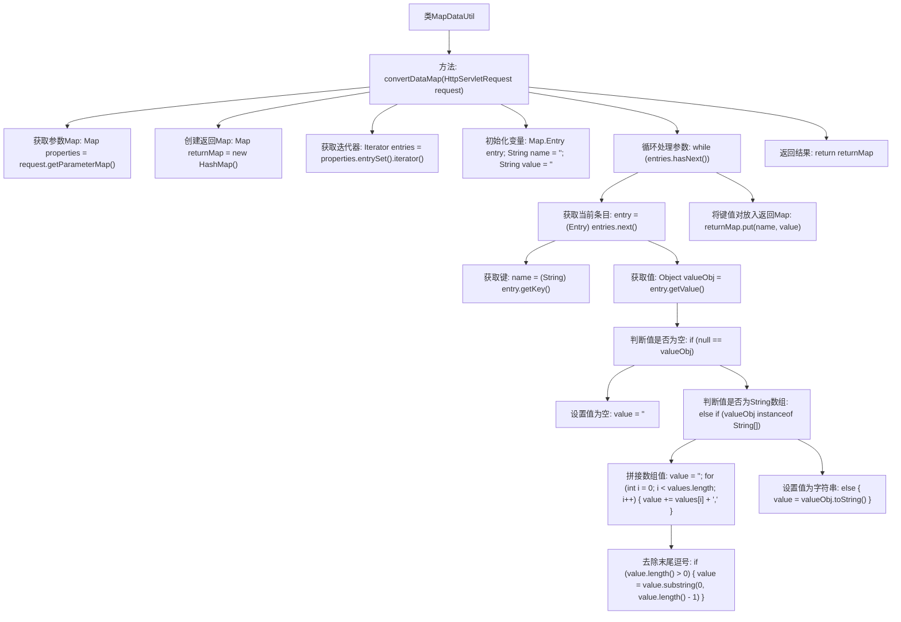

# 基础信息

|      |      |
|------|------|
| 名称 | MapDataUtil |
| 编码语言 | .java |
| 代码路径 | RuoYi-main/ruoyi-common/src/main/java/com/ruoyi/common/utils/MapDataUtil.java |
| 包名 | com.ruoyi.common.utils |
| 依赖项 | ['java.util.HashMap', 'java.util.Iterator', 'java.util.Map', 'java.util.Map.Entry', 'javax.servlet.http.HttpServletRequest'] |
| 概述说明 | MapDataUtil类将HttpServletRequest参数转为Map<String, Object>格式。 |

# 说明

MapDataUtil类的主要功能是将HttpServletRequest对象中的参数转换为Map<String, Object>格式。该类通过处理请求中的参数，将其转换为键值对形式，便于后续操作和处理。这种转换使得开发人员能够更方便地访问和操作请求中的数据，提高代码的可读性和维护性。

# 类列表 Class Summary

| 名称   | 类型  | 说明 |
|-------|------|-------------|
| MapDataUtil | class | MapDataUtil类将HttpServletRequest参数转换为Map<String, Object>格式。 |

## 类 MapDataUtil

|      |      |
|------|------|
| 访问范围 | public |
| 类型 | class |
| 名称 | MapDataUtil |
| 说明 | MapDataUtil类将HttpServletRequest参数转换为Map<String, Object>格式。 |

### UML类图

类图描述：
`MapDataUtil` 类提供了一个静态方法 `convertDataMap`，用于将 `HttpServletRequest` 中的参数映射转换为 `Map<String, Object>`。它依赖于 `HttpServletRequest` 接口来获取参数映射，并使用 `HashMap` 来存储转换后的数据。过程中还使用了 `Iterator` 和 `Entry` 来遍历和操作参数映射。

### 内部方法调用关系图

这段代码定义了一个名为`MapDataUtil`的工具类，其中包含一个静态方法`convertDataMap`，用于将`HttpServletRequest`对象中的参数转换为一个`Map<String, Object>`。代码首先获取请求参数Map，然后通过迭代器遍历每个参数，处理参数值并将其放入返回的Map中。最终，返回处理后的Map。该流程图详细展示了从获取参数到返回结果的每一步处理过程。

### 字段列表 Field List

| 名称  | 类型  | 说明 |
|-------|-------|------|

### 方法列表 Method List

| 名称  | 类型  | 说明 |
|-------|-------|------|
| convertDataMap | Map<String, Object> | 将HTTP请求参数转换为键值对映射。 |

