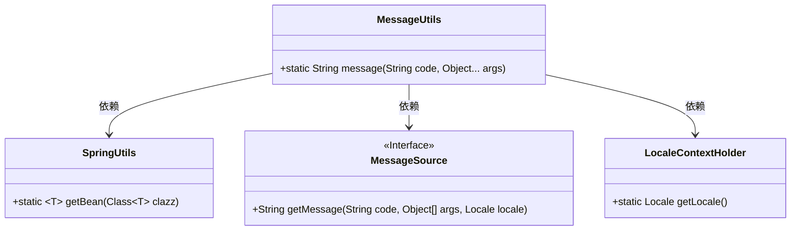
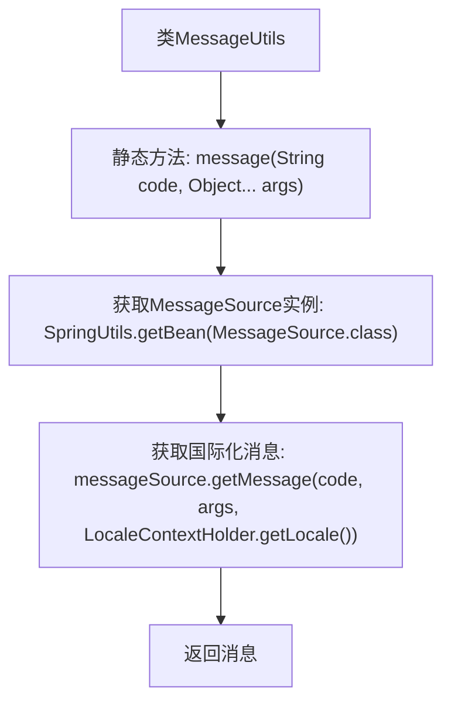

# 基础信息

|      |      |
|------|------|
| 名称 | MessageUtils |
| 编码语言 | .java |
| 代码路径 | RuoYi-main/ruoyi-common/src/main/java/com/ruoyi/common/utils/MessageUtils.java |
| 包名 | com.ruoyi.common.utils |
| 依赖项 | ['org.springframework.context.MessageSource', 'org.springframework.context.i18n.LocaleContextHolder', 'com.ruoyi.common.utils.spring.SpringUtils'] |
| 概述说明 | MessageUtils类利用Spring的MessageSource实现国际化翻译。 |

# 说明

MessageUtils类提供了一个名为message的方法，该方法利用Spring框架的MessageSource功能来获取国际化翻译值。通过这一方法，应用程序能够根据不同的语言环境动态获取相应的翻译文本，从而实现多语言支持。

# 类列表 Class Summary

| 名称   | 类型  | 说明 |
|-------|------|-------------|
| MessageUtils | class | MessageUtils类通过message方法，使用Spring的MessageSource获取国际化翻译值。 |

## 类 MessageUtils

|      |      |
|------|------|
| 访问范围 | public |
| 类型 | class |
| 名称 | MessageUtils |
| 说明 | MessageUtils类通过message方法，使用Spring的MessageSource获取国际化翻译值。 |

### UML类图

这段代码展示了一个工具类 `MessageUtils`，它通过静态方法 `message` 获取国际化消息。`MessageUtils` 依赖于 `SpringUtils` 获取 `MessageSource` 实例，并调用 `MessageSource` 的 `getMessage` 方法，同时使用 `LocaleContextHolder` 获取当前区域设置。整个过程展示了如何通过依赖注入和工具类实现国际化消息的获取。

### 内部方法调用关系图

这段代码定义了一个名为 `MessageUtils` 的类，其中包含一个静态方法 `message`，用于根据消息键和参数获取国际化翻译值。方法首先通过 `SpringUtils.getBean` 获取 `MessageSource` 实例，然后调用 `messageSource.getMessage` 方法获取翻译后的消息，并最终返回该消息。流程图清晰地展示了方法的调用顺序和逻辑流程。

### 字段列表 Field List

| 名称  | 类型  | 说明 |
|-------|-------|------|

### 方法列表 Method List

| 名称  | 类型  | 说明 |
|-------|-------|------|
| message | String | 静态方法message通过SpringUtils获取MessageSource实例，根据code和args返回本地化消息。 |

