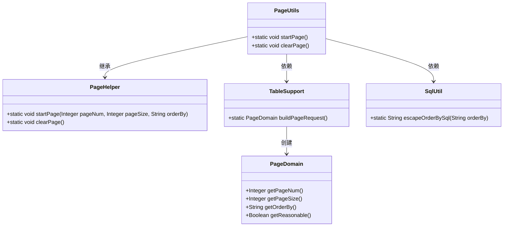
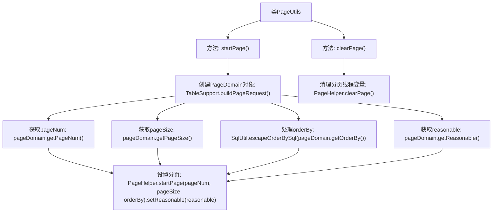

# 基础信息

|      |      |
|------|------|
| 名称 | PageUtils |
| 编码语言 | .java |
| 代码路径 | RuoYi-main/ruoyi-common/src/main/java/com/ruoyi/common/utils/PageUtils.java |
| 包名 | com.ruoyi.common.utils |
| 依赖项 | ['com.github.pagehelper.PageHelper', 'com.ruoyi.common.core.page.PageDomain', 'com.ruoyi.common.core.page.TableSupport', 'com.ruoyi.common.utils.sql.SqlUtil'] |
| 概述说明 | PageUtils类负责分页操作，管理分页数据和线程变量清理。 |

# 说明

PageUtils类主要用于处理分页操作，提供设置分页数据和清理线程变量的功能。通过该类，用户可以方便地管理分页数据，确保线程变量的及时清理，避免内存泄漏等问题。该类设计简洁，功能明确，适用于需要分页处理的场景。

# 类列表 Class Summary

| 名称   | 类型  | 说明 |
|-------|------|-------------|
| PageUtils | class | PageUtils类用于分页操作，包含设置分页数据和清理线程变量的方法。 |

## 类 PageUtils

|      |      |
|------|------|
| 访问范围 | public |
| 类型 | class |
| 名称 | PageUtils |
| 说明 | PageUtils类用于分页操作，包含设置分页数据和清理线程变量的方法。 |

### UML类图

类图描述：
`PageUtils` 类继承自 `PageHelper`，用于处理分页逻辑。它通过 `TableSupport` 类获取分页请求数据，并利用 `SqlUtil` 类对 SQL 排序语句进行转义。`PageUtils` 提供了 `startPage` 和 `clearPage` 两个静态方法，分别用于启动分页和清理分页线程变量。`PageDomain` 类用于封装分页请求的相关信息，如页码、每页大小、排序字段等。

### 内部方法调用关系图

这段代码定义了一个名为 `PageUtils` 的类，该类继承自 `PageHelper`。`PageUtils` 类包含两个静态方法：`startPage()` 和 `clearPage()`。`startPage()` 方法用于设置分页请求数据，首先通过 `TableSupport.buildPageRequest()` 创建 `PageDomain` 对象，然后从该对象中获取分页参数（如 `pageNum`、`pageSize`、`orderBy` 和 `reasonable`），最后调用 `PageHelper.startPage()` 方法设置分页。`clearPage()` 方法用于清理分页的线程变量，直接调用 `PageHelper.clearPage()` 方法。这段代码主要用于处理分页请求的初始化和清理工作。

### 字段列表 Field List

| 名称  | 类型  | 说明 |
|-------|-------|------|

### 方法列表 Method List

| 名称  | 类型  | 说明 |
|-------|-------|------|
| clearPage | void | 清除页面内容的静态方法。 |
| startPage | void | 静态方法startPage构建分页请求，设置页码、页数和排序，并启动分页。 |

