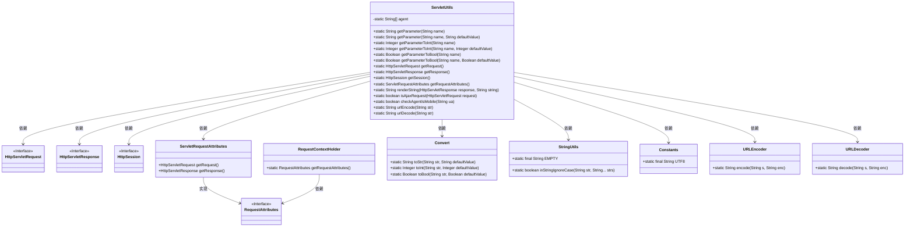

# 基础信息

|      |      |
|------|------|
| 名称 | ServletUtils |
| 编码语言 | .java |
| 代码路径 | RuoYi-main/ruoyi-common/src/main/java/com/ruoyi/common/utils/ServletUtils.java |
| 包名 | com.ruoyi.common.utils |
| 依赖项 | ['java.io.IOException', 'java.io.UnsupportedEncodingException', 'java.net.URLDecoder', 'java.net.URLEncoder', 'javax.servlet.http.HttpServletRequest', 'javax.servlet.http.HttpServletResponse', 'javax.servlet.http.HttpSession', 'org.springframework.web.context.request.RequestAttributes', 'org.springframework.web.context.request.RequestContextHolder', 'org.springframework.web.context.request.ServletRequestAttributes', 'com.ruoyi.common.constant.Constants', 'com.ruoyi.common.core.text.Convert'] |
| 概述说明 | ServletUtils类处理HTTP请求、管理会话、渲染字符串及检测移动端。 |

# 说明

ServletUtils类是一个多功能工具类，专门用于处理HTTP请求。它提供了获取请求参数、管理会话、渲染字符串、判断请求类型以及检测移动端设备等功能。通过这些功能，ServletUtils类简化了HTTP请求的处理流程，增强了代码的可维护性和可扩展性，适用于各种Web应用场景。

# 类列表 Class Summary

| 名称   | 类型  | 说明 |
|-------|------|-------------|
| ServletUtils | class | ServletUtils类提供HTTP请求处理、参数获取、会话管理、渲染字符串、判断请求类型及移动端检测等功能。 |

## 类 ServletUtils

|      |      |
|------|------|
| 访问范围 | public |
| 类型 | class |
| 名称 | ServletUtils |
| 说明 | ServletUtils类提供HTTP请求处理、参数获取、会话管理、渲染字符串、判断请求类型及移动端检测等功能。 |

### UML类图

### 描述
`ServletUtils` 是一个工具类，主要用于处理与 Servlet 相关的操作，如获取请求参数、判断请求类型、编码解码等。它依赖于多个接口和工具类，如 `HttpServletRequest`、`HttpServletResponse`、`Convert` 和 `StringUtils` 等。通过这些依赖，`ServletUtils` 提供了丰富的功能来简化 Servlet 开发中的常见任务，如参数处理、请求类型判断、内容编码解码等。

### 内部方法调用关系图

```mermaid
graph TD
    A["类ServletUtils"]
    B["属性: String[] agent"]
    C["方法: String getParameter(String name)"]
    D["方法: String getParameter(String name, String defaultValue)"]
    E["方法: Integer getParameterToInt(String name)"]
    F["方法: Integer getParameterToInt(String name, Integer defaultValue)"]
    G["方法: Boolean getParameterToBool(String name)"]
    H["方法: Boolean getParameterToBool(String name, Boolean defaultValue)"]
    I["方法: HttpServletRequest getRequest()"]
    J["方法: HttpServletResponse getResponse()"]
    K["方法: HttpSession getSession()"]
    L["方法: ServletRequestAttributes getRequestAttributes()"]
    M["方法: String renderString(HttpServletResponse response, String string)"]
    N["方法: boolean isAjaxRequest(HttpServletRequest request)"]
    O["方法: boolean checkAgentIsMobile(String ua)"]
    P["方法: String urlEncode(String str)"]
    Q["方法: String urlDecode(String str)"]

    A --> B
    A --> C
    A --> D
    A --> E
    A --> F
    A --> G
    A --> H
    A --> I
    A --> J
    A --> K
    A --> L
    A --> M
    A --> N
    A --> O
    A --> P
    A --> Q
```

这段代码定义了一个名为 `ServletUtils` 的工具类，主要用于处理与Servlet相关的操作。它包含了获取请求参数、判断请求类型、渲染字符串、判断是否为移动设备请求、以及URL编码和解码等功能。每个方法都有明确的职责，并且通过调用内部方法或外部工具类来实现功能。代码结构清晰，功能模块化，便于在Servlet开发中使用。

### 字段列表 Field List

| 名称  | 类型  | 说明 |
|-------|-------|------|
| agent = { "Android", "iPhone", "iPod", "iPad", "Windows Phone", "MQQBrowser" } | String[] | 定义包含多种设备类型的私有静态字符串数组。 |

### 方法列表 Method List

| 名称  | 类型  | 说明 |
|-------|-------|------|
| getResponse | HttpServletResponse | 获取HTTP响应对象的方法。 |
| getRequestAttributes | ServletRequestAttributes | 获取当前请求的ServletRequestAttributes对象。 |
| getParameterToInt | Integer | 将请求参数转换为整数并返回。 |
| getRequest | HttpServletRequest | 静态方法获取当前HTTP请求对象。 |
| getSession | HttpSession | 获取当前请求的HTTP会话对象。 |
| getParameter | String | 静态方法获取请求参数，若不存在则返回默认值。 |
| getParameterToBool | Boolean | 静态方法getParameterToBool将请求参数转换为布尔值。 |
| getParameterToInt | Integer | 该方法将请求参数转换为整数，默认值可选。 |
| checkAgentIsMobile | boolean | 方法检查用户代理字符串是否为移动设备，排除Windows和Macintosh系统。 |
| getParameterToBool | Boolean | 静态方法getParameterToBool将请求参数转换为布尔值，默认值为defaultValue。 |
| urlDecode | String | 静态方法urlDecode解码字符串，异常时返回空字符串。 |
| isAjaxRequest | boolean | 判断请求是否为Ajax请求，检查accept、X-Requested-With、URI和__ajax参数。 |
| renderString | String | 静态方法renderString设置响应类型为JSON，输出字符串，捕获IO异常并返回null。 |
| getParameter | String | 静态方法getParameter通过请求对象获取指定参数值。 |
| urlEncode | String | 静态方法urlEncode将字符串编码为UTF-8格式，失败时返回空字符串。 |

