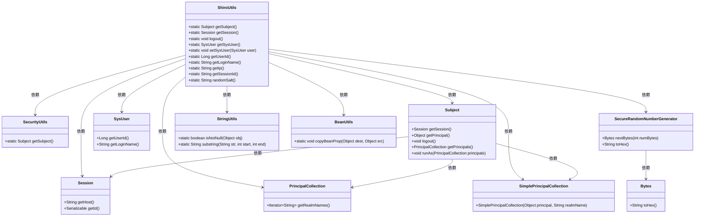

# 基础信息

|      |      |
|------|------|
| 名称 | ShiroUtils |
| 编码语言 | .java |
| 代码路径 | RuoYi-main/ruoyi-common/src/main/java/com/ruoyi/common/utils/ShiroUtils.java |
| 包名 | com.ruoyi.common.utils |
| 依赖项 | ['org.apache.shiro.SecurityUtils', 'org.apache.shiro.crypto.SecureRandomNumberGenerator', 'org.apache.shiro.session.Session', 'org.apache.shiro.subject.Subject', 'org.apache.shiro.subject.PrincipalCollection', 'org.apache.shiro.subject.SimplePrincipalCollection', 'com.ruoyi.common.core.domain.entity.SysUser', 'com.ruoyi.common.utils.bean.BeanUtils'] |
| 概述说明 | ShiroUtils类提供用户信息、会话管理、登出及随机盐生成功能。 |

# 说明

ShiroUtils类是一个功能丰富的工具类，主要用于处理与用户相关的操作。它提供了获取用户信息的功能，能够方便地获取当前用户的详细信息。此外，该类还支持会话管理，包括创建、更新和销毁会话等操作。登出功能允许用户安全地退出系统，确保会话终止和相关资源释放。ShiroUtils类还具备生成随机盐的能力，用于增强密码的安全性，通常与密码哈希算法结合使用。这些功能使得ShiroUtils类在用户认证和授权管理中非常实用。

# 类列表 Class Summary

| 名称   | 类型  | 说明 |
|-------|------|-------------|
| ShiroUtils | class | ShiroUtils类提供获取用户信息、会话管理、登出、生成随机盐等功能。 |

## 类 ShiroUtils

|      |      |
|------|------|
| 访问范围 | public |
| 类型 | class |
| 名称 | ShiroUtils |
| 说明 | ShiroUtils类提供获取用户信息、会话管理、登出、生成随机盐等功能。 |

### UML类图

**描述：**  
`ShiroUtils` 是一个工具类，提供了与 Apache Shiro 安全框架相关的常用方法。它依赖于 `SecurityUtils` 获取当前用户 (`Subject`)，并通过 `Subject` 获取会话 (`Session`) 和用户信息 (`SysUser`)。此外，`ShiroUtils` 还提供了生成随机盐的功能，依赖于 `SecureRandomNumberGenerator` 和 `Bytes` 类。`ShiroUtils` 还使用了 `StringUtils` 和 `BeanUtils` 进行字符串处理和对象属性复制。整体上，`ShiroUtils` 简化了与 Shiro 框架的交互，提供了便捷的用户管理和安全操作。

### 内部方法调用关系图

```mermaid
graph TD
    A["类ShiroUtils"]
    B["方法: Subject getSubject()"]
    C["方法: Session getSession()"]
    D["方法: void logout()"]
    E["方法: SysUser getSysUser()"]
    F["方法: void setSysUser(SysUser user)"]
    G["方法: Long getUserId()"]
    H["方法: String getLoginName()"]
    I["方法: String getIp()"]
    J["方法: String getSessionId()"]
    K["方法: String randomSalt()"]

    A --> B
    A --> C
    A --> D
    A --> E
    A --> F
    A --> G
    A --> H
    A --> I
    A --> J
    A --> K

    B --> L["SecurityUtils.getSubject()"]
    C --> M["SecurityUtils.getSubject().getSession()"]
    D --> N["getSubject().logout()"]
    E --> O["getSubject().getPrincipal()"]
    E --> P["StringUtils.isNotNull(obj)"]
    E --> Q["BeanUtils.copyBeanProp(user, obj)"]
    F --> R["getSubject()"]
    F --> S["subject.getPrincipals()"]
    F --> T["principalCollection.getRealmNames().iterator().next()"]
    F --> U["subject.runAs(newPrincipalCollection)"]
    G --> V["getSysUser().getUserId().longValue()"]
    H --> W["getSysUser().getLoginName()"]
    I --> X["getSubject().getSession().getHost()"]
    I --> Y["StringUtils.substring(host, 0, 128)"]
    J --> Z["getSubject().getSession().getId()"]
    J --> AA["String.valueOf(sessionId)"]
    K --> AB["SecureRandomNumberGenerator()"]
    K --> AC["secureRandom.nextBytes(3).toHex()"]
```

这段代码定义了一个名为`ShiroUtils`的工具类，提供了与Shiro安全框架相关的多种静态方法。这些方法包括获取当前用户、会话信息、IP地址、会话ID，以及生成随机盐等操作。代码通过调用`SecurityUtils`类的方法来获取当前用户和会话，并使用`StringUtils`和`BeanUtils`等工具类进行数据处理。每个方法都有明确的职责，代码结构清晰，便于在安全框架中快速获取和处理用户信息。

### 字段列表 Field List

| 名称  | 类型  | 说明 |
|-------|-------|------|

### 方法列表 Method List

| 名称  | 类型  | 说明 |
|-------|-------|------|
| getSubject | Subject | 该方法返回当前用户的安全主体对象。 |
| getLoginName | String | 该方法返回系统用户的登录名。 |
| getSessionId | String | 该方法返回当前会话ID的字符串表示。 |
| getSession | Session | 获取当前用户的安全会话对象。 |
| getSysUser | SysUser | 静态方法获取系统用户，复制属性并返回用户对象。 |
| getIp | String | 该方法截取会话主机地址的前128个字符作为IP返回。 |
| randomSalt | String | 生成6字符随机盐值，使用安全随机数生成器。 |
| getUserId | Long | 该方法返回系统用户的ID，并将其转换为长整型。 |
| logout | void | 静态方法logout调用getSubject().logout()实现登出功能。 |
| setSysUser | void | 设置系统用户，更新主体并重新加载主体信息。 |

