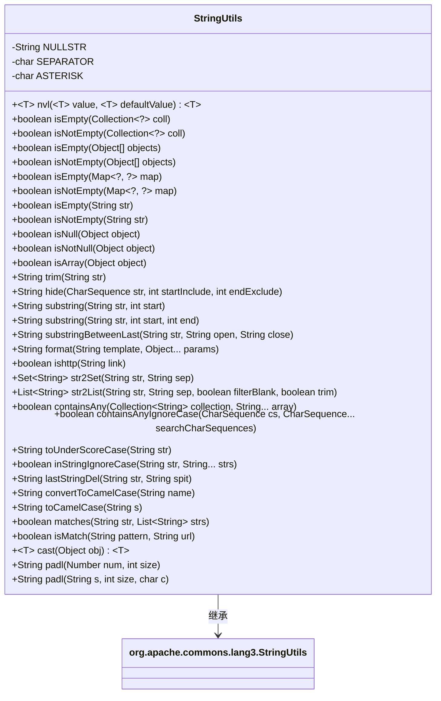

# 基础信息

|      |      |
|------|------|
| 名称 | StringUtils |
| 编码语言 | .java |
| 代码路径 | RuoYi-main/ruoyi-common/src/main/java/com/ruoyi/common/utils/StringUtils.java |
| 包名 | com.ruoyi.common.utils |
| 依赖项 | ['java.util.ArrayList', 'java.util.Collection', 'java.util.HashSet', 'java.util.List', 'java.util.Map', 'java.util.Set', 'org.springframework.util.AntPathMatcher', 'com.ruoyi.common.constant.Constants', 'com.ruoyi.common.core.text.StrFormatter'] |
| 概述说明 | StringUtils类提供字符串处理、空值判断、集合操作、格式化和转换功能。 |

# 说明

StringUtils类是一个功能丰富的工具类，主要用于处理字符串相关操作。它提供了多种实用功能，包括字符串的常规处理、空值判断、集合操作、格式化以及类型转换等。通过这些功能，开发者可以高效地执行字符串的检查、修改、转换等任务，简化代码逻辑，提升开发效率。该类广泛应用于各种需要字符串处理的场景，是开发中常用的工具之一。

# 类列表 Class Summary

| 名称   | 类型  | 说明 |
|-------|------|-------------|
| StringUtils | class | StringUtils类提供字符串处理、空值判断、集合操作、格式化、转换等功能。 |

## 类 StringUtils

|      |      |
|------|------|
| 访问范围 | public |
| 类型 | class |
| 名称 | StringUtils |
| 说明 | StringUtils类提供字符串处理、空值判断、集合操作、格式化、转换等功能。 |

### UML类图

**描述：**  
`StringUtils` 类继承自 `org.apache.commons.lang3.StringUtils`，提供了丰富的字符串处理工具方法。这些方法包括空值检查、字符串截取、格式化、大小写转换、集合操作等。类中定义了多个静态方法，用于处理不同类型的对象，如字符串、集合、数组等，并提供了对字符串的隐藏、截取、格式化和转换等功能。

### 内部方法调用关系图

```mermaid
graph TD
    A["类StringUtils"]
    B["常量: NULLSTR"]
    C["常量: SEPARATOR"]
    D["常量: ASTERISK"]
    E["方法: nvl(T value, T defaultValue)"]
    F["方法: isEmpty(Collection<?> coll)"]
    G["方法: isNotEmpty(Collection<?> coll)"]
    H["方法: isEmpty(Object[] objects)"]
    I["方法: isNotEmpty(Object[] objects)"]
    J["方法: isEmpty(Map<?, ?> map)"]
    K["方法: isNotEmpty(Map<?, ?> map)"]
    L["方法: isEmpty(String str)"]
    M["方法: isNotEmpty(String str)"]
    N["方法: isNull(Object object)"]
    O["方法: isNotNull(Object object)"]
    P["方法: isArray(Object object)"]
    Q["方法: trim(String str)"]
    R["方法: hide(CharSequence str, int startInclude, int endExclude)"]
    S["方法: substring(final String str, int start)"]
    T["方法: substring(final String str, int start, int end)"]
    U["方法: substringBetweenLast(final String str, final String open, final String close)"]
    V["方法: format(String template, Object... params)"]
    W["方法: ishttp(String link)"]
    X["方法: str2Set(String str, String sep)"]
    Y["方法: str2List(String str, String sep, boolean filterBlank, boolean trim)"]
    Z["方法: containsAny(Collection<String> collection, String... array)"]
    AA["方法: containsAnyIgnoreCase(CharSequence cs, CharSequence... searchCharSequences)"]
    AB["方法: toUnderScoreCase(String str)"]
    AC["方法: inStringIgnoreCase(String str, String... strs)"]
    AD["方法: lastStringDel(String str, String spit)"]
    AE["方法: convertToCamelCase(String name)"]
    AF["方法: toCamelCase(String s)"]
    AG["方法: matches(String str, List<String> strs)"]
    AH["方法: isMatch(String pattern, String url)"]
    AI["方法: cast(Object obj)"]
    AJ["方法: padl(final Number num, final int size)"]
    AK["方法: padl(final String s, final int size, final char c)"]

    A --> B
    A --> C
    A --> D
    A --> E
    A --> F
    A --> G
    A --> H
    A --> I
    A --> J
    A --> K
    A --> L
    A --> M
    A --> N
    A --> O
    A --> P
    A --> Q
    A --> R
    A --> S
    A --> T
    A --> U
    A --> V
    A --> W
    A --> X
    A --> Y
    A --> Z
    A --> AA
    A --> AB
    A --> AC
    A --> AD
    A --> AE
    A --> AF
    A --> AG
    A --> AH
    A --> AI
    A --> AJ
    A --> AK
```

这段代码定义了一个名为 `StringUtils` 的工具类，继承自 `org.apache.commons.lang3.StringUtils`，提供了多种字符串操作和判断方法。包括字符串的空值判断、字符串截取、字符串替换、字符串格式化、字符串转换等功能。该类还提供了对集合、数组、Map等数据结构的空值判断方法，以及字符串与集合之间的转换方法。代码结构清晰，功能丰富，适用于各种字符串处理场景。

### 字段列表 Field List

| 名称  | 类型  | 说明 |
|-------|-------|------|
| NULLSTR = "" | String | 定义空字符串常量NULLSTR。 |
| ASTERISK = '*' | char | 定义了一个私有静态常量字符ASTERISK，值为'*'。 |
| SEPARATOR = '_' | char | 定义私有静态常量SEPARATOR，值为下划线字符'_'。 |

### 方法列表 Method List

| 名称  | 类型  | 说明 |
|-------|-------|------|
| isNotEmpty | boolean | 检查对象数组是否非空。 |
| isEmpty | boolean | 判断字符串为空或仅含空格的方法。 |
| isEmpty | boolean | 检查集合是否为空或为null。 |
| isNotEmpty | boolean | 检查集合是否非空，返回布尔值。 |
| isNotNull | boolean | 检查对象是否非空的方法。 |
| isArray | boolean | 该方法检查对象是否为非空数组。 |
| isNull | boolean | 静态方法isNull判断对象是否为null。 |
| isNotEmpty | boolean | 判断字符串非空的静态方法。 |
| lastStringDel | String | 该方法删除字符串末尾指定字符并返回结果。 |
| nvl | T | 静态方法nvl返回非空值或默认值。 |
| containsAnyIgnoreCase | boolean | 方法检查字符串是否包含任意子串，忽略大小写。 |
| substringBetweenLast | String | 提取字符串中最后出现的两个指定标记之间的子串。 |
| str2Set | Set<String> | 将字符串按分隔符转换为Set集合。 |
| cast | T | 该方法将对象强制转换为泛型类型并返回。 |
| hide | String | 隐藏字符串指定区间字符，返回处理后的字符串。 |
| trim | String | 该方法用于去除字符串前后空格，若字符串为空则返回空字符串。 |
| str2List | List<String> | 将字符串按分隔符分割为列表，支持过滤空白和修剪空格。 |
| toUnderScoreCase | String | 将驼峰字符串转换为下划线格式，处理大小写边界。 |
| padl | String | 方法padl用于将字符串左侧填充指定字符至固定长度。 |
| isMatch | boolean | 静态方法isMatch使用AntPathMatcher匹配URL与模式。 |
| format | String | 静态方法format根据模板和参数格式化字符串，若参数或模板为空则返回模板。 |
| substring | String | 截取字符串指定范围的子串，处理边界和空值情况。 |
| inStringIgnoreCase | boolean | 忽略大小写检查字符串是否在给定列表中。 |
| containsAny | boolean | 检查集合是否包含数组中任意元素。 |
| isNotEmpty | boolean | 检查Map非空的静态方法，调用isEmpty判断并取反。 |
| padl | String | 静态方法padl将数字转换为字符串并用零左填充至指定长度。 |
| substring | String | 静态方法截取字符串，处理空值和负索引，返回指定位置后的子串。 |
| toCamelCase | String | 将字符串转换为驼峰命名，忽略空值，分隔符后字母大写。 |
| ishttp | boolean | 该方法判断字符串是否以HTTP或HTTPS开头。 |
| isEmpty | boolean | 判断Map是否为空或为null。 |
| convertToCamelCase | String | 将带下划线的字符串转换为驼峰格式，处理空值和首字母大写。 |
| isEmpty | boolean | 检查对象数组是否为空或长度为0。 |
| matches | boolean | 检查字符串是否匹配列表中的任一模式，若匹配则返回true，否则返回false。 |

