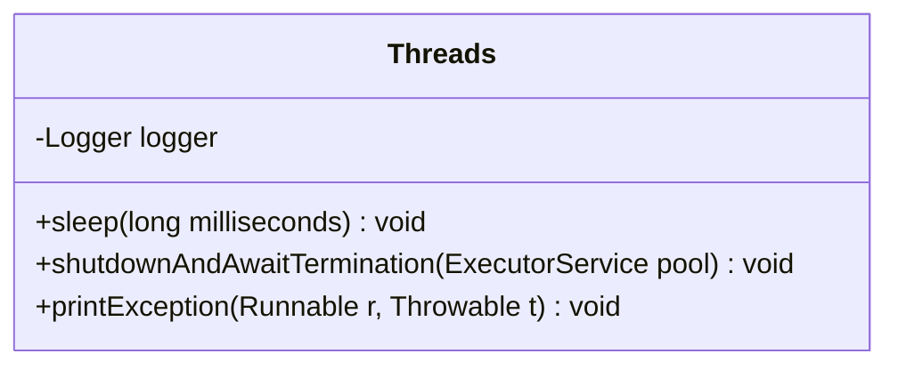
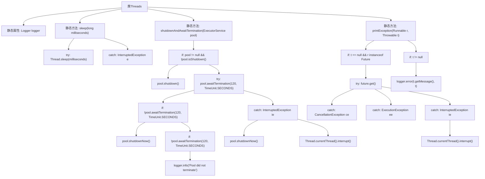

# 基础信息

|      |      |
|------|------|
| 名称 | Threads |
| 编码语言 | .java |
| 代码路径 | RuoYi-main/ruoyi-common/src/main/java/com/ruoyi/common/utils/Threads.java |
| 包名 | com.ruoyi.common.utils |
| 依赖项 | ['java.util.concurrent.CancellationException', 'java.util.concurrent.ExecutionException', 'java.util.concurrent.ExecutorService', 'java.util.concurrent.Future', 'java.util.concurrent.TimeUnit', 'org.slf4j.Logger', 'org.slf4j.LoggerFactory'] |
| 概述说明 | Threads类管理线程，支持睡眠、关闭线程池及打印异常。 |

# 说明

Threads类是一个用于线程管理的工具类，提供了多种与线程相关的功能。其主要功能包括线程的睡眠控制，允许线程在指定时间内暂停执行；线程池的关闭操作，确保线程池能够安全、有序地终止；以及异常打印功能，用于捕获并输出线程执行过程中出现的异常信息，便于调试和问题排查。通过这些功能，Threads类帮助开发者更高效地管理多线程环境，提升程序的稳定性和可维护性。

# 类列表 Class Summary

| 名称   | 类型  | 说明 |
|-------|------|-------------|
| Threads | class | Threads类提供线程管理功能，包括睡眠、线程池关闭及异常打印。 |

## 类 Threads

|      |      |
|------|------|
| 访问范围 | public |
| 类型 | class |
| 名称 | Threads |
| 说明 | Threads类提供线程管理功能，包括睡眠、线程池关闭及异常打印。 |

### UML类图

**描述：**
`Threads` 类提供了与线程操作相关的实用方法。`sleep` 方法用于使当前线程暂停指定的毫秒数，处理了 `InterruptedException` 异常。`shutdownAndAwaitTermination` 方法用于优雅地关闭线程池，先尝试正常关闭，若超时则强制关闭，并处理中断异常。`printException` 方法用于打印线程执行中的异常信息，支持 `Future` 任务的异常捕获和处理。这些方法帮助开发者更好地管理和调试多线程程序。

### 内部方法调用关系图

这段代码定义了一个名为 `Threads` 的类，主要用于处理与线程相关的操作。它包含三个静态方法：`sleep` 用于使当前线程休眠指定时间；`shutdownAndAwaitTermination` 用于优雅地关闭线程池，并处理超时和中断情况；`printException` 用于打印线程执行过程中的异常信息。每个方法都包含了详细的异常处理逻辑，确保在多线程环境下能够稳定运行。

### 字段列表 Field List

| 名称  | 类型  | 说明 |
|-------|-------|------|
| logger = LoggerFactory.getLogger(Threads.class) | Logger | 定义静态常量logger，用于Threads类的日志记录。 |

### 方法列表 Method List

| 名称  | 类型  | 说明 |
|-------|-------|------|
| printException | void | 处理Runnable异常并记录日志。 |
| sleep | void | 静态方法sleep用于使线程暂停指定毫秒数，捕获中断异常后直接返回。 |
| shutdownAndAwaitTermination | void | 关闭并等待线程池终止，超时后强制关闭，处理中断异常。 |

