# 基础信息

|      |      |
|------|------|
| 名称 | utils |
| 编码语言 | .java |
| 代码路径 | RuoYi-main/ruoyi-common/src/main/java/com/ruoyi/common/utils |
| 包名 | RuoYi-main.ruoyi-common.src.main.java.com.ruoyi.common.utils |
| 概述说明 | CacheUtils管理缓存，AddressUtils查IP位置，IpUtils处理IP，ReflectUtils反射操作，DateUtils日期处理，ShiroUtils用户操作，SpringUtils管理Bean，DesensitizedUtil脱敏，Arith精确运算，ServletUtils处理HTTP，StringUtils字符串操作，CookieUtils管理Cookie，MessageUtils国际化，Threads线程管理，BeanUtils属性操作，IdUtils生成UUID，SqlUtil增强SQL安全，PageUtils分页处理，ExcelUtil处理Excel，FileUtils文件操作，MapDataUtil请求转Map，HttpUtilsHTTP请求，DictUtils字典缓存，ExceptionUtil异常处理，CipherUtils秘钥生成，LogUtils记录日志，HTMLFilter过滤HTML。 |

# 说明

## 概述

该代码模块是一个综合性的工具类集合，涵盖了缓存管理、IP地址处理、反射操作、日期处理、用户会话管理、Spring容器操作、敏感信息脱敏、精确运算、HTTP请求处理、字符串操作、Cookie管理、国际化支持、线程管理、Bean操作、唯一标识符生成、SQL安全性增强、分页处理、Excel文件处理、文件处理、请求参数转换、HTTP请求、字典缓存管理、异常处理、安全处理、日志记录以及HTML内容安全处理等多个方面。这些工具类旨在简化开发流程，提升代码的可维护性、安全性和效率。

## 主要业务场景

1. **缓存管理**：
   - 使用`CacheUtils`类进行缓存数据的获取、写入、移除和清理操作，确保系统性能和效率。

2. **IP地址处理**：
   - 使用`AddressUtils`类通过IP地址查询地理位置，处理内网IP和异常情况。
   - 使用`IpUtils`类进行IP地址的获取、检查、格式转换、通配符匹配和网段验证。

3. **反射操作**：
   - 使用`ReflectUtils`类动态调用对象的Getter和Setter方法，读取和设置字段值，增强代码的灵活性和可扩展性。

4. **日期处理**：
   - 使用`DateUtils`类进行日期格式化、转换和计算，处理复杂的日期逻辑。

5. **用户会话管理**：
   - 使用`ShiroUtils`类获取用户信息、管理会话、执行登出操作和生成随机盐，增强用户认证和授权管理。

6. **Spring容器操作**：
   - 使用`SpringUtils`类从Spring容器中获取Bean实例、检查Bean类型和获取环境配置信息，提升代码的灵活性和可维护性。

7. **敏感信息脱敏**：
   - 使用`DesensitizedUtil`类对密码和车牌进行脱敏处理，保护敏感信息。

8. **精确运算**：
   - 使用`Arith`类进行精确的加减乘除和四舍五入运算，避免浮点数计算中的精度丢失问题。

9. **HTTP请求处理**：
   - 使用`ServletUtils`类获取请求参数、管理会话、渲染字符串、判断请求类型和检测移动端设备，简化HTTP请求处理流程。

10. **字符串操作**：
    - 使用`StringUtils`类进行字符串的常规处理、空值判断、集合操作、格式化和类型转换，提升开发效率。

11. **Cookie管理**：
    - 使用`CookieUtils`类设置和获取Cookie，灵活配置Cookie路径、生存时间和编码方式。

12. **国际化支持**：
    - 使用`MessageUtils`类获取国际化翻译值，实现多语言支持。

13. **线程管理**：
    - 使用`Threads`类控制线程睡眠、关闭线程池和打印异常信息，提升程序的稳定性和可维护性。

14. **Bean操作**：
    - 使用`BeanUtils`类复制Bean对象的属性值、获取setter和getter方法，检查方法属性名是否相等。
    - 使用`BeanValidators`类对对象进行验证，确保对象符合预设条件。

15. **唯一标识符生成**：
    - 使用`IdUtils`和`Seq`类生成随机UUID和唯一序列号，满足高并发、高性能和唯一性需求。

16. **SQL安全性增强**：
    - 使用`SqlUtil`类进行SQL关键字过滤、orderBy语法验证和长度限制，提升SQL操作的安全性和可靠性。

17. **分页处理**：
    - 使用`PageUtils`类设置分页数据和清理线程变量，确保分页处理的效率和内存管理。

18. **Excel文件处理**：
    - 使用`ExcelUtil`类进行Excel文件的导入导出、数据转换、样式设置和子列表处理，满足复杂Excel文件处理需求。

19. **文件处理**：
    - 使用`MimeTypeUtils`、`FileTypeUtils`、`ImageUtils`、`FileUploadUtils`和`FileUtils`类进行MIME类型转换、文件类型识别、图片和文件字节数据获取、文件上传和通用文件操作，简化文件处理流程。

20. **请求参数转换**：
    - 使用`MapDataUtil`类将HttpServletRequest对象中的参数转换为Map格式，便于后续操作和处理。

21. **HTTP请求**：
    - 使用`HttpUtils`类进行GET、POST和SSL POST请求，支持参数传递、编码类型指定、异常处理和日志记录。

22. **字典缓存管理**：
    - 使用`DictUtils`类进行字典缓存的设置、获取和删除操作，支持根据类型和值获取标签或值。

23. **异常处理**：
    - 使用`ExceptionUtil`类获取异常信息和判断异常原因，简化异常处理流程。

24. **安全处理**：
    - 使用`CipherUtils`、`Md5Utils`和`PermissionUtils`类生成随机秘钥、实现MD5加密和管理权限相关操作，确保系统安全性。

25. **日志记录**：
    - 使用`LogUtils`类记录访问日志、异常日志和页面错误日志，监控系统运行状态。

26. **HTML内容安全处理**：
    - 使用`HTMLFilter`和`EscapeUtil`类过滤和验证HTML内容，进行HTML字符转义、还原和标签清除，防止XSS攻击等安全风险。

### 包内部结构视图

```mermaid
graph TD
    utils --> CacheUtils.java
    utils --> AddressUtils.java
    utils --> IpUtils.java
    utils --> reflect
    utils --> DateUtils.java
    utils --> ShiroUtils.java
    utils --> spring
    utils --> DesensitizedUtil.java
    utils --> Arith.java
    utils --> ServletUtils.java
    utils --> StringUtils.java
    utils --> CookieUtils.java
    utils --> MessageUtils.java
    utils --> Threads.java
    utils --> bean
    utils --> uuid
    utils --> sql
    utils --> PageUtils.java
    utils --> poi
    utils --> file
    utils --> MapDataUtil.java
    utils --> http
    utils --> DictUtils.java
    utils --> ExceptionUtil.java
    utils --> security
    utils --> LogUtils.java
    utils --> html
    reflect --> ReflectUtils.java
    spring --> SpringUtils.java
    bean --> BeanUtils.java
    bean --> BeanValidators.java
    uuid --> IdUtils.java
    uuid --> UUID.java
    uuid --> Seq.java
    sql --> SqlUtil.java
    poi --> ExcelHandlerAdapter.java
    poi --> ExcelUtil.java
    file --> MimeTypeUtils.java
    file --> FileTypeUtils.java
    file --> ImageUtils.java
    file --> FileUploadUtils.java
    file --> FileUtils.java
    http --> HttpUtils.java
    security --> CipherUtils.java
    security --> Md5Utils.java
    security --> PermissionUtils.java
    html --> HTMLFilter.java
    html --> EscapeUtil.java
```

该流程图展示了`utils`文件夹下的文件与子文件夹的层级关系。`utils`作为根节点，包含了多个工具类文件和子文件夹，如`reflect`、`spring`、`bean`等。每个子文件夹又进一步包含了相关的工具类文件，如`ReflectUtils.java`、`SpringUtils.java`等。整个结构清晰地展示了各个工具类的组织方式。

# 文件列表 File List

| 名称   | 类型  | 说明 |
|-------|------|-------------|
| [Threads.java](Threads.md) | file | Threads类管理线程，支持睡眠、关闭线程池及打印异常。 |
| [ServletUtils.java](ServletUtils.md) | file | ServletUtils类处理HTTP请求、管理会话、渲染字符串及检测移动端。 |
| [LogUtils.java](LogUtils.md) | file | LogUtils类记录访问、异常和页面错误日志，含用户名、IP、URL等信息。 |
| [ExceptionUtil.java](ExceptionUtil.md) | file | ExceptionUtil类用于获取异常信息及判断异常原因。 |
| [DictUtils.java](DictUtils.md) | file | DictUtils类支持字典缓存操作，包括设置、获取、删除及类型值标签互查。 |
| [MapDataUtil.java](MapDataUtil.md) | file | MapDataUtil类将HttpServletRequest参数转为Map<String, Object>格式。 |
| [PageUtils.java](PageUtils.md) | file | PageUtils类负责分页操作，管理分页数据和线程变量清理。 |
| [MessageUtils.java](MessageUtils.md) | file | MessageUtils类利用Spring的MessageSource实现国际化翻译。 |
| [CookieUtils.java](CookieUtils.md) | file | CookieUtils类支持设置获取Cookie，处理路径、生存时间及编码。 |
| [StringUtils.java](StringUtils.md) | file | StringUtils类提供字符串处理、空值判断、集合操作、格式化和转换功能。 |
| [Arith.java](Arith.md) | file | Arith类实现精确运算，采用BigDecimal保障计算精度。 |
| [DesensitizedUtil.java](DesensitizedUtil.md) | file | DesensitizedUtil类实现密码全*替换和车牌中间隐藏功能。 |
| [ShiroUtils.java](ShiroUtils.md) | file | ShiroUtils类提供用户信息、会话管理、登出及随机盐生成功能。 |
| [DateUtils.java](DateUtils.md) | file | DateUtils类提供日期格式化、转换和计算功能，支持多种日期格式和操作。 |
| [IpUtils.java](IpUtils.md) | file | IpUtils类提供IP地址处理功能，包括获取、检查、转换、匹配和验证等操作。 |
| [AddressUtils.java](AddressUtils.md) | file | AddressUtils类通过IP查询地理位置，内网IP返回“内网IP”，异常返回“XX XX”。 |
| [CacheUtils.java](CacheUtils.md) | file | CacheUtils类实现缓存管理，支持获取、写入、移除及清理操作。 |
| [html](html/_module.md) | package | HTMLFilter类过滤验证HTML，防XSS攻击；EscapeUtil类转义还原清除HTML字符，确保安全可读。 |
| [security](security/_module.md) | package | CipherUtils生成随机秘钥，Md5Utils实现MD5加密，PermissionUtils管理权限常量。 |
| [http](http/_module.md) | package | HttpUtils类支持GET、POST、SSL POST请求，含参数、编码、异常处理和日志记录。 |
| [file](file/_module.md) | package | MimeTypeUtils用于MIME类型与文件扩展名转换，FileTypeUtils识别文件后缀，ImageUtils获取图片字节数据并管理资源，文件上传工具类校验文件规格，FileUtils提供多种文件操作功能。 |
| [reflect](reflect/_module.md) | package | ReflectUtils类提供反射工具，支持Getter/Setter、字段操作和方法调用。 |
| [poi](poi/_module.md) | package | ExcelUtil类提供Excel文件导入导出功能，支持数据转换、样式设置和子列表处理。 |
| [sql](sql/_module.md) | package | SqlUtil类提供SQL关键字过滤、orderBy验证及长度限制，防范SQL注入。 |
| [uuid](uuid/_module.md) | package | IdUtils类提供两种UUID生成方法，简化版和性能优化版。UUID类支持多种生成方式和字符串转换。Seq类生成唯一序列号，包含日期、机器标识和递增数值。 |
| [bean](bean/_module.md) | package | BeanUtils类用于操作Java Bean属性，简化代码。BeanValidators类验证对象，失败时抛出异常。 |
| [spring](spring/_module.md) | package | SpringUtils类实现接口，提供获取Bean、检查类型及环境配置功能。 |

