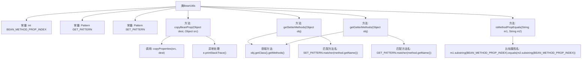

# 基础信息

|      |      |
|------|------|
| 名称 | BeanUtils |
| 编码语言 | .java |
| 代码路径 | RuoYi-main/ruoyi-common/src/main/java/com/ruoyi/common/utils/bean/BeanUtils.java |
| 包名 | com.ruoyi.common.utils.bean |
| 依赖项 | ['java.lang.reflect.Method', 'java.util.ArrayList', 'java.util.List', 'java.util.regex.Matcher', 'java.util.regex.Pattern'] |
| 概述说明 | BeanUtils类支持Bean属性复制、获取setter/getter方法及检查方法属性名相等。 |

# 说明

BeanUtils类是一个功能强大的工具类，主要用于处理Java Bean对象的属性操作。它提供了多种实用功能，包括复制Bean对象的属性值，获取Bean对象的setter和getter方法，以及检查方法属性名是否相等。这些功能使得开发者能够更方便地操作和管理Bean对象的属性，简化了代码编写过程，提高了开发效率。

# 类列表 Class Summary

| 名称   | 类型  | 说明 |
|-------|------|-------------|
| BeanUtils | class | BeanUtils类提供Bean属性复制、获取setter和getter方法、检查方法属性名是否相等功能。 |


## 类 BeanUtils

|      |      |
|------|------|
| 访问范围 | public |
| 类型 | class |
| 名称 | BeanUtils |
| 说明 | BeanUtils类提供Bean属性复制、获取setter和getter方法、检查方法属性名是否相等功能。 |


### UML类图

```mermaid
classDiagram
    class BeanUtils {
        -static final int BEAN_METHOD_PROP_INDEX
        -static final Pattern GET_PATTERN
        -static final Pattern SET_PATTERN
        +static void copyBeanProp(Object dest, Object src)
        +static List~Method~ getSetterMethods(Object obj)
        +static List~Method~ getGetterMethods(Object obj)
        +static boolean isMethodPropEquals(String m1, String m2)
    }

    BeanUtils --> "org.springframework.beans.BeanUtils" : 继承
```

这段代码定义了一个名为 `BeanUtils` 的类，它继承自 `org.springframework.beans.BeanUtils`。`BeanUtils` 类提供了几个静态方法，用于处理 Java Bean 的属性和方法。`copyBeanProp` 方法用于将一个对象的属性复制到另一个对象中。`getSetterMethods` 和 `getGetterMethods` 方法分别用于获取对象的 setter 和 getter 方法列表。`isMethodPropEquals` 方法用于检查两个方法名中的属性名是否相等。这些方法通过正则表达式匹配方法名，并处理方法的参数类型，以确保正确地识别 setter 和 getter 方法。


### 内部方法调用关系图



这段代码定义了一个`BeanUtils`类，继承自`org.springframework.beans.BeanUtils`，主要用于处理Java Bean的属性复制和方法获取。类中包含四个主要方法：`copyBeanProp`用于复制Bean属性，`getSetterMethods`和`getGetterMethods`分别用于获取对象的setter和getter方法，`isMethodPropEquals`用于检查两个方法名中的属性名是否相等。代码通过正则表达式匹配方法名，并处理异常情况，确保Bean属性操作的准确性和安全性。

### 字段列表 Field List

| 名称  | 类型  | 说明 |
|-------|-------|------|
| BEAN_METHOD_PROP_INDEX = 3 | int | 私有静态常量BEAN_METHOD_PROP_INDEX值为3。 |
| SET_PATTERN = Pattern.compile("set(\\p{javaUpperCase}\\w*)") | Pattern | 定义正则表达式匹配以"set"开头的大写字母单词。 |
| GET_PATTERN = Pattern.compile("get(\\p{javaUpperCase}\\w*)") | Pattern | 定义私有静态常量GET_PATTERN，用于匹配以get开头的字符串。 |

### 方法列表 Method List

| 名称  | 类型  | 说明 |
|-------|-------|------|
| getGetterMethods | List<Method> | 获取对象的所有getter方法并返回列表。 |
| isMethodPropEquals | boolean | 比较两字符串从指定索引开始的子串是否相等。 |
| copyBeanProp | void | 静态方法copyBeanProp将src对象属性复制到dest对象，捕获并打印异常。 |
| getSetterMethods | List<Method> | 获取对象的所有setter方法并返回列表。 |


