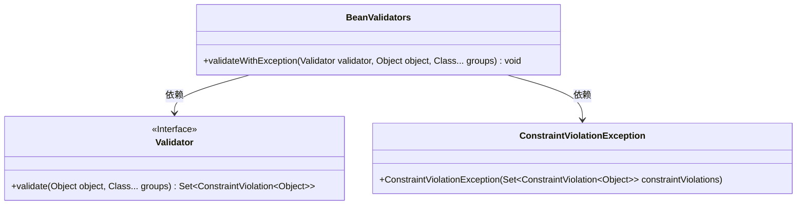
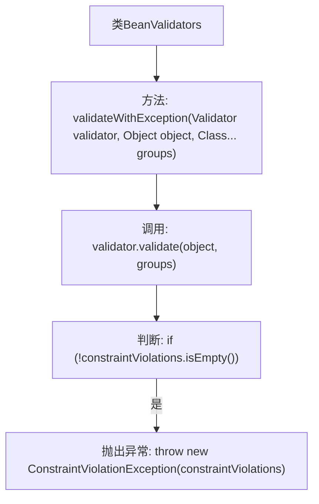

# 基础信息

|      |      |
|------|------|
| 名称 | BeanValidators |
| 编码语言 | .java |
| 代码路径 | RuoYi-main/ruoyi-common/src/main/java/com/ruoyi/common/utils/bean/BeanValidators.java |
| 包名 | com.ruoyi.common.utils.bean |
| 依赖项 | ['java.util.Set', 'javax.validation.ConstraintViolation', 'javax.validation.ConstraintViolationException', 'javax.validation.Validator'] |
| 概述说明 | BeanValidators类的validateWithException方法用于验证对象并抛出异常。 |

# 说明

BeanValidators类中的validateWithException方法用于对对象进行验证。如果验证过程中发现对象不符合预设的条件或规则，该方法会抛出异常。这种方法的设计旨在确保对象在进一步处理前满足所有必要的验证要求，从而增强代码的健壮性和可靠性。通过抛出异常，开发者可以及时捕获并处理验证失败的情况，避免潜在的错误或数据不一致问题。

# 类列表 Class Summary

| 名称   | 类型  | 说明 |
|-------|------|-------------|
| BeanValidators | class | BeanValidators类提供validateWithException方法，验证对象并抛出异常。 |

## 类 BeanValidators

|      |      |
|------|------|
| 访问范围 | public |
| 类型 | class |
| 名称 | BeanValidators |
| 说明 | BeanValidators类提供validateWithException方法，验证对象并抛出异常。 |

### UML类图

这段代码定义了一个 `BeanValidators` 类，其中包含一个静态方法 `validateWithException`，用于验证对象是否符合指定的约束条件。如果验证失败，该方法会抛出 `ConstraintViolationException` 异常。`Validator` 是一个接口，提供了 `validate` 方法用于执行验证操作。`ConstraintViolationException` 是一个异常类，用于封装验证失败的结果。`BeanValidators` 类依赖于 `Validator` 接口和 `ConstraintViolationException` 类来实现其功能。

### 内部方法调用关系图

这段代码定义了一个名为 `BeanValidators` 的类，其中包含一个静态方法 `validateWithException`。该方法接收一个 `Validator` 对象、一个 `Object` 对象以及一组 `Class` 类型的可变参数。它首先调用 `validator.validate` 方法对传入的对象进行验证，并返回一个 `Set<ConstraintViolation<Object>>` 集合。如果集合不为空，则抛出 `ConstraintViolationException` 异常，包含所有验证失败的约束违规信息。

### 字段列表 Field List

| 名称  | 类型  | 说明 |
|-------|-------|------|

### 方法列表 Method List

| 名称  | 类型  | 说明 |
|-------|-------|------|
| validateWithException | void | 验证对象并抛出异常，若违反约束则抛出ConstraintViolationException。 |

