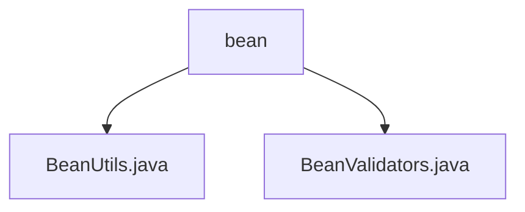

# 基础信息

|      |      |
|------|------|
| 名称 | bean |
| 编码语言 | .java |
| 代码路径 | RuoYi-main/ruoyi-common/src/main/java/com/ruoyi/common/utils/bean |
| 包名 | RuoYi-main.ruoyi-common.src.main.java.com.ruoyi.common.utils.bean |
| 概述说明 | BeanUtils类用于操作Java Bean属性，简化代码。BeanValidators类验证对象，失败时抛出异常。 |

# 说明

## 概述

该代码模块主要包含两个工具类：`BeanUtils` 和 `BeanValidators`，它们分别用于处理Java Bean对象的属性操作和对象验证。这两个类共同为开发者提供了便捷的Bean对象管理和验证功能，简化了代码编写过程，提高了开发效率和代码的健壮性。

## 主要业务场景

1. **Bean对象属性操作**：
   - `BeanUtils` 类提供了多种实用功能，包括复制Bean对象的属性值、获取Bean对象的setter和getter方法，以及检查方法属性名是否相等。这些功能在需要操作和管理Bean对象属性的场景中非常有用，例如在数据映射、对象转换等场景中，开发者可以借助`BeanUtils`类快速实现属性值的复制和获取。

2. **对象验证**：
   - `BeanValidators` 类中的 `validateWithException` 方法用于对对象进行验证。如果对象不符合预设的条件或规则，该方法会抛出异常。这种设计确保了对象在进一步处理前满足所有必要的验证要求，增强了代码的健壮性和可靠性。该功能常用于数据校验、表单验证等场景，开发者可以通过捕获异常及时处理验证失败的情况，避免潜在的错误或数据不一致问题。

通过这两个工具类，开发者可以更高效地管理和验证Bean对象，确保代码的可靠性和可维护性。

### 包内部结构视图

该流程图展示了`bean`文件夹与其内部两个文件`BeanUtils.java`和`BeanValidators.java`之间的层级关系。`bean`作为父节点，包含两个子节点，分别对应两个具体的Java文件，清晰地反映了文件在项目中的组织结构。

# 文件列表 File List

| 名称   | 类型  | 说明 |
|-------|------|-------------|
| [BeanValidators.java](BeanValidators.md) | file | BeanValidators类的validateWithException方法用于验证对象并抛出异常。 |
| [BeanUtils.java](BeanUtils.md) | file | BeanUtils类支持Bean属性复制、获取setter/getter方法及检查方法属性名相等。 |

