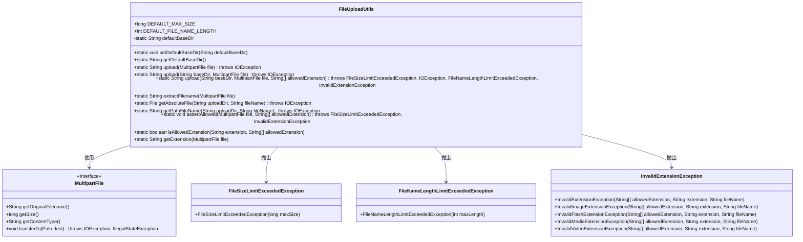

# 基础信息

|      |      |
|------|------|
| 名称 | FileUploadUtils |
| 编码语言 | .java |
| 代码路径 | RuoYi-main/ruoyi-common/src/main/java/com/ruoyi/common/utils/file/FileUploadUtils.java |
| 包名 | com.ruoyi.common.utils.file |
| 依赖项 | ['java.io.File', 'java.io.IOException', 'java.nio.file.Paths', 'java.util.Objects', 'org.apache.commons.io.FilenameUtils', 'org.springframework.web.multipart.MultipartFile', 'com.ruoyi.common.config.RuoYiConfig', 'com.ruoyi.common.constant.Constants', 'com.ruoyi.common.exception.file.FileNameLengthLimitExceededException', 'com.ruoyi.common.exception.file.FileSizeLimitExceededException', 'com.ruoyi.common.exception.file.InvalidExtensionException', 'com.ruoyi.common.utils.DateUtils', 'com.ruoyi.common.utils.StringUtils', 'com.ruoyi.common.utils.uuid.Seq'] |
| 概述说明 | 文件上传工具类支持大小、类型、路径校验，默认大小50M，文件名长度100。 |

# 说明

文件上传工具类提供了全面的文件上传功能，支持对文件大小、类型和路径进行校验。默认情况下，文件大小限制为50M，文件名长度限制为100个字符。该工具类确保上传的文件符合预设的规格要求，增强了文件上传的安全性和可靠性。

# 类列表 Class Summary

| 名称   | 类型  | 说明 |
|-------|------|-------------|
| FileUploadUtils | class | 文件上传工具类，支持大小、类型、路径校验，默认大小50M，文件名长度100。 |

## 类 FileUploadUtils

|      |      |
|------|------|
| 访问范围 | public |
| 类型 | class |
| 名称 | FileUploadUtils |
| 说明 | 文件上传工具类，支持大小、类型、路径校验，默认大小50M，文件名长度100。 |

### UML类图

### 描述
`FileUploadUtils` 是一个用于处理文件上传的工具类，提供了文件上传、文件名编码、文件大小校验、文件类型校验等功能。它依赖于 `MultipartFile` 接口来获取文件信息，并在文件大小、文件名长度或文件类型不符合要求时抛出相应的异常。该类通过静态方法提供了多种上传方式，并支持自定义上传目录和允许的文件类型。

### 内部方法调用关系图

这段代码定义了一个用于文件上传的工具类 `FileUploadUtils`，包含了文件上传、文件名处理、文件大小校验、文件类型校验等功能。代码通过多个静态方法实现了文件上传的各个步骤，包括文件名编码、文件路径获取、文件类型校验等。流程图展示了类中各个方法的调用关系，帮助理解文件上传的完整流程。

### 字段列表 Field List

| 名称  | 类型  | 说明 |
|-------|-------|------|
| DEFAULT_MAX_SIZE = 50 * 1024 * 1024L | long | 默认最大文件大小为50MB。 |
| DEFAULT_FILE_NAME_LENGTH = 100 | int | 常量DEFAULT_FILE_NAME_LENGTH定义为100。 |
| defaultBaseDir = RuoYiConfig.getProfile() | String | 默认基础目录通过RuoYiConfig获取配置文件路径。 |

### 方法列表 Method List

| 名称  | 类型  | 说明 |
|-------|-------|------|
| isAllowedExtension | boolean | 检查文件扩展名是否在允许列表中。 |
| setDefaultBaseDir | void | 设置默认基础目录为指定路径。 |
| getDefaultBaseDir | String | 获取默认基础目录路径的静态方法。 |
| upload | String | 上传文件方法，处理异常并抛出IOException。 |
| upload | String | 上传文件至默认目录，处理异常并抛出IOException。 |
| extractFilename | String | 提取文件名方法：生成带日期路径和唯一ID的文件名。 |
| getAbsoluteFile | File | 获取指定路径下文件的绝对路径，若目录不存在则创建。 |
| upload | String | 上传文件方法，检查文件名长度和扩展名，保存文件并返回路径。 |
| getPathFileName | String | 获取文件路径，基于上传目录和文件名生成完整路径。 |
| assertAllowed | void | 检查文件大小和扩展名，超出限制或不符合时抛出异常。 |
| getExtension | String | 该方法获取MultipartFile文件扩展名，优先从文件名提取，失败则从内容类型提取。 |

