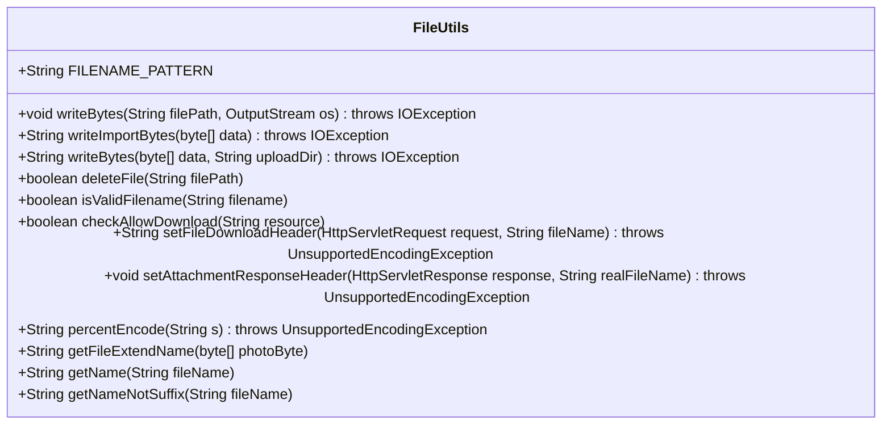

# 基础信息

|      |      |
|------|------|
| 名称 | FileUtils |
| 编码语言 | .java |
| 代码路径 | RuoYi-main/ruoyi-common/src/main/java/com/ruoyi/common/utils/file/FileUtils.java |
| 包名 | com.ruoyi.common.utils.file |
| 依赖项 | ['java.io.File', 'java.io.FileInputStream', 'java.io.FileNotFoundException', 'java.io.FileOutputStream', 'java.io.IOException', 'java.io.OutputStream', 'java.io.UnsupportedEncodingException', 'java.net.URLEncoder', 'java.nio.charset.StandardCharsets', 'javax.servlet.http.HttpServletRequest', 'javax.servlet.http.HttpServletResponse', 'org.apache.commons.io.FilenameUtils', 'org.apache.commons.io.IOUtils', 'org.apache.commons.lang3.ArrayUtils', 'com.ruoyi.common.config.RuoYiConfig', 'com.ruoyi.common.utils.DateUtils', 'com.ruoyi.common.utils.StringUtils', 'com.ruoyi.common.utils.uuid.IdUtils'] |
| 概述说明 | FileUtils类提供文件写入、删除、验证、下载编码及信息获取功能。 |

# 说明

FileUtils类是一个提供多种文件操作功能的工具类，涵盖了文件写入、删除、文件名验证、下载编码处理以及获取文件信息等操作。该类旨在简化文件管理任务，提升开发效率，确保文件操作的安全性和准确性。通过集成这些功能，FileUtils类为开发者提供了全面的文件处理解决方案，适用于各种文件管理场景。

# 类列表 Class Summary

| 名称   | 类型  | 说明 |
|-------|------|-------------|
| FileUtils | class | FileUtils类提供文件操作功能，包括写入、删除、验证文件名、下载编码及获取文件信息等。 |

## 类 FileUtils

|      |      |
|------|------|
| 访问范围 | public |
| 类型 | class |
| 名称 | FileUtils |
| 说明 | FileUtils类提供文件操作功能，包括写入、删除、验证文件名、下载编码及获取文件信息等。 |

### UML类图

这段代码定义了一个名为 `FileUtils` 的工具类，主要用于处理文件的读写、删除、文件名验证、文件下载等操作。类中包含多个静态方法，用于处理文件路径、文件名编码、文件类型判断等任务。代码通过 `IOException` 处理文件操作中的异常，并提供了对文件名的合法性检查和文件下载的支持。

### 内部方法调用关系图

```mermaid
graph TD
    A["类FileUtils"]
    B["属性: String FILENAME_PATTERN"]
    C["方法: void writeBytes(String filePath, OutputStream os)"]
    D["方法: String writeImportBytes(byte[] data)"]
    E["方法: String writeBytes(byte[] data, String uploadDir)"]
    F["方法: boolean deleteFile(String filePath)"]
    G["方法: boolean isValidFilename(String filename)"]
    H["方法: boolean checkAllowDownload(String resource)"]
    I["方法: String setFileDownloadHeader(HttpServletRequest request, String fileName)"]
    J["方法: void setAttachmentResponseHeader(HttpServletResponse response, String realFileName)"]
    K["方法: String percentEncode(String s)"]
    L["方法: String getFileExtendName(byte[] photoByte)"]
    M["方法: String getName(String fileName)"]
    N["方法: String getNameNotSuffix(String fileName)"]

    A --> B
    A --> C
    A --> D
    A --> E
    A --> F
    A --> G
    A --> H
    A --> I
    A --> J
    A --> K
    A --> L
    A --> M
    A --> N
```

**描述：**  
`FileUtils` 类提供了多种文件操作功能，包括文件写入、删除、文件名验证、文件下载检查、文件名编码转换、文件扩展名获取等。每个方法都有明确的职责，例如 `writeBytes` 方法用于将文件内容写入输出流，`deleteFile` 方法用于删除指定文件，`isValidFilename` 方法用于验证文件名是否符合特定模式。这些方法共同构成了一个功能全面的文件处理工具类。

### 字段列表 Field List

| 名称  | 类型  | 说明 |
|-------|-------|------|
| FILENAME_PATTERN = "[a-zA-Z0-9_\\-\\|\\.\\u4e00-\\u9fa5]+" | String | 文件名模式支持字母、数字、下划线、连字符、竖线、点和中文字符。 |

### 方法列表 Method List

| 名称  | 类型  | 说明 |
|-------|-------|------|
| isValidFilename | boolean | 静态方法验证文件名是否符合指定模式。 |
| setFileDownloadHeader | String | 根据浏览器类型设置文件下载头信息，确保文件名编码正确。 |
| getFileExtendName | String | 根据字节数组判断文件扩展名，支持jpg、gif、bmp、png格式。 |
| writeImportBytes | String | 静态方法writeImportBytes将字节数组写入导入路径，可能抛出IOException。 |
| deleteFile | boolean | 静态方法deleteFile删除指定路径文件，成功返回true，否则false。 |
| setAttachmentResponseHeader | void | 设置HTTP响应头，用于文件下载，支持文件名编码。 |
| getName | String | 该方法从文件名中提取最后一部分，忽略路径分隔符。 |
| writeBytes | void | 将文件内容写入输出流，处理异常并关闭资源。 |
| writeBytes | String | 将字节数组写入指定目录并返回文件路径。 |
| percentEncode | String | 静态方法percentEncode对字符串进行URL编码，并将加号替换为%20。 |
| getNameNotSuffix | String | 获取文件名无后缀部分，空值返回null。 |
| checkAllowDownload | boolean | 检查资源路径是否允许下载，禁止目录上跳并验证文件类型。 |

