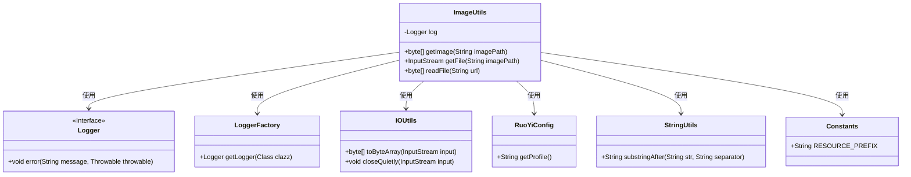
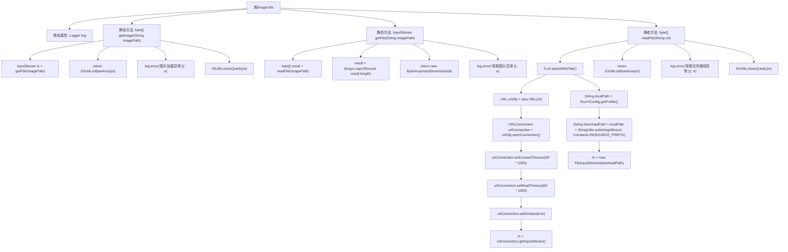

# 基础信息

|      |      |
|------|------|
| 名称 | ImageUtils |
| 编码语言 | .java |
| 代码路径 | RuoYi-main/ruoyi-common/src/main/java/com/ruoyi/common/utils/file/ImageUtils.java |
| 包名 | com.ruoyi.common.utils.file |
| 依赖项 | ['java.io.ByteArrayInputStream', 'java.io.FileInputStream', 'java.io.InputStream', 'java.net.URL', 'java.net.URLConnection', 'java.util.Arrays', 'org.apache.poi.util.IOUtils', 'org.slf4j.Logger', 'org.slf4j.LoggerFactory', 'com.ruoyi.common.config.RuoYiConfig', 'com.ruoyi.common.constant.Constants', 'com.ruoyi.common.utils.StringUtils'] |
| 概述说明 | ImageUtils类支持获取网络和本地图片文件字节数据，处理异常并关闭资源。 |

# 说明

ImageUtils类是一个功能丰富的工具类，主要用于获取图片和文件的字节数据。它支持从网络路径和本地路径两种方式获取数据，确保用户可以从多种来源获取所需资源。在处理过程中，该类能够有效地捕获和处理异常情况，避免程序因错误而中断。此外，ImageUtils类还具备资源管理功能，能够在使用完毕后自动关闭相关资源，防止资源泄露，提高系统的稳定性和效率。

# 类列表 Class Summary

| 名称   | 类型  | 说明 |
|-------|------|-------------|
| ImageUtils | class | ImageUtils类提供获取图片和文件字节数据的功能，支持网络和本地路径，处理异常并关闭资源。 |

## 类 ImageUtils

|      |      |
|------|------|
| 访问范围 | public |
| 类型 | class |
| 名称 | ImageUtils |
| 说明 | ImageUtils类提供获取图片和文件字节数据的功能，支持网络和本地路径，处理异常并关闭资源。 |

### UML类图

这段代码定义了一个 `ImageUtils` 类，用于处理图像的加载和读取操作。`ImageUtils` 类依赖于 `Logger`、`LoggerFactory`、`IOUtils`、`RuoYiConfig`、`StringUtils` 和 `Constants` 等工具类来实现其功能。`getImage` 方法用于获取图像的字节数据，`getFile` 方法用于获取图像的输入流，`readFile` 方法用于根据URL读取文件内容并返回字节数据。代码中处理了多种异常情况，并确保资源在操作完成后被正确关闭。

### 内部方法调用关系图

**描述：**
该流程图展示了`ImageUtils`类中的主要方法调用关系。`getImage`方法首先调用`getFile`获取输入流，然后尝试将其转换为字节数组，若出现异常则记录日志并关闭流。`getFile`方法调用`readFile`读取文件数据，处理后返回字节数组输入流。`readFile`方法根据URL类型（网络或本地）获取输入流，并最终转换为字节数组，处理异常并关闭流。

### 字段列表 Field List

| 名称  | 类型  | 说明 |
|-------|-------|------|
| log = LoggerFactory.getLogger(ImageUtils.class) | Logger | 定义私有静态日志记录器用于ImageUtils类。 |

### 方法列表 Method List

| 名称  | 类型  | 说明 |
|-------|-------|------|
| readFile | byte[] | 静态方法读取文件，支持网络和本地路径，处理异常并关闭流。 |
| getFile | InputStream | 静态方法获取文件输入流，处理异常并返回字节数组输入流。 |
| getImage | byte[] | 静态方法获取图片字节流，异常处理并关闭流。 |

