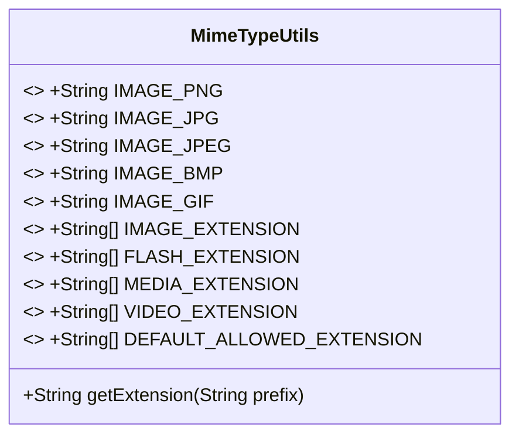

# 基础信息

|      |      |
|------|------|
| 名称 | MimeTypeUtils |
| 编码语言 | .java |
| 代码路径 | RuoYi-main/ruoyi-common/src/main/java/com/ruoyi/common/utils/file/MimeTypeUtils.java |
| 包名 | com.ruoyi.common.utils.file |
| 依赖项 | [] |
| 概述说明 | MimeTypeUtils类定义MIME类型和文件扩展名，提供获取扩展名方法。 |

# 说明

MimeTypeUtils类是一个用于定义常用MIME类型和文件扩展名的工具类。该类提供了一种方法，用于根据给定的MIME类型获取对应的文件扩展名。通过这个类，开发者可以方便地在处理文件类型时进行MIME类型与文件扩展名之间的转换，从而简化文件处理和识别过程。

# 类列表 Class Summary

| 名称   | 类型  | 说明 |
|-------|------|-------------|
| MimeTypeUtils | class | MimeTypeUtils类定义常用MIME类型和文件扩展名，提供获取扩展名的方法。 |

## 类 MimeTypeUtils

|      |      |
|------|------|
| 访问范围 | public |
| 类型 | class |
| 名称 | MimeTypeUtils |
| 说明 | MimeTypeUtils类定义常用MIME类型和文件扩展名，提供获取扩展名的方法。 |

### UML类图

这段代码定义了一个 `MimeTypeUtils` 类，主要用于处理 MIME 类型和文件扩展名之间的转换。类中包含多个静态常量，用于表示常见的 MIME 类型和文件扩展名。`getExtension` 方法根据传入的 MIME 类型前缀返回对应的文件扩展名。该类的主要作用是提供一种便捷的方式来管理和转换 MIME 类型与文件扩展名之间的关系。

### 内部方法调用关系图

这段代码定义了一个名为`MimeTypeUtils`的类，其中包含多个常量字符串和数组，用于表示不同的MIME类型和文件扩展名。类中还定义了一个`getExtension`方法，根据传入的MIME类型前缀返回相应的文件扩展名。流程图展示了类中的常量、数组以及方法之间的调用关系，帮助理解代码的结构和功能。

### 字段列表 Field List

| 名称  | 类型  | 说明 |
|-------|-------|------|
| IMAGE_BMP = "image/bmp" | String | 定义BMP图像格式的常量字符串。 |
| IMAGE_GIF = "image/gif" | String | 定义静态常量IMAGE_GIF为"image/gif"。 |
| IMAGE_JPG = "image/jpg" | String | 定义静态常量IMAGE_JPG，值为"image/jpg"。 |
| VIDEO_EXTENSION = { "mp4", "avi", "rmvb" } | String[] | 定义包含视频扩展名的静态字符串数组。 |
| IMAGE_EXTENSION = { "bmp", "gif", "jpg", "jpeg", "png" } | String[] | 定义静态常量字符串数组，包含常见图片扩展名。 |
| IMAGE_JPEG = "image/jpeg" | String | 定义静态常量IMAGE_JPEG，值为"image/jpeg"。 |
| IMAGE_PNG = "image/png" | String | 定义常量IMAGE_PNG，值为"image/png"。 |
| DEFAULT_ALLOWED_EXTENSION = {            // 图片            "bmp", "gif", "jpg", "jpeg", "png",            // word excel powerpoint            "doc", "docx", "xls", "xlsx", "ppt", "pptx", "html", "htm", "txt",            // 压缩文件            "rar", "zip", "gz", "bz2",            // 视频格式            "mp4", "avi", "rmvb",            // pdf            "pdf" } | String[] | 默认允许的文件扩展名包括图片、文档、压缩文件、视频和PDF格式。 |
| MEDIA_EXTENSION = { "swf", "flv", "mp3", "wav", "wma", "wmv", "mid", "avi", "mpg",            "asf", "rm", "rmvb" } | String[] | 定义了一个包含常见媒体文件扩展名的字符串数组。 |
| FLASH_EXTENSION = { "swf", "flv" } | String[] | 定义包含swf和flv的静态字符串数组FLASH_EXTENSION。 |

### 方法列表 Method List

| 名称  | 类型  | 说明 |
|-------|-------|------|
| getExtension | String | 根据前缀返回相应图片扩展名，无匹配返回空字符串。 |

