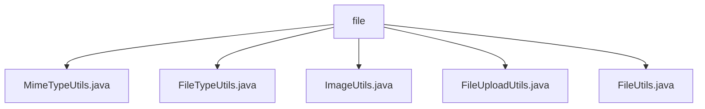

# 基础信息

|      |      |
|------|------|
| 名称 | file |
| 编码语言 | .java |
| 代码路径 | RuoYi-main/ruoyi-common/src/main/java/com/ruoyi/common/utils/file |
| 包名 | RuoYi-main.ruoyi-common.src.main.java.com.ruoyi.common.utils.file |
| 概述说明 | MimeTypeUtils用于MIME类型与文件扩展名转换，FileTypeUtils识别文件后缀，ImageUtils获取图片字节数据并管理资源，文件上传工具类校验文件规格，FileUtils提供多种文件操作功能。 |

# 说明

## 概述
该代码模块主要提供了一系列与文件处理相关的工具类，涵盖了MIME类型转换、文件类型识别、图片和文件字节数据获取、文件上传以及通用文件操作等功能。这些工具类旨在简化文件处理的复杂性，提升开发效率，并确保文件操作的安全性和可靠性。模块中的工具类均位于`com.ruoyi.common.utils.file`包下，适用于各种文件管理场景。

## 主要业务场景
1. **MIME类型与文件扩展名转换**：通过`MimeTypeUtils`类，开发者可以方便地在处理文件类型时进行MIME类型与文件扩展名之间的转换，适用于需要识别和处理文件类型的场景。
2. **文件类型识别**：`FileTypeUtils`类支持通过文件名和字节码识别文件类型，并返回不包含点号的后缀，适用于需要快速判断文件类型的场景。
3. **图片和文件字节数据获取**：`ImageUtils`类支持从网络路径和本地路径获取图片和文件的字节数据，并具备异常处理和资源管理功能，适用于需要从多种来源获取资源并确保资源安全释放的场景。
4. **文件上传**：`FileUploadUtils`类提供了全面的文件上传功能，支持对文件大小、类型和路径进行校验，确保上传的文件符合预设的规格要求，适用于需要安全可靠的文件上传场景。
5. **通用文件操作**：`FileUtils`类提供了多种文件操作功能，包括文件写入、删除、文件名验证、下载编码处理以及获取文件信息等，适用于各种文件管理任务，旨在简化文件操作并提升开发效率。

该模块的工具类设计合理，功能全面，能够有效支持各种文件处理需求，提升系统的稳定性和开发效率。

### 包内部结构视图

该流程图展示了在 `file` 文件夹下的五个文件之间的层级关系。所有文件都直接隶属于 `file` 文件夹，没有进一步的子文件夹结构。这些文件包括 `MimeTypeUtils.java`、`FileTypeUtils.java`、`ImageUtils.java`、`FileUploadUtils.java` 和 `FileUtils.java`，它们共同构成了该文件夹下的工具类集合。

# 文件列表 File List

| 名称   | 类型  | 说明 |
|-------|------|-------------|
| [FileUploadUtils.java](FileUploadUtils.md) | file | 文件上传工具类支持大小、类型、路径校验，默认大小50M，文件名长度100。 |
| [MimeTypeUtils.java](MimeTypeUtils.md) | file | MimeTypeUtils类定义MIME类型和文件扩展名，提供获取扩展名方法。 |
| [FileUtils.java](FileUtils.md) | file | FileUtils类提供文件写入、删除、验证、下载编码及信息获取功能。 |
| [ImageUtils.java](ImageUtils.md) | file | ImageUtils类支持获取网络和本地图片文件字节数据，处理异常并关闭资源。 |
| [FileTypeUtils.java](FileTypeUtils.md) | file | FileTypeUtils类支持通过文件名或字节码获取无点后缀的文件类型。 |

