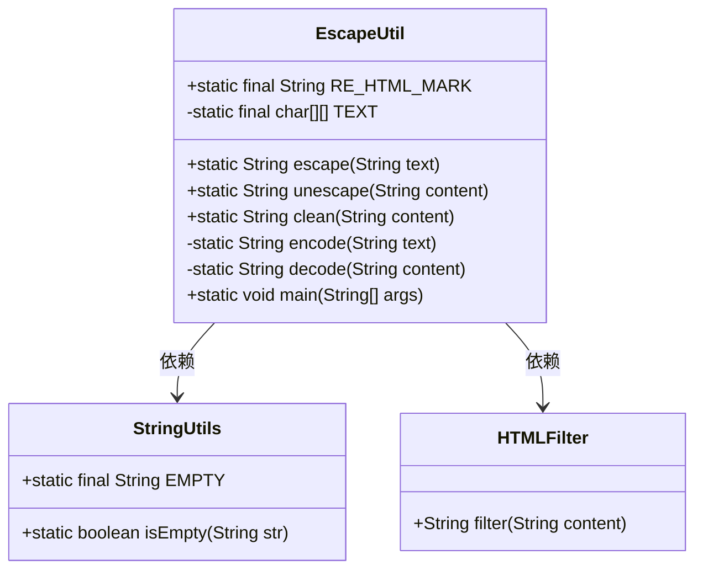
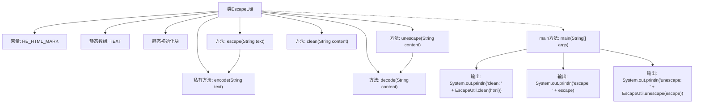

# 基础信息

|      |      |
|------|------|
| 名称 | EscapeUtil |
| 编码语言 | .java |
| 代码路径 | RuoYi-main/ruoyi-common/src/main/java/com/ruoyi/common/utils/html/EscapeUtil.java |
| 包名 | com.ruoyi.common.utils.html |
| 依赖项 | ['com.ruoyi.common.utils.StringUtils'] |
| 概述说明 | EscapeUtil类实现HTML字符转义、还原及标签清除。 |

# 说明

EscapeUtil类是一个用于处理HTML字符的工具类，主要提供三种功能：HTML字符的转义、HTML字符的还原以及HTML标签的清除。转义功能可以将特殊字符转换为HTML实体，防止XSS攻击；还原功能则将这些实体重新转换回原始字符；标签清除功能用于去除HTML标签，保留纯文本内容。这些功能在处理用户输入或输出时非常有用，确保数据的安全性和可读性。

# 类列表 Class Summary

| 名称   | 类型  | 说明 |
|-------|------|-------------|
| EscapeUtil | class | EscapeUtil类提供HTML字符转义、还原及标签清除功能。 |

## 类 EscapeUtil

|      |      |
|------|------|
| 访问范围 | public |
| 类型 | class |
| 名称 | EscapeUtil |
| 说明 | EscapeUtil类提供HTML字符转义、还原及标签清除功能。 |

### UML类图

**描述**：`EscapeUtil` 类提供了处理HTML字符串的工具方法，包括转义、还原和清除HTML标签。`escape` 方法将HTML特殊字符转义为安全字符，`unescape` 方法将转义后的字符还原为原始字符，`clean` 方法清除所有HTML标签但保留标签内容。`encode` 和 `decode` 方法分别用于编码和解码字符串。`StringUtils` 和 `HTMLFilter` 类被 `EscapeUtil` 依赖，用于字符串操作和HTML过滤。

### 内部方法调用关系图

该流程图展示了`EscapeUtil`类的结构和方法调用关系。类中包含一个常量`RE_HTML_MARK`和一个静态数组`TEXT`，并在静态初始化块中对`TEXT`进行初始化。类提供了三个主要方法：`escape`用于转义HTML字符，`unescape`用于还原转义字符，`clean`用于清除HTML标签。`encode`和`decode`是私有方法，分别用于编码和解码字符串。`main`方法展示了如何使用这些方法，并输出结果。

### 字段列表 Field List

| 名称  | 类型  | 说明 |
|-------|-------|------|
| TEXT = new char[64][] | char[][] | 定义64行字符数组TEXT。 |
| RE_HTML_MARK = "(<[^<]*?>)|(<[\\s]*?/[^<]*?>)|(<[^<]*?/[\\s]*?>)" | String | 静态常量RE_HTML_MARK用于匹配HTML标签及其闭合标签。 |

### 方法列表 Method List

| 名称  | 类型  | 说明 |
|-------|-------|------|
| clean | String | 该方法使用HTMLFilter过滤并清理输入字符串内容。 |
| unescape | String | 静态方法unescape用于解码字符串内容。 |
| escape | String | 静态方法escape调用encode处理字符串text。 |
| decode | String | 解码含百分号编码的字符串，支持Unicode和ASCII字符。 |
| main | void | Java代码示例：转义HTML脚本并输出清理结果。 |
| encode | String | 私有方法encode将字符串编码为百分比编码格式，处理ASCII和非ASCII字符。 |

