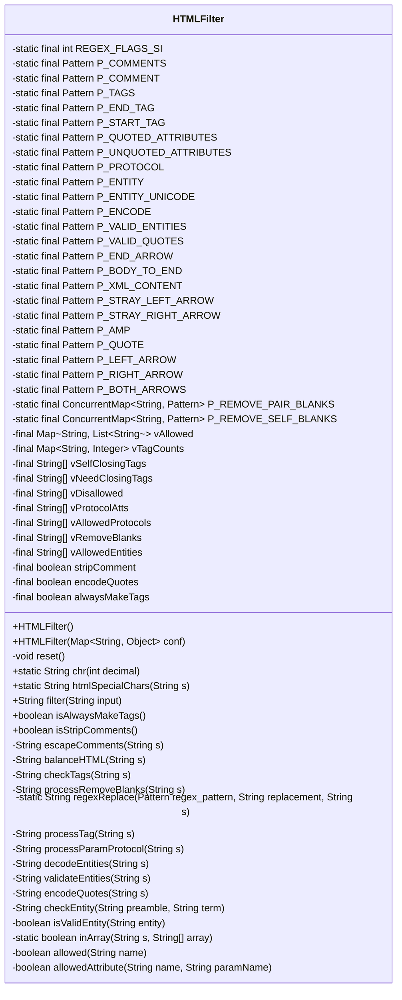

# 基础信息

|      |      |
|------|------|
| 名称 | HTMLFilter |
| 编码语言 | .java |
| 代码路径 | RuoYi-main/ruoyi-common/src/main/java/com/ruoyi/common/utils/html/HTMLFilter.java |
| 包名 | com.ruoyi.common.utils.html |
| 依赖项 | ['java.util.ArrayList', 'java.util.Collections', 'java.util.HashMap', 'java.util.List', 'java.util.Map', 'java.util.concurrent.ConcurrentHashMap', 'java.util.concurrent.ConcurrentMap', 'java.util.regex.Matcher', 'java.util.regex.Pattern'] |
| 概述说明 | HTMLFilter类用于过滤和验证用户输入的HTML内容，确保合法元素和属性。 |

# 说明

HTMLFilter类的主要功能是过滤和验证用户输入的HTML内容，确保只有合法的HTML元素和属性被允许通过。该类通过严格的检查和过滤机制，防止恶意或不规范的HTML代码进入系统，从而提升应用的安全性和稳定性。通过使用HTMLFilter类，开发者可以有效减少XSS攻击等安全风险，确保用户输入的内容符合预期的格式和标准。

# 类列表 Class Summary

| 名称   | 类型  | 说明 |
|-------|------|-------------|
| HTMLFilter | class | HTMLFilter类用于过滤和验证用户输入的HTML内容，确保仅允许合法的HTML元素和属性。 |

## 类 HTMLFilter

|      |      |
|------|------|
| 访问范围 | public final |
| 类型 | class |
| 名称 | HTMLFilter |
| 说明 | HTMLFilter类用于过滤和验证用户输入的HTML内容，确保仅允许合法的HTML元素和属性。 |

### UML类图

**描述**：`HTMLFilter`类是一个用于过滤和清理HTML内容的工具。它通过一系列正则表达式和配置参数来确保输入的HTML字符串是安全的，并且只包含允许的标签和属性。类中包含多个静态正则表达式模式，用于匹配和处理HTML标签、属性、实体等。`HTMLFilter`类提供了默认构造函数和通过Map配置的构造函数，允许用户自定义过滤规则。主要方法包括`filter`，用于处理输入字符串并返回过滤后的结果，以及其他辅助方法如`escapeComments`、`balanceHTML`、`checkTags`等，用于处理特定的HTML元素和属性。

### 内部方法调用关系图

```mermaid
graph TD
    A["类HTMLFilter"]
    B["属性: int REGEX_FLAGS_SI"]
    C["属性: Pattern P_COMMENTS"]
    D["属性: Pattern P_COMMENT"]
    E["属性: Pattern P_TAGS"]
    F["属性: Pattern P_END_TAG"]
    G["属性: Pattern P_START_TAG"]
    H["属性: Pattern P_QUOTED_ATTRIBUTES"]
    I["属性: Pattern P_UNQUOTED_ATTRIBUTES"]
    J["属性: Pattern P_PROTOCOL"]
    K["属性: Pattern P_ENTITY"]
    L["属性: Pattern P_ENTITY_UNICODE"]
    M["属性: Pattern P_ENCODE"]
    N["属性: Pattern P_VALID_ENTITIES"]
    O["属性: Pattern P_VALID_QUOTES"]
    P["属性: Pattern P_END_ARROW"]
    Q["属性: Pattern P_BODY_TO_END"]
    R["属性: Pattern P_XML_CONTENT"]
    S["属性: Pattern P_STRAY_LEFT_ARROW"]
    T["属性: Pattern P_STRAY_RIGHT_ARROW"]
    U["属性: Pattern P_AMP"]
    V["属性: Pattern P_QUOTE"]
    W["属性: Pattern P_LEFT_ARROW"]
    X["属性: Pattern P_RIGHT_ARROW"]
    Y["属性: Pattern P_BOTH_ARROWS"]
    Z["属性: ConcurrentMap<String, Pattern> P_REMOVE_PAIR_BLANKS"]
    AA["属性: ConcurrentMap<String, Pattern> P_REMOVE_SELF_BLANKS"]
    AB["属性: Map<String, List<String>> vAllowed"]
    AC["属性: Map<String, Integer> vTagCounts"]
    AD["属性: String[] vSelfClosingTags"]
    AE["属性: String[] vNeedClosingTags"]
    AF["属性: String[] vDisallowed"]
    AG["属性: String[] vProtocolAtts"]
    AH["属性: String[] vAllowedProtocols"]
    AI["属性: String[] vRemoveBlanks"]
    AJ["属性: String[] vAllowedEntities"]
    AK["属性: boolean stripComment"]
    AL["属性: boolean encodeQuotes"]
    AM["属性: boolean alwaysMakeTags"]
    AN["构造方法: HTMLFilter()"]
    AO["构造方法: HTMLFilter(Map<String, Object> conf)"]
    AP["方法: void reset()"]
    AQ["方法: static String chr(int decimal)"]
    AR["方法: static String htmlSpecialChars(String s)"]
    AS["方法: String filter(String input)"]
    AT["方法: boolean isAlwaysMakeTags()"]
    AU["方法: boolean isStripComments()"]
    AV["方法: String escapeComments(String s)"]
    AW["方法: String balanceHTML(String s)"]
    AX["方法: String checkTags(String s)"]
    AY["方法: String processRemoveBlanks(String s)"]
    AZ["方法: static String regexReplace(Pattern regex_pattern, String replacement, String s)"]
    BA["方法: String processTag(String s)"]
    BB["方法: String processParamProtocol(String s)"]
    BC["方法: String decodeEntities(String s)"]
    BD["方法: String validateEntities(String s)"]
    BE["方法: String encodeQuotes(String s)"]
    BF["方法: String checkEntity(String preamble, String term)"]
    BG["方法: boolean isValidEntity(String entity)"]
    BH["方法: static boolean inArray(String s, String[] array)"]
    BI["方法: boolean allowed(String name)"]
    BJ["方法: boolean allowedAttribute(String name, String paramName)"]

    A --> B
    A --> C
    A --> D
    A --> E
    A --> F
    A --> G
    A --> H
    A --> I
    A --> J
    A --> K
    A --> L
    A --> M
    A --> N
    A --> O
    A --> P
    A --> Q
    A --> R
    A --> S
    A --> T
    A --> U
    A --> V
    A --> W
    A --> X
    A --> Y
    A --> Z
    A --> AA
    A --> AB
    A --> AC
    A --> AD
    A --> AE
    A --> AF
    A --> AG
    A --> AH
    A --> AI
    A --> AJ
    A --> AK
    A --> AL
    A --> AM
    A --> AN
    A --> AO
    A --> AP
    A --> AQ
    A --> AR
    A --> AS
    AS --> AV
    AS --> AW
    AS --> AX
    AS --> AY
    A --> AT
    A --> AU
    AV --> AR
    AW --> AZ
    AX --> BA
    AY --> AZ
    BA --> BB
    BA --> BC
    BB --> BC
    BC --> BD
    BD --> BE
    BD --> BF
    BF --> BG
    BG --> BH
    BA --> BI
    BA --> BJ
    BI --> BH
    BJ --> BI
```

### 描述
这段代码定义了一个`HTMLFilter`类，用于过滤和清理HTML内容。类中包含多个正则表达式模式，用于匹配和处理HTML标签、属性、实体等内容。`filter`方法是核心方法，依次调用`escapeComments`、`balanceHTML`、`checkTags`和`processRemoveBlanks`等方法，最终返回清理后的HTML字符串。类中还包含多个辅助方法，如`htmlSpecialChars`用于转义特殊字符，`decodeEntities`用于解码HTML实体，`validateEntities`用于验证实体等。

### 字段列表 Field List

| 名称  | 类型  | 说明 |
|-------|-------|------|
| P_XML_CONTENT = Pattern.compile("(^|>)([^<]*?)(?=>)") | Pattern | 定义正则表达式匹配XML内容。 |
| vDisallowed | String[] | 定义私有不可变字符串数组vDisallowed。 |
| vRemoveBlanks | String[] | 定义私有字符串数组变量vRemoveBlanks。 |
| P_BODY_TO_END = Pattern.compile("<([^>]*?)(?=<|$)") | Pattern | 定义正则表达式匹配HTML标签后内容至结尾。 |
| vAllowedEntities | String[] | 私有字符串数组vAllowedEntities声明。 |
| P_QUOTED_ATTRIBUTES = Pattern.compile("([a-z0-9]+)=([\"'])(.*?)\\2", REGEX_FLAGS_SI) | Pattern | 定义静态正则模式，匹配带引号的属性值。 |
| P_VALID_ENTITIES = Pattern.compile("&([^&;]*)(?=(;|&|$))") | Pattern | 定义私有静态正则表达式模式，用于匹配有效实体。 |
| vAllowedProtocols | String[] | 私有字符串数组存储允许的协议。 |
| P_ENTITY = Pattern.compile("&#(\\d+);?") | Pattern | 定义私有静态常量P_ENTITY，用于匹配HTML实体编码。 |
| alwaysMakeTags | boolean | 私有布尔变量，用于标记是否始终生成标签。 |
| encodeQuotes | boolean | 私有布尔变量encodeQuotes用于控制引号编码。 |
| P_COMMENTS = Pattern.compile("<!--(.*?)-->", Pattern.DOTALL) | Pattern | 定义私有静态最终正则表达式，匹配HTML注释内容。 |
| vAllowed | Map<String, List<String>> | 私有映射存储字符串键和字符串列表值。 |
| P_START_TAG = Pattern.compile("^([a-z0-9]+)(.*?)(/?)$", REGEX_FLAGS_SI) | Pattern | 定义正则表达式模式匹配HTML标签开头部分。 |
| P_ENCODE = Pattern.compile("%([0-9a-f]{2});?") | Pattern | 定义用于匹配百分号编码的正则表达式模式。 |
| vTagCounts = new HashMap<>() | Map<String, Integer> | 私有哈希映射存储字符串键与整数值的对应关系。 |
| P_END_TAG = Pattern.compile("^/([a-z0-9]+)", REGEX_FLAGS_SI) | Pattern | 定义正则表达式匹配以斜杠开头的字母数字组合。 |
| P_LEFT_ARROW = Pattern.compile("<") | Pattern | 定义静态正则表达式匹配左尖括号。 |
| vProtocolAtts | String[] | 私有字符串数组vProtocolAtts声明。 |
| P_PROTOCOL = Pattern.compile("^([^:]+):", REGEX_FLAGS_SI) | Pattern | 私有静态常量P_PROTOCOL用于匹配协议前缀。 |
| REGEX_FLAGS_SI = Pattern.CASE_INSENSITIVE | Pattern.DOTALL | int | 定义了一个包含不区分大小写和匹配所有字符的正则表达式标志常量。 |
| P_REMOVE_PAIR_BLANKS = new ConcurrentHashMap<>() | ConcurrentMap<String, Pattern> | 定义线程安全的字符串到正则模式的并发映射。 |
| P_AMP = Pattern.compile("&") | Pattern | 定义私有静态常量P_AMP，用于匹配"&"字符。 |
| P_REMOVE_SELF_BLANKS = new ConcurrentHashMap<>() | ConcurrentMap<String, Pattern> | 定义线程安全的ConcurrentMap存储字符串与Pattern的映射。 |
| P_STRAY_LEFT_ARROW = Pattern.compile("<([^>]*?)(?=<|$)") | Pattern | 定义正则表达式匹配未闭合的左尖括号及其内容。 |
| P_QUOTE = Pattern.compile("\"") | Pattern | 定义私有静态常量P_QUOTE，用于匹配双引号。 |
| P_ENTITY_UNICODE = Pattern.compile("&#x([0-9a-f]+);?") | Pattern | 定义正则表达式匹配Unicode实体转义字符。 |
| P_END_ARROW = Pattern.compile("^>") | Pattern | 定义正则表达式模式匹配以">"开头的字符串。 |
| stripComment | boolean | 私有布尔变量stripComment用于控制是否去除注释。 |
| P_STRAY_RIGHT_ARROW = Pattern.compile("(^|>)([^<]*?)(?=>)") | Pattern | 定义正则表达式匹配未闭合的右箭头及前导字符。 |
| P_VALID_QUOTES = Pattern.compile("(>|^)([^<]+?)(<|$)", Pattern.DOTALL) | Pattern | 定义正则表达式匹配非HTML标签的文本内容。 |
| P_UNQUOTED_ATTRIBUTES = Pattern.compile("([a-z0-9]+)(=)([^\"\\s']+)", REGEX_FLAGS_SI) | Pattern | 定义正则表达式模式匹配未加引号的属性值。 |
| P_BOTH_ARROWS = Pattern.compile("<>") | Pattern | 定义静态最终正则表达式模式，匹配“<>”字符串。 |
| vSelfClosingTags | String[] | 定义私有不可变字符串数组vSelfClosingTags。 |
| P_RIGHT_ARROW = Pattern.compile(">") | Pattern | 定义静态常量P_RIGHT_ARROW，用于匹配">"字符。 |
| P_COMMENT = Pattern.compile("^!--(.*)--$", REGEX_FLAGS_SI) | Pattern | 定义私有静态常量P_COMMENT，用于匹配HTML注释的正则表达式。 |
| vNeedClosingTags | String[] | 私有字符串数组，需关闭标签。 |
| P_TAGS = Pattern.compile("<(.*?)>", Pattern.DOTALL) | Pattern | 定义正则表达式模式，匹配HTML标签内容。 |

### 方法列表 Method List

| 名称  | 类型  | 说明 |
|-------|-------|------|
| chr | String | 静态方法将整数转换为对应字符并返回字符串。 |
| isStripComments | boolean | 方法返回stripComment布尔值。 |
| htmlSpecialChars | String | 将字符串中的特殊字符转换为HTML实体。 |
| decodeEntities | String | 解码字符串中的实体并验证其有效性。 |
| checkTags | String | 该方法检查并处理字符串中的标签，替换并追加闭合标签后返回结果。 |
| isAlwaysMakeTags | boolean | 方法isAlwaysMakeTags返回布尔值alwaysMakeTags。 |
| inArray | boolean | 检查字符串是否在数组中，存在返回true，否则返回false。 |
| processRemoveBlanks | String | 该方法通过正则表达式移除字符串中指定标签及其空白内容。 |
| processParamProtocol | String | 处理协议参数，检查协议是否合法，非法则转为本地锚点链接。 |
| isValidEntity | boolean | 检查字符串是否为有效实体，通过验证是否在允许实体数组中。 |
| checkEntity | String | 方法检查实体，若条件满足则返回特定格式字符串。 |
| balanceHTML | String | 该方法根据条件处理HTML标签，确保标签格式正确或转义特殊字符。 |
| allowedAttribute | boolean | 方法检查属性名和参数名是否被允许。 |
| allowed | boolean | 检查名称是否允许：在允许列表或不在禁止列表中。 |
| filter | String | 该方法过滤输入字符串，依次转义注释、平衡HTML、检查标签、处理空白，最后返回结果。 |
| regexReplace | String | 使用正则表达式替换字符串中匹配部分。 |
| encodeQuotes | String | 方法encodeQuotes根据条件替换字符串中的引号，保留JSON格式有效性。 |
| processTag | String | 处理HTML标签，匹配起始和结束标签，检查允许标签，生成带属性的标签字符串。 |
| validateEntities | String | 方法验证字符串实体并替换，返回处理后的字符串。 |
| reset | void | 清空vTagCounts集合。 |
| escapeComments | String | 该方法用于转义字符串中的注释，并将其替换为HTML格式。 |

