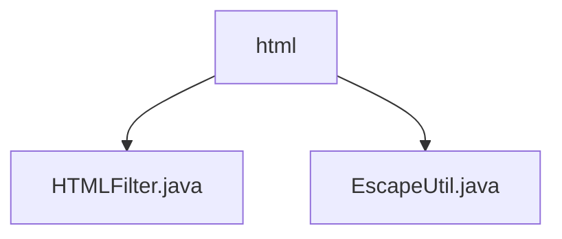

# 基础信息

|      |      |
|------|------|
| 名称 | html |
| 编码语言 | .java |
| 代码路径 | RuoYi-main/ruoyi-common/src/main/java/com/ruoyi/common/utils/html |
| 包名 | RuoYi-main.ruoyi-common.src.main.java.com.ruoyi.common.utils.html |
| 概述说明 | HTMLFilter类过滤验证HTML，防XSS攻击；EscapeUtil类转义还原清除HTML字符，确保安全可读。 |

# 说明

## 概述

该代码模块主要涉及HTML内容的安全处理和验证，包含两个核心类：`HTMLFilter`和`EscapeUtil`。`HTMLFilter`类负责过滤和验证用户输入的HTML内容，确保只有合法的HTML元素和属性被允许通过，从而提升应用的安全性和稳定性。`EscapeUtil`类则提供了HTML字符的转义、还原以及标签清除功能，确保在处理用户输入或输出时数据的安全性和可读性。

## 主要业务场景

1. **HTML内容过滤与验证**：
   - 使用`HTMLFilter`类对用户输入的HTML内容进行严格的检查和过滤，防止恶意或不规范的HTML代码进入系统，有效减少XSS攻击等安全风险。

2. **HTML字符处理**：
   - 使用`EscapeUtil`类对HTML字符进行转义，防止XSS攻击。
   - 使用`EscapeUtil`类将转义后的HTML实体还原为原始字符，确保数据的可读性。
   - 使用`EscapeUtil`类清除HTML标签，保留纯文本内容，适用于需要去除HTML格式的场景。

### 包内部结构视图

该流程图展示了RuoYi项目中`html`文件夹下的文件层级关系。`html`文件夹包含两个文件：`HTMLFilter.java`和`EscapeUtil.java`。这两个文件位于同一层级，直接隶属于`html`文件夹，用于处理HTML相关的工具类功能。

# 文件列表 File List

| 名称   | 类型  | 说明 |
|-------|------|-------------|
| [EscapeUtil.java](EscapeUtil.md) | file | EscapeUtil类实现HTML字符转义、还原及标签清除。 |
| [HTMLFilter.java](HTMLFilter.md) | file | HTMLFilter类用于过滤和验证用户输入的HTML内容，确保合法元素和属性。 |

