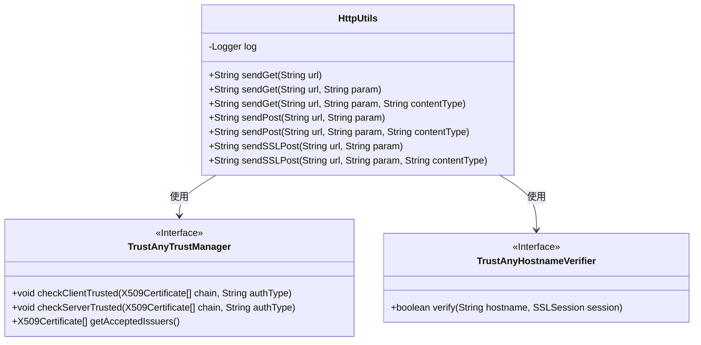
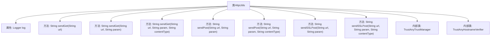

# 基础信息

|      |      |
|------|------|
| 名称 | HttpUtils |
| 编码语言 | .java |
| 代码路径 | RuoYi-main/ruoyi-common/src/main/java/com/ruoyi/common/utils/http/HttpUtils.java |
| 包名 | com.ruoyi.common.utils.http |
| 依赖项 | ['java.io.BufferedReader', 'java.io.IOException', 'java.io.InputStream', 'java.io.InputStreamReader', 'java.io.PrintWriter', 'java.net.ConnectException', 'java.net.SocketTimeoutException', 'java.net.URL', 'java.net.URLConnection', 'java.nio.charset.StandardCharsets', 'java.security.cert.X509Certificate', 'javax.net.ssl.HostnameVerifier', 'javax.net.ssl.HttpsURLConnection', 'javax.net.ssl.SSLContext', 'javax.net.ssl.SSLSession', 'javax.net.ssl.TrustManager', 'javax.net.ssl.X509TrustManager', 'org.slf4j.Logger', 'org.slf4j.LoggerFactory', 'com.ruoyi.common.constant.Constants', 'com.ruoyi.common.utils.StringUtils', 'org.springframework.http.MediaType'] |
| 概述说明 | HttpUtils类支持GET、POST、SSL POST请求，含参数、编码、异常处理和日志记录。 |

# 说明

HttpUtils类是一个功能全面的工具类，提供了GET、POST以及SSL POST三种HTTP请求方法。该类支持传入请求参数，并允许指定编码类型以确保数据传输的正确性。此外，HttpUtils类还内置了异常处理机制，能够有效捕获和处理请求过程中可能出现的错误。同时，该类集成了日志记录功能，便于开发者追踪和分析请求的执行情况，确保系统的稳定性和可维护性。

# 类列表 Class Summary

| 名称   | 类型  | 说明 |
|-------|------|-------------|
| HttpUtils | class | HttpUtils类提供GET、POST和SSL POST请求方法，支持参数和编码类型，包含异常处理和日志记录。 |

## 类 HttpUtils

|      |      |
|------|------|
| 访问范围 | public |
| 类型 | class |
| 名称 | HttpUtils |
| 说明 | HttpUtils类提供GET、POST和SSL POST请求方法，支持参数和编码类型，包含异常处理和日志记录。 |

### UML类图

**描述：**
`HttpUtils` 类提供了发送 HTTP GET 和 POST 请求的功能，支持普通 HTTP 和 SSL 加密请求。该类包含了多个重载的 `sendGet` 和 `sendPost` 方法，允许用户指定 URL、请求参数和内容类型。`TrustAnyTrustManager` 和 `TrustAnyHostnameVerifier` 是内部类，分别实现了 `X509TrustManager` 和 `HostnameVerifier` 接口，用于处理 SSL 请求时的证书验证和主机名验证。这些类共同协作，确保 HTTP 请求的安全性和灵活性。

### 内部方法调用关系图

这段代码定义了一个`HttpUtils`类，用于发送HTTP GET、POST以及SSL POST请求。类中包含多个重载的`sendGet`和`sendPost`方法，分别处理不同的参数组合。此外，还包含两个内部类`TrustAnyTrustManager`和`TrustAnyHostnameVerifier`，用于处理SSL连接时的信任管理和主机名验证。每个方法都包含日志记录和异常处理，确保在请求过程中出现错误时能够及时捕获并记录。

### 字段列表 Field List

| 名称  | 类型  | 说明 |
|-------|-------|------|
| log = LoggerFactory.getLogger(HttpUtils.class) | Logger | HttpUtils类中定义了一个私有的静态日志记录器实例。 |

### 方法列表 Method List

| 名称  | 类型  | 说明 |
|-------|-------|------|
| sendPost | String | 发送POST请求，处理异常，返回响应结果。 |
| sendSSLPost | String | 静态方法sendSSLPost发送SSL POST请求，支持URL和参数。 |
| sendGet | String | 发送GET请求并返回响应内容，处理连接和读取异常。 |
| sendGet | String | 静态方法sendGet通过URL发送GET请求，默认参数为空字符串。 |
| sendGet | String | 静态方法sendGet通过URL和参数发送GET请求，默认使用UTF-8编码。 |
| sendPost | String | 静态方法sendPost发送POST请求，支持URL和参数。 |
| sendSSLPost | String | 发送SSL POST请求，处理响应并返回结果，捕获异常记录日志。 |

